# 一、Linux概述  unix和LInux的关系

  **LInux的应用领域** 服务器领域 - Linux在服务器领域的应用是最强的 - LInux免费、稳定、高效等特点在这里得到了很好的体现，尤其是在一些高端领域尤为广泛 嵌入式领域 - linux运行稳定、对网络的良好支持性、低成本，且可以根据需要进行网络裁剪，内核最小可达到几百kb的特点，使近些年来在嵌入式领域的应用得到非常大的提高 - 主要应用:机顶盒、数字电视、网络电话、程控交换机、手机、PDA、智能家居、智能硬件等都是其应用领域。以后在物联网中应用会更加广泛。 

unix和LInux的关系


**LInux的应用领域**

服务器领域

- Linux在服务器领域的应用是最强的
- LInux免费、稳定、高效等特点在这里得到了很好的体现，尤其是在一些高端领域尤为广泛

嵌入式领域

- linux运行稳定、对网络的良好支持性、低成本，且可以根据需要进行网络裁剪，内核最小可达到几百kb的特点，使近些年来在嵌入式领域的应用得到非常大的提高
- 主要应用:机顶盒、数字电视、网络电话、程控交换机、手机、PDA、智能家居、智能硬件等都是其应用领域。以后在物联网中应用会更加广泛。

**LInux的吉祥物tux**


------

**Linux主要的发行版本**

Ubuntu（乌班图）、RedHat（红帽）、CentOS

------

**vm与Linux的关系**


**VMware网络连接的三种模式**

桥接模式

- VMWare会虚拟一块网卡和真正的物理网卡就行桥接，这样，发到物理网卡的所有数据包就到了VMWare虚拟机，而由VMWare发出的数据包也会通过桥从物理网卡的那端发出。桥接网络是指本地物理网卡和虚拟网卡通过VMnet0虚拟交换机进行桥接。相当于在一个局域网内创立了一个单独的主机，他可以访问这个局域网内的所有的主机
- 该模式下主机网卡和虚拟机网卡的IP地址处于同一个网段，子网掩码、网关、DNS等参数都相同
- 桥接模式下虚拟机和主机在网络上地位相等，可以理解为一台新的电脑


NAT模式

- 虚拟系统会通过真实主机的网络来访问外网，而真实主机相当于有两个网卡：真实网卡和虚拟网卡，真实网卡相当于链接了现实世界的真实路由器，而虚拟网卡相当于链接一个虚拟交换机/路由器（这个虚拟交换机同时链接虚拟机和真实主机）,此时虚拟机想访问外网就必须通过真实主机IP地址，而外面看来也确实是真实主机的IP地址，实则是虚拟机访问的，完全看不到虚拟网络局域的内部形式。
- 网络地址转换模式。虚拟机系统可以和外部系统通讯，不早造成IP冲突


主机模式

- 他就是一个独立的系统，不和外界发生联系

# 二、Linux目录结构（重点）

## 2.1基本介绍

- linux的文件系统是采用级层式的树状目录结构，在此结构上的**最上层是根目录“/"**，然后在此目录下在创建其他的目录。**用户主目录  ~**
- 深刻理解linux树状文件目录是非常重要的
- 在LInux世界里，**一切皆文件**

## 2.2具体的目录结构

- /bin 【常用】（/usr/bin、/uer/local/bin)

  是Binary的缩写，这个**目录存放着最常使用的命令**

- /sbin （/usr/sbin、/usr/local/sbin）

  s就是Super user的意思，**这里存放的是系统管理员使用的系统管理程序**

- /home 【常用】

  **存放普通用户的主目录，**在Linux中每个用户都有一个自己的目录，**一般该目录是以用户的账号命名** , 产生的新用户就是放在这里

  

- /root 【常用】

  **该目录为系统管理员，**也称作超级权限者的用户主目录

- **/lib 系统开机所需要的最基本的动态链接共享库**，起作用类似数于Windows里的DLL文件。几乎所有的应用程序都需要用到这些共享库

- /lost+found 这个目录一般情况下是空的，当系统非法关机后，这里就存放了一些文件

- etc 【常用】

  **所有的系统管理所需要的配置文件和子目录，**比如安装mysql数据库，my.conf

  **里面有一个文件 usr/passwd文件 是和组有关的**

- /usr 【常用】

  这是一个非常重要的目录，用户很多**应用程序都放在这个目录下，类似于windows下的program files目录。 **

- /boot 【常用】

  **存放的是启动Linux时使用的一些核心文件**，包括一些链接文件以及镜像文件

- /proc   [不能动 ]这个目录是一个虚拟的目录，他是系统内存的映射，访问这个目录来获取系统信息

- /srv service  [不能动 ] 缩写，该目录存放一些服务器启动后需要提取的数据

- /sys    [不能动] 这是linux2.6内核的一个很大的变化，该目录下安装了2.6内核中新出现的一个文件系统sysfs

- /tmp    这个目录是用来**存放一些临时文件的**

- /dev

  **类似于windows的设备管理器，把所有的硬件用文件的形式存储**

- **/media【常用】linux系统会自动识别一些设备，例如U盘**，光驱等等，当识别后，linux会把识别的设备挂载到这个目录下

- /mnt 【常用】

  **系统提供该目录是为了让用户临时挂载别的系统文件**，我们可以将外部的存储挂载在/mnt/上，然后进入该目录就可以查看里面的内容了。D:/mushare

- **/opt 这是给主机额外的安装软件所存放的目录。**如安装ORACLE数据库就可以放到该目录下。默认为空

- /usr/local【常用】

  软件安装好的地方. 这是另一个给主机额外安装软件所安装的目录。**一般是通过编译源码的方式安装的程序**

- /var 【常用】

  这个目录中存放着在不断扩充的东西 ，习惯的**将经常修改的目录放在这个目录下。包括各种==日志文件==**

- /selinux 【security-enhanced linux】

  **SELinux是一种安全子系统，**他能控制程序自能访问特定的文件，有三种工作模式，可以自行设置

  ------

# 三、vi和vim编辑器

## 3.1 vi和vim的基本介绍

Linux系统会内置vi文本编辑器

Vim具有程序编辑的能力，可以看做是Vi的增强版本，可以主动的以字体颜色辨别语法的正确性，方便程序设计。代码补完、编译错误跳转等方便编程的功能相当丰富，在程序员中被广泛使用。（vim就是vi的增强版）

## 3.2 vi和vim常用的三种模式

- 正常模式

以vim打开一个档案就直接进入一般模式了（这是默认的模式）。在这个模式中，**可以使用【上下左右】键来移动光标**，你**可以使用【删除字符】或【删除整行】来处理档案内容，也可以使用【复制、粘贴】来处理你的文件数据。**

- 插入模式

**按下i，I，o，O，a，A，r，R等任何一个字母之后才会进入编辑模式**，一般来说按i就可

- 命令行模式

在这个模式中，可以提供你相关指令，完成读取、存盘、替换、离开vim、显示行号等动作则是在此模式中达成的！


# 四、LInux开机，重启和用户登录注销

## 4.1关机和重启的命令

- 基本介绍

```linux
shutdown -h now			立刻进行关机

shutdown -h 1			”hello，1分钟后会关机了“
shutdown -r now			现在重新启动计算机


halt					关机
reboot					重新启动

syn					把内存的数据同步到磁盘
```

- 注意细节

1.不管是重启系统还是关闭系统，首先要运行sync命令，把内存中的数据写到磁盘中

2.目前的shutdown/reboot/halt等**命令均已,保证在关机前进行了sync**

## 4.2用户登录和注销

- 基本介绍

1、**登陆时尽量少用root账号登录**，因为他是系统管理员，最大的权限，避免操作失误。可以利用普通用户登录，

**登陆后再用  ”su - 用户名“  命令来切换成系统管理员身份**

2、在提示符下输入**logout即可注销用户**

- 使用细节

**logout  注销指令在图形运行级别无效**，在shell界面有效

# 五、用户管理

## 5.1基本介绍

Linux系统是一个多用户多任务的操作系统，任何一个要使用系统资源的用户，都必须先向系统管理员申请一个账号，然后以这个账号的身份进入系统

------

## 5.2添加用户

- 基本语法

```
useradd -m 用户名

useradd -m -g 组名 用户名
```

- 例子(root权限下)

```
useradd hucheng
添加一个用户chucheng，默认该用户的家目录在/home/hucheng
```

- 细节说明

  **会自动的创建和创建的用户同名的家目录**

```
1、当用户创建成功后，会自动的创建和用户同名的家目录
2、也可以通过useradd -d 指定目录  新的用户名     来给新创建的用户指定家目录
```


```
新建用户zhanzhiwen的home目录下的文件夹名称是muluming
```

## 5.3指定/修改密码

- 基本语法

```
passwd 用户名
```

- 实例


- 补充，**显示当前用户所在的目录pwd**

## 5.4 删除用户

- 基本语法

```
userdel -r 用户名
```

- 实例

1.删除用户zhanzhiwen，但是要保留目录

2.删除用户以及用户主目录 ，userdel -r 用户名


------

****

​	

## 5.5查询用户信息  指令

- 基本语法

```
id 用户名
```

- 实列


- 细节说明

当用户不存在是，返回无此用户

## 5.6切换用户

- 介绍

在操作Linux时，如果当前用户的权限不够，可以通过su - 指令，切换到更高权限的用户，如root

- 基本语法

```
su - 用户名
```

- 实列说明


- 细节说明

1.从权限高的用户切换到权限低的用户时，不需要输入密码，反之需要

2**.当需要返回到原来用户时，使用exit/logout指令   建议使用 logout **

------

## 5.7 查看当前登录用户的信息

- 基本语法

```
whoami/who am i
```

- 实例
  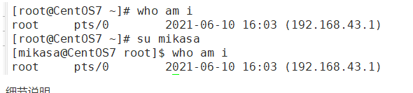

------

## 5.8 用户组

- 介绍

类似于角色，系统可以对有共性/权限的多个用户进行统一的管理

- 新增组

```
指令：groupadd    组名
```

- 删除组

```
指令：groupdel     组名
```


- 注意：如果当添加用户时没有指定组，会默认创建和这个用户同名的组，同时把用户放到该组里


- 增加用户时直接加上组

```
指令：useradd -g 用户组 用户名
```


- 移动组

```
usermod -g 组名 用户名
```


------

## 5.9 用户和组相关文件

- /**etc/passwd 文件**

**用户（user）的配置文件，记录用户的各种信息**

每行的含义：用户名：口令：用户标识号：组标识号：注释性描述：主目录：  登录Shell

- **/etc/shadow文件**

口令配置文件

每行的含义：登录名：加密口令：最后一次修改时间：最小时间间隔：最大时间间隔：警告时间：不活动时间：失效时间：标志

- **/etc/group文件**

组（group）的配置文件，记录Linux包含的组的信息

每行含义：组名：口令：组标识号：组内用户列表

# 六、实用指令

## 6.1指定运行级别

- 基本介绍

**运行级别说明：**

0：关机

1：单用户【找回丢失密码】

2：多用户状态没有网络服务

3：**多用户状态有网络服务**

4：系统未使用保留给用户

5：图形界面

6：系统重启

常用运行级别是3和5，也可以指定默认运行级别

- 应用实例

命令：init[0123456]应用案例：通过init来切换不同的运行级别，比如动5-3，然后关机

```
查看当前的运行级别
systemctl get-ddefault
```

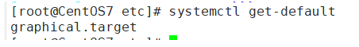

```
改变为   systemctl set-default multi-user.target007
```

------

## 6.2帮助指令

- man获得帮助信息

```
基本语法：man [命令或配置文件]（功能描述：获得帮助信息）
如:
man ls
```

设置中文

[(28条消息) centos7设置man下显示中文_思维触发行为的博客-CSDN博客_centos man 中文](https://blog.csdn.net/caikeng/article/details/120580374)

```linux
中文查看命令
cman ls
```

在linux下隐藏文件是以 “.” 开头的

- **help指令**

```
基本语法：help 命令 （功能描述：获得shell内置命令的帮助信息）
```

## 6.3文件目录类(重要)

- pwd指令

 功能描述：**显示当前工作目录的绝对路径**

理解：绝对路径和相对路径（相对路径是针对当前位置的路径）

```
基本语法：pwd   
```

------

- ls指令

```
基本语法：ls [选项] [目录或是文件]
```

常用选项

**-a ： 显示当前目录所有的文件和目录，包括隐藏的**

**-l ： 以列表的方式显示信息**

---------------

+ ll指令

相当于ls -l

------

- cd指令

```
基本语法：cd [参数] （功能描述：切换到指定的目录）
```

cd 或者cd ~ 回到当前用户的家目录

cd … 回到当前目录的上一级目录

------

- mkdir指令

理解：**mkdir指令用于创建目录**（默认只能创建一级目录）

```
基本语法：mkdir [选项] 要创建的目录  
```

常用选项

**-p :创建多级目录**

拓展: 可以用 > 创建单目录

```
/var/log/hsp.log  单用 > 表示将空写入文件
将空内容覆盖写入到 此文件，如果该文件不存在，就创建该文件
```

----------

+ touch指令（用于创建空文件）

```
基本语法：touch 文件名称   // tou tab就行
```

------

- rm指令（用于删除空目录）

```shell
基本语法：rm -rf 要删除的空目录
```

-r : 递归删除整个文件夹

-f ：强制删除不提示

使用细节：强制删除不提示的方式，带上-f参数即可

**如果需要删除非空目录**，需要**使用  rm -rf** 要删除的目录

--------

- mv指令（move，移动文件与目录或重命名)（以可剪切文件夹）

```shell
基本语法:
#方式1:
mv 待移动文件名 重命名           #(重命名)
mv 待移动文件 目标位置/          (移动文件)
mv 待移动目录 目标位置/          (移动目录)
mv 待移动文件 目标位置/重命名     (移动文件+重命名) 

#方式2:
[用户名@localhost 目标位置]$ mv 待移动文件 .   #不改变名字可以直接. 改名就用新名称代替 .
```

注意: 写好后缀名

例子:

```
案例1：将/home/cat.txt文件 重新命名为pig.txt Cut
案例2：将/home/pig.txt 文件 移动到/root目录下
案例3: 移动整个目录: /opt/bbb 移动到/home下:   mv  /opt/bbb  /home/
```

------

- cp指令（copy拷贝文件导指定目录下）

```shell
基本语法：
#方法1:
cp -r 待复制文件 目标位置/        #(不改名)
cp -r 待复制文件 目标位置/改名     #(改名)

#方式2:
[用户名@localhost 目标位置]$ cp 待复制文件 .   #不改变名字可以直接. 改名就用新名称代替 .
```

常用选项：

**-r 递归复制整个文件夹**

例子:

```
案例1：
cp 1.txt ../       #不改名
cp 1.txt ../2.txt  #改名
案例2：将 /home/hello.txt 拷贝到 /home/bbb 目录下
cp /home/hello.txt /home/bbb/
案例3：递归复制整个文件夹，将/home/aaa 目录下的文件全部拷贝到/home/bbb中
cp -r /home/aaa /hom/bbb/  (是将整个目录和目录本身拷贝进来)
```

------

+ cat指令（查看文件内容）

```
cat [选项] 要查看的文件
```

常用选项： -n 显示行号

使用细节：**cat只能浏览文件，而不能修改文件，**为了浏览方便，**一般会带上管道命令 |more**

```
cat -n /etc/profile | more
```

- more指令

more指令是一个基于VI编辑器的文本过滤器，它以全屏幕的方式按页显示文本文件的内容。more指令中内置了若干快捷键（交互的指令）

```
基本语法：
more 要查看的文件
```

操作说明:
空白键(space) 代表向下翻一页；
Enter 代表向下翻「一行」；
q 退出
Ctrl+F   向下滚动一屏
Ctrl+B  返回上一屏
二   输出当前行的行号
:f   输出文件名和当前行的行号

---------------

+ less指令

**大文件查看**

```
基本语法：
less 要查看的文件
```

--------------

+ head指令

head用于显示文件的开头部分内容，**默认情况下head指令显示文件的前10行内容**

```
基本语法:
head 文件       (功能描述：查看文件头10行内容)
head -n 5文件  （功能描述：查看文件头5行内容，5可以是任意行数）
```

应用实例
/etc/profile的前面5行代码

+ tail指令

tail用于输出文件中尾部的内容，默认情况下tail指令显示文件的前10行内容。或者 **实时追踪该文档的所有更新**
基本语法

```
tail文件 （功能描述：查看文件尾10行内容）

tail -n 5文件 （功能描述：查看文件尾5行内容，5可以是任意行数)

tail -f 文件(功能描述：实时追踪该文档的所有更新)
```

应用实例
案例1：查看/etc/profile最后5行的代码tail-n 5/etc/profile
案例2：实时监控 mydate.txt，看看到文件有变化时，是否看到，实时的追加 hello，world

-----------

+ echo指令

输出内容到控制台

```linux
基本语法
echo [选项] [输出内容]   // ec 回车就行
```

应用实例
案例：使用echo指令输出环境变量，比如输出 $PATH $HOSTNAME, echo $HOSTNAME

案例：使用echo指令输出hello,world!


-----------

+ 指令 >  和>> 指令

输出重定向  和 追加

文件不存在会自动创建

```shell
基本语法
ls -l > 文件 （功能描述：列表的内容写入文件a.txt中(覆盖写）
ls -al >> 文件 （功能描述：列表的内容追加到文件aa.txt的末尾）
cat 文件1 > 文件2 （功能描述：将文件1的内容覆盖到文件2）
echo "内容” 文件
```

------

- 管道 | 指令

```bash
基本语法
指令1 | 指令2
```

作用:  把第一个命令的输出，作为第二个命令的输入。 需要第二个命令支持这种从管道获取输入的功能

**xargs**

```undefined
基本语法
指令1 | xargs 指令2
```

xargs和管道类似, 与管道不同的是，管道给第二个命令传递是直接传到命令输入上，这种方式要求命令本身的支持，支持的命令较少。

xargs，则是把第一个命令的输出作为参数传递到第二个命令上，这种方式只要第二个命令可以接受参数即可，支持的命令较多。

一个例子：

```linux
echo test.txt | cat
test.txt

echo test.txt | xargs cat
显示test.txt中的内容
```

echo test.txt | cat 是把 "test.txt" 这个字符串直接让cat输出

echo test.txt | xargs cat 是把 "test.txt" 作为参数传递给cat，表示把 test.txt 这个文件的内容输出

**exec**

```
基本语法
指令1 -exec 指令2 {} \;
```

-exec 和 xargs 的作用相似，都是把前一个命令的输出作为参数传给第二个命令

```bash
find . -name "test.txt" -exec cat {} \;
显示test.txt中的内容
```

-----------

- ln指令  (小写的L) 

软连接也称为符号链接，**类似于windows里的快捷键方式**，主要存放了连接其他文件的路径

```shell
基本语法：
ln -s [原文件或目录] [目标软链接名]
（功能描述：给原文件创建一个软链接）
```

------

- history指令

查看已经执行过历史命令，也可以执行历史指令

```
history		  显示所有的历史命令
history 10    显示最近使用过的10个指令	
!5 			  执行历史编号为5的指令	 
```

----------

- **查询指定文件和 目录个数**

  - 1.统计/opt文件夹下**文件的个数**

    ```
    ls -l /opt | grep "^-" | wc -l
    ```

  - 2.统计/opt文件夹下**目录的个数**

    ```
    ls -l /opt | grep "^d" | wc -l
    ```

  - 3.统计/opt文件夹下文件的个数，包括子文件夹里的

    ```
    ls -lR /opt | grep "^-" | wc -l
    ```

  - 4.统计/opt文件夹下目录的个数，包括子文件夹里的

    ```
    ls -lR /opt | grep "^d" | wc -l
    ```

  - 5.以树状显示目录结构

    yum install tree

    ```shell
    tree /home
    ```

--------------

## 6.4时间日期类

- date指令-显示当前日期

```linux
基本语法：
date				显示当前时间
date +%Y			显示当前年份
date +%m			显示当前月份
date +%d			显示当前是哪一天
date "+%Y-%m-%d %H:%M:%S" 显示年月日时分秒    就是自己设计格式
```

date指令还可以设置日期

```
date -s 字符串时间
date -s "2021-6-20 16:44:30"
```

- cal指令

查看日历指令

```
cal [选项]      （功能描述：不加选项，显示本月日历）
cal 2021      显示2021整年的日历
```

------

## 6.5搜索查找类

- **find指令    查找指定的文件**  

  find指令指令 **将从指定目录向下递归遍历各个子目录，只要满足条件的文件或者目录就显示在终端上**

```linux
find [搜索范围] [选项]

常用:
1.搜索桌面目录下，文件名包含(1的文件
find 桌面路径 -name "*1*"

2.搜索桌面目录下，所有以.txt]为扩展名的文件
find 桌面路径 -name "*.txt"

3.搜索桌面目录下，以数字1开头的文件
find 桌面路径 -name ""1*"
```

选项说明（可填选项）

| 选项                 | 功能                                   |
| -------------------- | -------------------------------------- |
| -name   <查询方式>   | 按照指定的文件名查找模式查找文件       |
| -user    <用户名>    | 查找属于指定用户名所有文件             |
| -size     <文件大小> | 按照指定的文件大小查找文件             |
| atime +10            | 读取时间  +10是大于十天  -10是小于十天 |
| -mtime               | 修改时间                               |
| -ctime               | 创建时间                               |

-atime<24小时数> 查找在指定时间曾被存取过的文件或目录，单位以24小时计算。

说明：当查询路径下无该文件，就不会有任何显示

------

- locate指令

 **locate指令可以快速定位文件路径**。locate命令利用事先建立的系统中所有文件名称及路径的locate数据库实现快速定位的文件名。Locate指令无需遍历整个文件系统，查询速度较快。为了保障查询结果的准确度，管理员必须定期更新locate时刻

```
基本语法：locate 搜索文件
```

特别说明：由于locate指令基于数据进行查询，所以**第一次运行前，必须是使用updatedb指令创建locate数据库**

------

- which指令 ，可以查看某个指令在哪个目录下

  -------------

  


+ **grep指令  和  管道符号 |      查找指定的文件中的内容** 

**grep过滤查找**，管道符，“|“，表示将前一个命令输出传递给后面的命令处理

```
基本语法：grep [选项] 查找内容 源文件
```

选项：

**-n 显示匹配行及行号**

**-i 忽略字母大小写**

**-v 不查找后面的**

两种写法   hello.txt文件夹中输出同样的

```linux
cat /home/hello.txt | grep -n "yes"   

grep -n "yes" /home/hello.txt
```

## 6.6 压缩和解压

格式:

​	**指令 目标文件.后缀  源文件1  源文件2**

- gzip/gunzip指令

gzip用于压缩文件，gunzip用于解压文件的

```
gzip 文件	     （功能描述：压缩文件，只能将文件压缩为*.gz文件
gunzip 文件    （功能描述：解压文件命令）
```

------

- zip/unzip指令

zip用于压缩文件，unzip用于解压的，在整个项目打包发布中很有用的

```
zip [选项]  xxx.zip   (将要压缩的内容（一般是文件和文件夹))
uzip [选项] xxx.zip  （功能描述：解压文件）
```

zip的常用项： **-r 递归压缩，即压缩目录**

```
zip -r myhome.zip /home/
```

unzip的常用项 ： **-d <目录> : 指定解压后文件的存放目录**

```
unzip -d /home/dd/
```

- ==tar指令==

tar指令是打包指令，最后打包后的文件是.tar.gz的文件

```shell
# 打包:  
tar -czvf 目标位置/xxx.tar.gz  待打包的目录1/ 待打包的目录2/ 待打包的文件1 待打包的文件2 ....

# 解压:  
tar -xzvf 打包的内容 -C 目标位置/    #(打包到目标位置)
tar -xzvf 打包的内容                #(打包到当前位置)
```

选项说明

| 选项 | 功能               |
| ---- | ------------------ |
| -c   | 产生.tar打包文件   |
| -v   | 显示详细信息       |
| -f   | 指定压缩后的文件名 |
| -z   | 打包同时压缩       |
| -x   | 解包.tar文件       |

**案例;** 

```linux
案例1：压缩多个文件，将/home/pig.txt和/home/cat.txt 压缩成  pc.tar.gz
tar -czvf pc.tar.gz /home/pig.txt /home/cat.txt

案例2：将/home的文件夹压缩成myhome.tar.gz
tar -czvf myhome.tar.gz /home/

案例3：pc.tar.gz 解压到当前目录
tar -xzvf pc.tar.gz

案例4：将myhome.tar.gz  解压到/opt/tmp2目录下 mkdr/opt/tmp2/
tar -xzvf myhome.tar.gz -C opt/tmp2/

// 将前面的数据压缩
"$DATA" | gzip > "$BACKUP/$BATETIME/$BATETIME.gz"
```

因为解压的目标地址不是当前文件夹，**要去别的文件加，所以要加-C**

##  6.7清屏命令

```
clear 清屏        按住 cle 回车就行
```

```
&& 表示继续的操作
```

```
用gedit 加文件名称可以直接打开该文件的图形界面
```


# 七、linux的主管理和权限管理

## 7.1Liunx组的基本介绍

- 在Linux中的每个用户必须属于一个组，不能独立于组外。
- 在Linux中每个文件都有所有者、所在组、其他组的概念
  - 所有者
  - 所在组
  - 其它组
  - 改变用户所在的组

## 7.2文件/目录的 所有者

- 一般文件的创建者，谁创建了该文件，就自然成为该文件的所有者
- 查看文件的所有者：

```
指令： ls -ahl
```

- 修改文件所有者   求

```
指令：
chown 用户名 文件名
```


## 7.3文件/目录的  所在组

- 当某个用户创建了一个文件后，这个文件的所在组就是该用户所在的组
- 查看文件/目录所在组

```
ls -ahl
```

- 修改文件所在的组

```
chgrp 组名 文件名
```

## 7.4其他组

除文件的所有者和所在组的用户外，系统的其他用户都是文件的其它组

## 7.5==改变用户所在组==

- 在添加用户时，可以指定将该用户添加到哪个组中，同样的用root的管理权限可以改变某个用户所在的组
- 改变用户所在组

```
usermod -g 组名 用户名

usermod -d 目录名 用户名改变该用户登录的初始目录
```

## 7.6 权限的基本介绍

ll 显示的如下内容：

```
-rw-r--r--. 1 mikasa mikasa   141 6月  22 11:19 hello.txt
```

0-9位说明

- 1.第0位确定文件类型（d，-，l，c，b）
  - d是目录，相当于windows的文件夹
  - l是链接文件，相当于windows的快捷方式
  - -是普通文件
  - c是字符设备文件，鼠标，键盘
  - b是块设备，比如硬盘
- 2.第1-3位确定**所有者（该文件的所有者）拥有该文件的权限** --user
- 3.第4-6位确定**所属组（同用户组的）拥有该文件的权限** --Group
- 4.第7-9位确定**其他用户拥有该文件的权限** --Other

------

rwx权限详解，难点

- **rwx作用到文件**
  - 【r】 代表可读（read）： 可以读取、查看
  - 【w】代表可写（write）：可以修改，但是不代表可以删除该文件，删除一个文件的前提条件是对该文件所在的目录有些权限，才能删除该文件
  - 【x】代表可执行（execute）：可以被执行
- **rwx作用到目录**
  - 【r】代表可读（read）：可以读取，ls查看目录内容
  - 【w】代表可写（write）：可以修改，对目录内创建+删除+重命名目录名
  - 【x】代表可执行（execute）：可以进入该目录

------

## 7.7文件及目录权限说明  实际案例

- ls -l 显示内容

```
-rwxrw-r-- 1 root root 1213 Feb 2 09:39 abc
```

- 10个字符确定不同用户能对文件干什么
  - 第一个字符代表文件类型： -l d c b
  - 其余字符每三个一组（rwx）读（r）写（w）执行（x）
  - 第一组rwx：文件拥有者的权限是读、写但不能执行
  - 第二组rw-：与文件拥有者同一组的用户的权限是读、写但不能执行
  - 第三组r–：不与文件拥有者同组的其他用户的权限是都只能读
- 可用数字表示为：r=4,w=2,x=1 因此rwx=4+2+1=7
- 其他说明
  - 1 若是文件：硬件连接 若是目录：子目录数+文件数
  - root 用户
  - root 组
  - 1213 文件大小（字节），如果是文件夹显示4096字节
  - Feb 2 09：39 最后修改日期
  - abc 文件

## 7.8==修改文件和目录权限-chmod==

- 基本说明：

通过chmod指令，可以修改文件或者目录的权限

**注意: 用户目录也是目录**

- 第一种方式：+ 、- 、=变更权限

**u:所有者       g:所有组       o：其他用户       a：所有人（u、g、o的总和）**

**(是指文件或者是目录的拥有者)** 

1）chmod u=rwx,g=rx,o=x 文件/目录名

2）chmod o+w 文件/目录名

3）chmod a-x 文件/目录名

```
1）给abc文件的所有者读写执行的权限，给所在组读执行权限， 给其他组读执行权限
chmod u=rwx,g=rx,0=x abc

2)给abc文件的所有者除去执行的权限，增加组写的权限
chmod u-x,g+w abc

3)给abc文件的所有用户添加读的权限
chmod a+r abc
```

- 第二种方式：通过数字变更权限

**r=4   w=2   x=1**    rwx=4+2+1

```
chmod u=rwx,g=rx,o=x 文件目录名
相当于chmod 751 文件目录
```

**要求：将/home/abc.txt文件的权限修改成 rwxr-xr-x,使用数字的方式实现**

```
chmod 755 /home/abc.txt
```

## 7.9==修改文件和目录  所有者-chown==

- 基本介绍

```
chown newowener 文件/目录 改变所有者
chown newonwner:newgroup 改变所有者和所在组
```

- **-R 如果是目录则使其下所有子文件或目录递归生效**（recursion）

```
文件    chown mikasa /home/mikasa/hello.txt
目录    chown -R mikasa /home/qianxin
```

## 7.10==修改文件和目录   所在组-chgrp==

- 基本介绍
- **-R 如果是目录则使其下所有子文件或目录递归生效**（recursion）

```
文件   chgrp newgroup 文件 [改变所在组]
目录   chown -R 目录 [改变所在组]
```


## 7.11对文件夹(目录）的rwx的细节讨论

- x：表示可有进入到该目录，比如cd
- r：表示可以ls，将目录的内容显示
- w：表示可以在该目录删除或者创建文件


### 案例

--------------


**用su进入到jack用户的，得切换到home目录，再切换到jack(自己的目录)就能创建文件了**


-----------


# 八、crond任务调度(定时任务)

问题: Ubuntu 重设crontab -e的默认编辑器[Ubuntu 重设crontab -e的默认编辑器 ](https://www.jianshu.com/p/5b565953c99f)

## 8.1crontab 进行 定时任务的设置

- 概述
  - **任务调度：是指系统在某个时间执行的特定的命令或程序。**
  - 任务调度分类.
    - 系统工作：**有些重要的工作必须周而复始地执行**。如病毒扫描等
    - 个别用户工作：个别用户可能希望执行某些程序，比如对mysql数据库的备份
  - 基本语法

```linux
crontab [选项]
常用选项有：
	-e				编辑crontab定时任务
	-l				查询crontab任务
	-r				删除当前用户所有的crontab任务
```

**语法:**

```crontab
// 通过 crontab -e 进入

*/每隔多久执行一次(可选)  分钟  小时  月 年 星期  脚本位置

默认 * 代表 每(全部)
, 代表不连续的时间。比如“* * * * 1,6     代表在周一和周六执行
- 代表连续的时间范围。比如”* * * * 1-6   代表在周一到周六执行
```

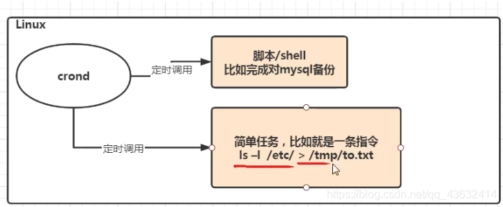

- 快速入门

  - 设置任务调度文件：/etc/crontab

  - 设置个人任务调度。执行crontab -e命令

  - 接着输入任务到调度文件

  - 如：

    ```
    */1 * * * * ls -l /etc/ > /tmp/to.txt
    
    意思说每个小时的每分钟执行  ls -l /etc/ > /tmp/to.txt 命令
    ```

  - 参数细节说明

  - 5个占位符的说明


- 特殊符号说明

  | 特殊符号 | 含义                                                         |
  | -------- | ------------------------------------------------------------ |
  | *        | 代表任何时间。比如第一个 “ * ” 就代表一小时中每分钟都执行一次的意识 |
  | ‘        | 代表不连续的时间。比如“0 8，12，16 *** 命令，就代表在每天的8点0分，12点0分，16点0分都执行一次命令 |
  | -        | 代表连续的时间范围。比如”0 5 * * 1-6 命令“，代表在周一到周六的凌晨5点0分执行命令 |
  | */n      | 代表每隔多久执行一次。比如 ” */10 * * * * 命令" ，代表每隔10分钟就执行一遍命令 |

- 特定时间执行任务案例


```ASN.1
应用实列：
案例1：每隔1分钟，就将当前的日期信息，追加到/tmp/mydate文件中
	crontab -e
		*/1 * * * * data >> /tmp/mydata
	
案例2：每隔2分钟，将当前日期和日历都追加到/home/mycal文件中
	第一步 编辑一个脚本文件
		vim /home/my.sh
				date >> /home/mycal
				cal >> /home/mycal
				
	给my.sh增加执行权限
				
	使用执行:
				./my.sh
				cat mycal 
	第二步：
		crontab -e
				*/1 * * * * /home/my.sh            //满一分钟就调用 my.sh
				
				
案列3：每天凌晨2：00将mysql数据库testdb，备份到文件中，提示：

    指令为mysqldump -u root -p密码 数据库 >> /home/bd.bak
	
	第一步：crontab -e
	第二步：0 2 * * * mysqldump -u root -proot testdb > /home/db.bak
```


## 8.2 at定时任务

- 基本介绍

  - at命令是一次性定时计划任务，at的守护进程atd会以后台模式运行，检查作业队列来运行
  - 默认情况下，**atd守护进程每60秒检查作业队列，有作业时，会检查作业运行时间，如果时间与当前时间匹配，则运行此作业**
  - **at命令是一次性定时任务计划，执行完一个任务后不再执行此任务了**
  - 在使用at命令的时候，**一定要保证atd进程的启动**，可以使用相关指令来查看

  ```linux
  ps -ef | grep xx
  ```

- at命令格式

  ```
  at [选项] [时间]
  ctrl + D 结束at命令输入（两次）
  ```


- at命令选项
  

​		atq 查看任务

- at时间定义的方法


- 相关方法
  - atq命令，来查看系统中没有执行的工作任务
  - atrm 编号 删除已经设置的任务
- 案列
  - 2天后的下午5点  执行/bin/ls /home


+ + 明天17点钟，输出时间到指定文件内 比如/root/date100.log

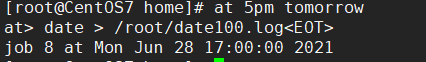

# 九、Linux磁盘分区、挂载

## 9.1Linux分区

- 原理介绍
  - 1. Linux来说无论有几个分区，分给哪一目录使用，它归根结底就只有一个根目录，一个独立且唯一的文件结构，Linux中每个分区都是用来组成整个文件系统的一部分
    2. **Linux采用了一种叫”载入“的处理方法，**它的整个文件系统包含了一整套的目录，且将一个分区和一个目录联系起来。这时要载入的一个分区将使它的存储空间在一个目录下获得


- 硬盘shuo’ming

  - Linux硬盘分IDE硬盘和SCSI硬盘，目前基本上是SCSI硬盘
  - 对于IDE硬盘，驱动驱动标识符为” hdx~ “，其中”hd“表明分区所在的设备类型，这里是指IDE硬盘了。”x“为盘号（a为基本盘，b为基本从属盘，c为辅助主盘，d为辅助从属盘），”~“代表分区，前四个分区用数字1到4表示，他们是主分区和拓展分区；从5开始就是逻辑分区。例，hda3表示为第一个IDE硬盘上的第三个主分区或拓展分区，hdb2表示为第二个IDE硬盘上的第二个主分区或拓展分区
  - **对于SCSI硬盘则标识为”sdx~“**，**SCSI硬盘是用”sd“来表示分区所在设备的类型的，**其余则和IDE硬盘的标识方式一样

- 查看所有的设备挂载情况

  ```
  命令：lsblk  或者 lsblk -f
  ```


- 针对第二张图
  - sda下指得是分区情况
    - FSTYPE 指的是文件类型
  - UUID值得是分区得唯一标识符（40个位）
  - MOUNTPOIN 挂载点

## 9.2挂载的经典案例

以增加一块硬盘为例来熟悉磁盘的相关指令和深入理解磁盘分区、挂载、卸载的概念。

**如何为linux系统增加一块硬盘？**


- 1.虚拟机添加硬盘

  - 在vmware上实现

  

  - 重启虚拟机
  - 重启后的分区情况[外链图片转存失败,源站可能有防盗链机制,建议将图片保存下来直接上传
    

- 2.分区

  - 分区命令

    ```
    fdisk /dev/sdb
    ```

  - (dev（device)这个目录中包含了所有Linux系统中使用的外部设备。但是不是存放外部设备的驱动程序。它实际上是一个访问这些外部设备的端口就。我们可以非常方便的去访问这些外部设备，和访问一个文件，一个目录没有任何区别）

  - **sdb就是再dev下面的**

  

  - 开始对 /sdb分区

  ```
  m	显示命令列表
  p	显示磁盘分区 同 fdisk -l
  n	新增分区
  d	删除分区
  w	写入并退出
  说明：开始分区后输入n，新增分区，然后选者p，分区类型为主分区。两次回车默认剩余全部空间。最后输入w写入分区并退出，若不保存退出输入q
  ```


- 3.格式化

  - 格式化磁盘    // **格式化指定文件类型 之后才能用**
  - 分区命令：

  ```
  mkfs -f ext4 /dev/sdb1    // vext4是分区类型
  ```

- 


- 4.挂载（将一个分区与一个目录联系起来）

  ```
  挂载令： mount 设备名称 挂载目录
  
  卸载命令： umout 设备名称（或者已挂载的目录）
  ```


注意:    用命令行挂载，重启后就会失效

- 5.设置可以自动挂载

  - **永久挂载：通过修改/etc/fstab实现挂载**

  

  - 添加完成后，执行mount -a立即生效


---------


## 9.3磁盘情况查询

- 1. **查看系统整体磁盘**  使用情况

  - 基本语法

  ```
  df -h
  ```

- 应用实例：查询系统整体磁盘使用情况（**使用率到了80以上就不正常了**）


- 2. **查询指定目录**  的磁盘占用情况

  - 基本语法

  ```
  du -h 目录名
  ```

- 查询指定目录的磁盘占用情况，默认为当前目录

  - 选项

```
  -s		指定目录占用大小汇总
  -h		带计量单位
  -a		含文件
  -c 		列出明细的同时，增加汇总值
  
  --max-depth=1 子目录深度
```

- 案例：查询opt目录的磁盘占用情况，深度为1


-------


- 十、LInux网络配置

## 10.1Linux网络配置原理图


## 10.2配置一个指定的ip(不然每次都会变)

- 直接修改配置文件来制定IP，并可以连接到外网（cxy推荐）
- 编辑 vim /etc /sysconfig/network-scripts/ifcfg-ens33
- 修改前


- 要求：将IP地址配置为静态的，比如ip地址为192.168.200.130
- 修改后
  
- ifcfg-ens33文件说明


- 

- 重启网络服务或者重启兄系统生效

  ```
  service network restart
  
  reboot
  ```

- ping指令

```
ping ip(或域名)    （测试连通性） 
ping www.baidu.com
```

## 10.3设置主机名和hosts映射  (配置别名)

- 设置hosts映射

  - windows

  ```
  C:\windows\System32\drivers\etc\hosts 文件指定即可
  ```

  - liunx

  ```
  在/etc/hosts 文件 指定
  ```

- 主机名解析过程分析（hosts、DNS）

  - hosts文件是什么：一个文本文件，用来记录IP和hostname（主机名）的映射关系
  - DNS（Domain Name System，域名系统）：是互联网上作为域名和IP地址相互映射的一个分布式数据库

- 主机名解析机制分析
  应用实例：用户在浏览器输输入了www.baidu.com

  - 1.浏览器先检查浏览器缓存中有没有该域名解析ip地址，有就先调用这个IP完成解析；如果没有，就检查DNS解析器缓存，如果有就直接返回ip完成解析。（这两个缓存可以理解为本地解析器缓存）

    （一般来说，当电脑第一次成功访问某一网站后，在一定的时间内，浏览器或者操作系统会缓存它的ip地址DNS解析记录，如在命令行输入

    ```
    ipconfig /displaydns		//DNS缓存解析
    ipconifg /flushdns			//手动清理dns缓存
    ```

  - 2.如果本地解析器缓存没有找到对应的映射，则检查系统系统中的hosts文件中有没有配置对应的域名ip映射。如果有，则完成解析并返回

  - 3.如果本地DNS解析器缓存和hosts文件中均没有找到对应的ip，则到域名服务DNS进行解析

  - 

# 十一、进程管理(ps)

## 11.1基本

- 在Linux中，**每一个执行的程序都被称为一个进程**。每一个进程都被分配一个ID号（pid，进程号）
  - windows下的pid
  - 


- linux：**top指令**  ==可以看动态监控那章==


- 每个进程都可能以两种方式存在。前台与后台，所谓前台进程就是用户目前屏幕上可以进行操作的。后台进程则是实际在操作，但由于屏幕上无法看到的进程，通常使用后台方式执行。
- 一般系统的服务都是以后台进程的方式存在，而且都会常驻在系统中。直到关机才会结束

## 11.2显示系统执行的进程

- ps    命令是用来查看目前系统中，有哪些正在执行的进程 ，以及他们的执行状况。可以不加任何参数


ps显示的信息选项

| 字段 | 说明                   |
| ---- | ---------------------- |
| PID  | 进程识别号             |
| TTY  | 终端机号               |
| TIME | 此进程所消耗CPU时间    |
| CMD  | 正在执行的命令或进程名 |

```
ps -a:显示当前终端的所有进程信息
ps -u:以用户的格式显示进程信息
ps -x:显示后台进程运行的参数
```

- **执行ps  -aux**


- 参数解释

  - USER：进程执行用户
  - PID：进程号
  - %CPU：当前进程占用cpu的百分比
  - %MEM：占用物理内存的百分比
  - VSZ：进程占用虚拟内存大小（KB）
  - RSS：进程占用的物理内存的大小（KB）
  - TTY：终端名称
  - STAT：**运行状态，S-表示sleep休眠、s-表示该进程是会话的先导进程，N-表示进程拥有比普通优先级更低的优先级，R-表示正在运行，D-短期等待，z-僵尸进程，T-被跟踪或者被停止等等**
  - STARTED：执行的开始时间
  - TIME：占用CPU时间
  - COMMAND：启动进程所用的命令和参数，如果过长会被截断显示


- **ps -ef | grep xxx   是以全格式显示xxx的进程，查看进程的父进程**

  ```
  -e	显示所有的进程
  -f	全格式
  
  BSD风格:
  ps -ef|grep xxx
  ```

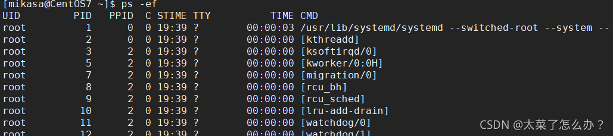

- UID：用户ID

- PID：进程ID

- PPID：父进程ID

- C：cpu用于计算执行优先的因子。数值越大，表明进程是CPU密集型运算，执行优先级会降低；数值越小，表明进程是I/O密集型运算，执行优先级会提高

- STIME：进程启动时间

- TTY：完整的终端名称

- TIME：CPU占用时间

- CMD启动进程所用的命令和参数

- ```
  ps -ef|grep sshd
  ```


sshd进程是1号进程的子进程，9579有是7756的子进程


- **终止进程kill 和 killall**

  - 若是某一个进程执行一半需要停止时，或是已消了很大的系统资源时，此时可以考虑停止该进程。使用kill命令来完成此项任务
  - 基本语法

  ```
  kill -9 进程号		 功能描述：通过进程号杀死进程
  killall 进程名称 	功能描述：通过进程名杀死进程也支持通配符，这在系统因负载过的很慢时很有用
  ```

  - 常用选项：-9 表示强迫进程立即停止

案例: 

1.  **踢掉某个非法登录用户（mikasa）**

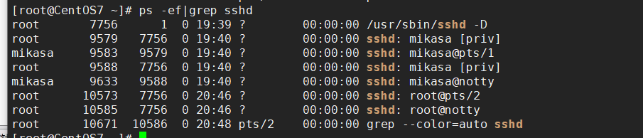

```
ps- ef|grep sshd后可知用户mikasa登录的进程号为9583

kill 进程号
kill 9583

用户mikasa的连接关闭
```


----------------


2. **终止远程登录服务sshd，在适当时候再次重启sshd服务**
   

```
kill 7756
结束远程登录服务sshd后用户无法通过xshell连上Linux虚拟机

启动sshd服务
/bin/systemctl start sshd.service
```

---------------------


3. **终止多个gedit**

```
killall gedit
```

---


4. **强制杀掉一个终端**

```
 ps -aux | grep bash   找出终端的进程号
 
 killall -9 bash对应的进程号
```

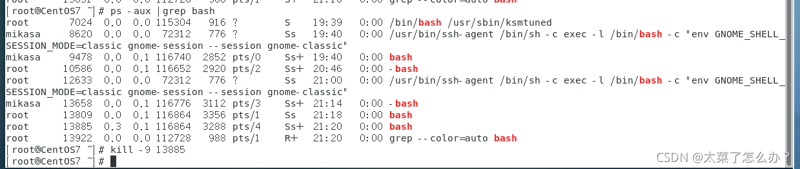

## 11.3查看进程树 pstree

- 基本语法

```
pstree [选项]         可以更加直观的来看进程信息
```

- 常用选项

```
-p	树状形式显示进程的pid
-u	树状形式显示进程的所属用户
```


# 十二、服务（service）管理

**服务（service）本质就是进程，但是时运行在后台的，通常都会监听某个端口，等待其他程序的请求，**比如（mysqld，sshd 防火墙等），因此称为守护进程，是Linux中非常重要的知识点


## 12.1service命令

- **service管理指令**

  ```
  service 服务名 [start| stop| restart| reload | status]
  ```

- **在CentOS7.0后很多服务不再使用service，而是systemctl**

- **service指令管理的服务在 /etc/init.d查看**

- 

- 案例

  使用servce指令，查看，关闭，启动network  不要在xshell中执行，关闭网络后，连接sshd服务会断开连接)


- **查看 服务名：**
  - 方式1：使用setup——>系统服务，就可以看到全部
    - **带*号**的服务  是随着linux的启动 **自动启动**，没有带 *号的都是需要手动启动的
    - 退出按Tab

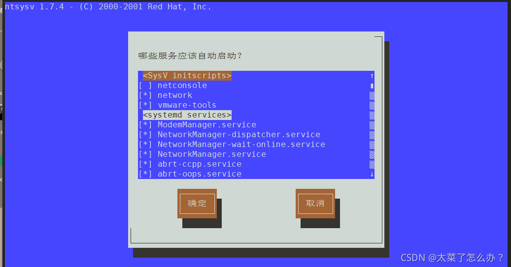

- 方式2：/etc/init.d 看到service指令管理的服务ls -l /etc/init.d
- 扩展：linux很多服务以d结尾的原因:
  - d代表deamon 守护进程
  - Linux的大多数服务就是用守护进程
  - 守护进程是运行在Linux服务器后台的一种服务程序
  - 它周期地执行某种任务或等待处理某些发生的事件
  - 比如：xinetd提供网络服务，sshd提供ssh登录服务，httpd提供web服务

## 12.2服务的运行级别

- linux系统有七种运行级别（runlevel）：

  常用的是级别3和5

  - 运行级别0：系统停机状态，系统默认运行级别不能设为0，否则不能正常启动
  - 运行级别1：单用户工作状态，root权限，用于系统维护，禁止远程登录
  - 运行级别2：多用户状态（没有NFS），不支持网络
  - 运行级别3：完全的多用户状态（有NFS），登录后进入控制台命令行模式
  - 运行级别4：系统未使用，保留
  - 运行级别5：X11控制台，登陆后进入图形GUI模式
  - 运行级别6：系统正常关闭并重启，默认运行级别不能设为6，否则不能正常启动

- 开机的流程说明


- CentOS7运行级别说明

  - 在/etc/initab，进行了简化如下

  ```
  multi-user.target:analogous to runlevel 3
  graphical.target:analogous to runlevel 5
  ```

  - ```
    #to view current default target,run:
    systemctl get-default
    ```

  - ```
    #To set a default target,run:
    systemctl set-default TARGET.target
    ```

## 12.3chkconfig指令(在各个运行级别中)

- 作用:
  - 1.通过chkconfig命令可以**给服务在各个运行级别中的 启动/关闭**
  - 2.chkconfig指令管理的服务在 /etc/init.d查看
  - 注意：CentOS7.0后，很多服务使用systemctl管理
- 基本语法:

```
chkconfig --list | grep xxx				    查看某个服务
// chkconfig 服务名 --list					  查看服务
chkconfig --level 5 服务名 on/off            对服务在各等级下的状态进行控制
```


- 案列

```
对network服务进行操作，把network在3运行级别关闭自启动
chkconfig --level 3 network off
```

- **注意：chkconfig重新设置服务后自启动或关闭，需要重启机器reboot生效**


## 12.4systemctl命令

**CentOS7.0后很多服务不再使用service，而是systemctl**

- **systemctl管理命令**

  ```
  systemctl [start | stop |restart |status ] 服务名   // 临时的
  ```

  - **使用 ls -l  /usr/lib/systemd/system   |  grep xxx  中查看systemctr服务**

  - 比如看防火墙的:

    

- **systemctl设置服务的自启动状态**

  ```linux
  systemctl list-unit-files | grep 服务名  (查看服务开机启动状态)
  
  systemctl enable 服务名			  （设置服务开机启动） // 永久设置
  systemctl disable 服务名 			   (关闭服务开机启动)关闭和开启都是默认的3和5两级别 // 永久设置
  
  systemctl is-enabled 服务名             (查询某个服务是否是自启动的)
  ```

- 案列：

  ```
  ll /usr/lib/systemd/system |grep fire 查找防火墙服务
  
  systemctl list-unit-files | grep firewalld 查看当防火墙的服务状态
  
  systemctl is-enabled firewalld  查看防火墙服务是否是自启的
  
  
  查看当前防火墙的状态，关闭防火墙和重启防火墙
  systemctl status firewalld
  
  停止防火墙
  systemctl stop firewalld
  
  启动防火墙
  systemctl s
  ```


- 细节点

  

  - 关闭或者启动防火墙后，立即生效。[telnet测试 某个端口即可]
  - 这种方式只是临时生效，当重启系统后，还是回归以前对服务的设置
  - **如果设置某个服务自启动或关闭永久生效，要使用systemctl [enable|disable]服务名**


## 12.5打开或者关闭指定端口

在真正的生产环境，往往需要将防火墙打开，但是如果我们把防火墙打开，那么外部请求数据包就不能给服务器监听端口通讯。这时，需要打开指定的端口。比如80，22，8080 

- **firewall指令**

  ==注意:  端口号/协议   通过  netstat -anp | more==

  - 打开端口

  ```
  firewall-cmd --permanent --add-port=端口号/协议        // permanent n.永久
  ```

  - 关闭端口

  ```
  firewall-cmd --permanent --remove-port	=端口号/协议
  ```

  - 无论是关闭还是开启端口都需要重新载入防火墙才能生效

  ```
  firewall-cmd --reload
  ```

  - 查看端口是否开放

  ```
  firewall-cmd --query-port=端口/协议
  ```

- 案例

  - 启用防火墙，测试111端口是否能telnet
  - 开放111端口
    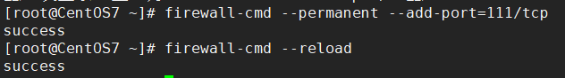
  - 再次关闭111端口
    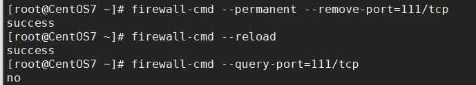


------------


# 十三、动态监控(top)

## 13.1动态监控进程的基本语法

 **top和ps命令很相似**。他们都用来显示正在执行的进程Top和ps最大的不同处在于**top在执行一段时间可以更行正在运行的进程**

- 基本语法

```
top [选项]
```

- 选项说明

| 选项    | 功能                                       | 实例     |
| ------- | ------------------------------------------ | -------- |
| -d 秒数 | 指定top命令每隔几秒更新。默认是3秒         | top -d 5 |
| -i      | 是top不显示任何闲置或者僵死进程            |          |
| -p      | 通过指定监控进程ID来仅仅监控某个进程的状态 |          |

- 
- 僵死进程：进程已经死掉了（进程运行结束），但是内存没有被释放掉。僵死进程需要定时清除！！
  
- 其中cpu使用率和KiB Mem(内存管理）最为重要

## 13.2动态监控进程的交互操作

- 交互操作说明

| 操作 | 功能                            |
| ---- | ------------------------------- |
| P    | 以CPU施一公率排序，默认就是此项 |
| M    | 以内存使用率排序                |
| u    | 输入用户名                      |
| N    | 以PID排序                       |
| q    | 退出top                         |

- 实例

  ```
  案例1.监视特定用户，比如说监控mikasa用户
  top：输入此命令，按回车键，查看执行的进程
  然后输入“u”,回车，在输入用户名，即可
  
  案例2：终止指令的进程
  先输入top指令后，在输入“k“ ，在输入想要终止的进程号
  
  案例3：指定系统状态更新的时间（每隔10秒自动更新）（默认的是3秒）
  top -d 10
  ```


-------------


## 13.3监控网络状态

- **查看系统网络情况netstat**

  - 基本语法

  ```
  netstat [-anp] 
  ```

  - 选项说明

  ```
  -an 按一定顺序排列输出
  -p 显示所在进程
  ```

例子:

使用 netstat -an  :


**增加一个tom用户**


- 检测主机连接命令ping

  - 是一种网络检测工具，它主要是用来检测远程主机是否正常，或是两部主机间的网线或网卡故障

  

# 十四、RPM与YUM

## 14.1rpm包的管理

- 介绍

  - rpm用于互联网下载包的打包及安装工具，它包含在某些LInux分发版中。它生成具有.RPM拓展名的文件。RPM是RedHat Package Manager （RedHat软件包管理工具）的缩写，类似windows的setup.ext，这一文件格式名称虽然打上了RedHat的标志，但理念是通用的。
  - Linux的分发版都有采用（suse，redhat，centos等），可以说是公用的行业标准。

- rpm包的简单查询指令

  - rpm -qa 查询所安装的所rpm包软件包

  ```
  rpm -qa | more
  rpm -qa | grep xxx(如：rpm -qa | grep firefox)
  
  查看当前系统是否安装firefoxrpm -qa | grep firefox
  ```

  

  - rpm包名基本格式

  ```
  一个rpm包名：firefox-60.2.2-1.el7.centos.x86_64
  名称：firefox
  版本号：60.2.2-1
  适用操作系统：el7.centos.x86_64     表示centos7.x的64位系统
  （如果似乎i686、i386表示32位系统，noarch表示通用）
  ```

- rpm包的其它查询指令

  - rpm -q 软件包名 查询软件包信息

  ```
  rpm -q firefox
  ```

  - rpm -qi 软件包名 查询软件包信息

  ```
  rpm -qi firefox
  ```


   + rpm -ql 软件包名 查询软件包中的文件


+ + rpm -qf 文件全路径名 查询文件所属的软件包

```
rpm -af /etd/shadow
```


- 安装rpm包

  - 基本语法

  ```
  rpm -ivh RPM包全路径名称
  
  rpm -ivh /opt/firefox      (tab补全再回车)
  ```

  - 参数说明

  ```
  i=install   安装
  v=verbose   提示
  h=hash      进度条
  ```

- 卸载rpm包

  - 基本语法

  ```
  rpm -e RPM包的名称     //erass
  
  rpm -e firefox       删除firefox 软件包
  ```

  - 注意

    - 如果其它软件包依赖于要卸载的软件包，卸载时则会产生错误的信息
    - 如果必须要删除这个软件包，可以增加参数 --nodeps，就可以强制删除，但是一般不推荐这么做，因为依赖于该软件包的程序可能无法运行

    ```
    rpm -e --nodeps 软件包名
    ```

## 14.2yum

- ***介绍***：Yum是一个Shell前端软件包管理器。基于RPM包管理，**能够从指定的服务器自动下载RPM包并安装**. **相当于应用商店**，可以自动处理依赖关系，并且一次安装所有依赖的软件包

- **yum的基本指令**

  ```
  查询yum服务器是否有需要安装的软件（软件列表）
  yum list|grep xx
  
  安装指定的yum包（下载安装)
  yum install xxx 
  ```

- 实列：使用yum的方式安装firefox

  ```
  rpm -e firefox              先卸载centos中的firefox
  yum list | grep firefox		 查询firefox的软件
  yum install firefox			下载！
  ```

注意:   opt是放软件包的

##  14.3配置软件源（选择网速快的服务器)

自行百度

--------


# 十五、 linux  g++

**文件其实就是普通的纯文本文件。 在文本和可执行程序之间，g++做所谓的编译。**

g++就是将包含了代码的文本文件编译（预处理、编译、汇编、链接）成可执行的文件。

==比如:==

你写了一段代码(名为a.cpp)，可以用任意文本编辑软件来写，不需要是IDE。

```c++
#include <iostream>
using namespace std; 
int main() 
{    
    cout<< "Hello, World!" << endl;    
    return 0; 
}
```

下面我们开始编译程序，会经历4个步骤。

预处理

第一步，预处理， **以#开头的行都将被预处理器当做预处理命令来解释**，比如#include包含头文件，在这一步就会将系统或本地的头文件插入的当前文本中。如果 #define 定义的宏则这这一步做展开（直接替换）

```
g++ -E a.cpp
```


编译

第二步，编译,  **就是把文本中的代码转成汇编代码。**

```
g++ -S a.cpp
```

会生成一个a  .s文件，里面是汇编代码，这一步还是文本文件。


汇编

第三步，汇编，**就是把汇编代码转成目标文件的格式**

```
g++ -c a.cpp
```

会生成一个a  .o文件，这一步开始已经是二进制文件了。但还不是可执行文件。


链接

第四步，链接，**就是把上一步的目标文件转成可执行文件。**

默认生成的可执行文件名称就是  a.out （默认可执行文件都叫是a.out)

-------------


**例子:**


预编译，宏替换，头文件加载：

```c++
g++ -E test.cpp test.h -o test.i   //  -o test.i  输出成什么文件
```


编译，生成汇编代码：


汇编，生成机器码：


汇编+链接，生成可执行文件：


 

---------------

[(28条消息) g++编译详解_三级狗的博客-CSDN博客_g++编译](https://blog.csdn.net/Three_dog/article/details/103688043)


# 十六、 shell脚本

Shell是一个命令行解释器，它为用户提供了一个向Linux内核发送请求以便运行程序的界面系统级程序，用户可以用Shell来启动、挂起、停止甚至是编写一些程序。看一个示意图


## 16.1 shell脚本的执行方式

+ 脚本格式要求

  ​	1. 脚本以#!/bin/bash开头

​			 2. 脚本需要有可执行权限

编写第一个Shell脚本
需求说明:创建一个Shell脚本，输出hello world!

```sh
#!/bin/bash
echo "hello, world~"
```

+ 脚本的常用执行方式
  方式1   (./脚本)
  说明:首先要赋予helloworld.sh脚本的 加上 可执行权限，再执行脚本

  比如: ./hell.sh


​		方式2  (sh + 脚本)
​		说明:不用赋予脚本+x权限，直接执行即可。


------------

## 16.2 shell变量

+ **Shell变量介绍**

  1. Linux Shell中的变量分为，系统变量和用户自定义变量

  2. 系统变量: 

     ```
     $HOME、$PWD、$SHELL、$USER等等，
     比如:echo $HOME 等等.
     ```

  3. 显示当前shell中所有变量:  set


+ **shell变量的定义**
  基本语法

  1. 定义变量:   变量名=值  (==不能有空格==), **不用声明数据类型**

     ```shell
     #!/bin/bash
     a=100
     echo "a=$a"
     
     结果:
     a=100
     ```

  2. 撤销变量:    unset变量

     ```shell
     #!/bin/bash
     a=100
     echo "a=$a"
     
     unset a
     echo "a=$a"
     
     结果:
     a=100
     a=
     ```
  
  3. 声明静态变量:  readonly 变量.   注意:不能对静态变量 unset

     ```shell
     readonly b=2
     unset b
     ```
  
     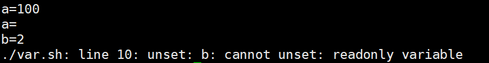
  
+ **shell变量的使用**

  ```shell
  语法:  $变量名
  ```

  个人喜欢加" " 并且一般是字符串都加上 ""

  ```shell
  echo "a=$a"
  ```

  

+ **定义变量规范**

  1. 变量名称可以由字母、数字和下划线组成，但是不**能以数字开头**。5A=200(×)

  2. 等号两侧不能有空格

  3. **变量名称一般习惯为大写**，这是一个规范

     

## 16.3 **将linux命令的结果赋值变量**

  ```shell
  A=`date`    反引号，运行里面的命令，并把结果返回给变量A
  A=$(date)   等价于反引号  // 推荐
  ```

​    

~~~shell
```shell
#!/bin/bash

c=`date`
D=$(date)

echo "C=$c"
echo "D=$D" 
      
结果:
C=Thu Aug 11 01:06:53 PDT 2022
D=Thu Aug 11 01:06:53 PDT 2022
```
~~~

```shell
DATETIME=$ (date "+%Y-%m-%d %H:%M:%S")
```


## 16.4 设置环境变量

●基本语法

1. export变量名=变量值（功能描述:将shell变量输出为环境变量/全局变量)

2. **source  配置文件**
   (功能描述:让修改后的配置信息立即生效)

3. echo $变量名
   (功能描述:查询环境变量的值)

+ 使用

  1. **在vim  /etc/profile文件中定义TOMCAT_HOME环境变量·**

     

     

  2. 查看环境变量TOMCAT_HOME的

     ```
     终端中 
     echo $TOMCAT_HOME
     ```

  3. 在shell程序中使用TOMCAT_HOME

     ```shell
     脚本
     echo "tomcat_home=$TOMCAT_HOME"
     ```

注意: 在输出TOMCAT_HOME 环境变量前，需要让其生效source /etc/profile


## 16.5 注释

单行注释

```shell
#案例1:计算(2+3)X4的值
```

多行注释

```shell
:<<!
c=`date`
D=$(date) 
echo "C=$c"
echo "D=$D" 
!
```


## 16.6 位置参数变量

+ 介绍
  当我们执行一个shell脚本时，如果希望获取到命令行的参数信息，就可以使用到位置参数变量

+ 基本语法

  ```shell
  $n
  （功能描述:n为数字，$0代表命令本身，$1-$9代表第一到第九个参数，十以上的参数，十以上的参数需要用大括号包含，如${10})
  
  $*（功能描述:这个变量代表命令行中所有的参数，$*把所有的参数看成一个整体)
  
  $@（功能描述:这个变量也代表命令行中所有的参数，不过$@把每个参数区分对待)
  
  $#(功能描述:这个变量代表命令行中所有参数的个数)
  ```

  ●位置参数变量
  案例:编写一个shell脚本position.sh，在脚本中获取到命令行的各个参数信息

案例: 

./myshell.sh 100 200，这个就是一个执行SnelI命令，可以在myshell脚本中获取到参数的信息

```shell
#!/bin/bash

echo "$0 $1 $2"
echo "所有的参数=$*"
echo "$@"
echo "参数的个数=$#"


效果:
[root@localhost shcode]# ./myshell.sh 
./myshell.sh  
所有的参数=
参数的个数=0

[root@localhost shcode]# ./myshell.sh 100 200
./myshell.sh 100 200
所有的参数=100 200
100 200
参数的个数=2
```


## 16.7 预定义变量

+ 基本介绍
  就是shell设计者事先已经定义好的变量，可以直接在shell脚本中使用

+ 基本语法

  ```shell
  $$（功能描述:  当前进程的进程号(PID))
  
  $!（功能描述:  后台运行的最后一个进程的进程号（PID))
  
  $?（功能描述:  最后一次执行的命令的返回状态。如果这个变量的值为0，证明上一个命令正确执行;
               如果这个变量的值为非0(具体是哪个数，由命令自己来决定），则证明上一个命令执行不正确了。)
               if [ "$?" = "0" ]
  ```

  

+ 案例 : 
  在一个shell脚本中简单使用一下预定义变量preVar.sh

·

------------


## 16.8 运算符

+ 基本介绍
  在shell中进行各种运算操作

+ 基本语法

  ```shell
  1. “$[运算式]”
      或者“$((运算式))”
      
  或者 `expr m \* n`        
   . expression表达式  注意expr运算符间要有空格
   . expr中的  \*乘  /除  %取余
  ```

  案例1:   计算(2+3)X4的值

  

  

  案例2∶  请求出命令行的两个参数[整数]的和

  

  


## 16.9  条件判断

+ 基本语法
  **if [ condition ]**     注意condition**前后必须要有空格**
  #空返回true,可使用  $?  验证   (0为true ,   >1为false)

  ```shell
  if [ "ok" = "ok"]
  then 
  		echo "equal"
  fi
  ```

  √应用实例
  if  [ hspEdu ]   返回true
  if [  ]    返回false
  if  [condition ] && echo OK || echo notok
  条件满足，执行后面的语句

+ 判断语句

  ```shell
  1)  = 字符串比较
  
  2)  两个整数的比较
  -lt 小于
  -le 小于等于
  
  -eq 等于
  -ne 不等于
  
  -gt 大于
  -ge 大于等于
  
  3)  按照文件权限进行判断
  -r 有读的权限
  -w 有写的权限
  -x 有执行的权限
  
  4)按照文件类型进行判断
  -f "文件路径"   //文件存在并且是一个常规的文件
  -e "文件路径"   //文件存在
  -d "文件路径"   //文件存在并是一个目录
  ! -d "文件路径"  // 文件存在并是一个目录不存在
  ```

  

+ 案例
  案例1: "ok"是否等于"ok"

  判断语句:   =

  

  

  案例2:  23是否大于等于 22
  判断语句:  -ge

  

  

  案例3 :   /root/shcode/aaa.txt目录中的文件是否存在
  判断语句:  -f

  ```shell
  if [ -f  "/root/shcode/aaa.txt" ] 
  then   
  		echo "存在" 
  else   
  		echo "不存在" 
  fi
  ```

  

## 16.10 流程控制

+ **1.  if 语法**

  **多分支语法 : **

  ```shell
  if [ "ok" = "ok"]
  then 
  		echo "equal"
  elif  [ "o" = "o"]
  then 
  		echo "equal"
  fi
  ```

  ```shell
  if  (( $a >= $b ))
  then
     echo "a 等于 b"
  elif (( $a < $b ))
  then
     echo "a 小于 b"
  else
     echo "没有符合的条件"
  fi
  ```

  注意事项:[条件判断式]，中括号和条件判断式之间必须有空格√应用实例ifCase.sh

+ **案例:**

  请编写一个shell程序，如果输入的参数，大于等于60，则输出"及格了"，如果小于60,则输出“不及格"

  

  

+ **2.  case语句**

**语法  : **

```shell
#!/bin/bash

case $1 in
"1")
echo "周一"
;;
"2")
echo "周二"
;;
*)
echo "other"
;;
esac
```

效果:


## 16.11 for循环

+ 基本语法1

  ```shell
  for 变量  in 值1值2值3….
  do
  程序/代码
  done
  ```

  应用实例testFor1.sh

  案例: 打印命令行输入的参数

  ```shell
  !bin/bash
  
  # $* 是把终端参数当成一个整体   
  # $@ 是把终端参数会区分的  
  for i in "$*" # 用$@ 或者 不加双引号就是一个一个依次输出了              
  do
          echo "num is $i"
  done
  
  #效果:
  # 用"$*"
  [root@localhost shcode]# sh testFor.sh 10 20 30
  num is 10 20 30
  
  # 用$@ 不加双引号就是一个一个依次输出了
  [root@localhost shcode]# sh testFor.sh 10 20 30
  num is 10
  num is 20
  num is 30
  ```

  

+ 基本语法2

  ```shell
  for ((初始值;循环控制条件;变量变化))   
  do
  程序/代码
  done
  ```

  应用实例testFor2.sh
  案例:  从1加到100的值输出显示

  ```shell
  #!bin/bash
  
  SUM=0
  for ((i = 1; i <= 100; i++))
  do
          SUM=$[$SUM+$i]
  done      
  echo "总和=$SUM"        
  
  #效果:
  [root@localhost shcode]# sh testFor.sh 
  总和=5050
  ```


## 16.12 while循环

+ 基本语法1

  ```shell
  while[ 条件判断式 ]  #while和 [ ] 有空格，条件判断式和[]也有空格
  do
  程序/代码
  done
  ```

  **注意:  while和 [ ] 有空格，条件判断式和[]也有空格**

  

案例1:

从命令行输入一个数n，统计从1+x+n的值是多少

```shell
#!/bin/bash

SUN=0
i=0

while [ $i -le $1 ]
do
        SUM=$[$SUM+$i]
        i=$[$i+1]
done

echo $SUM                
```


## 16.13 read获取输入

+ 基本语法

  ```shell
  read(选项)(参数)
  ```

选项:

-p:   指定读取值时的提示符;
-t:   指定读取值时等待的时间(秒），超出指定的时间内输入，就不再等待

参数:
变量:  指定读取值的变量名


案例:
案例1: 读取控制台输入一个NUM1值

```shell
#!/bin/bash

read -p "请输入一个数=" NUM1
echo "$NUM1"

#结果:
请输入一个数=22
22
```


案例2: 读取控制台输入一个num值，在10秒内输入。

```shell
v#!/bin/bash

read -t 10 -p "请输入第二个数" NUM2
echo "$NUM2"       

#结果:
请输入第二个数=22
22
```


读取文件

一、按行读取文件

方法一：**while循环中执行效率最高，最常用的方法。**

```bash
#!/bin/bash


while read line


do


echo $line


done < filename(待读取的文件)
```

**方法2 ： 重定向法；管道法: cat $FILENAME | while read LINE** 

```bash
#!/bin/bash


cat filename(待读取的文件) | while read line


do


echo $line


done
```

**方法3； for 循环**

```bash
#!/bin/bash


for line in `cat filename(待读取的文件)`


do


echo $line


done
```

 二、 读取特定行的内容

**1. sed用法，读取某一行内容**

```bash
#!/bin/bash


 


#sed用法 sed -n 'xp' data.txt


#读取第一行数据


 


sed -n '1p' data.txt
```

**2. sed用法，读取文件X行到Y行的内容**

```bash
#!/bin/bash


 


# 获取data.txt 第10-18行内容


sed -n '10,18p' data.txt
```

**3. tail用法，读取文件末尾的数据。**

```bash
#!/bin/bash


 


# 获取文件最后3行数据


tail -n -3 data.txt


 


# 获取文件第3行到最后一行数据


tail -n +3 data.txt
```

**4. head用法，读取文本的前n行数据**

```bash
#!/bin/bash


 


# 获取文本前10行数据


head -n 10 data.txt
```

**5. tail和head的结合使用**

```bash
#!/bin/bash


 


# 获取文本倒数第二行数据,结果如图所示


tail -n 2 data.txt | head -n 1
```

**6. awk用法，awk在文本处理方面有着强大的功能，配合脚本使用，可以打印指定行和列。**

```bash
#!/bin/bash


 


# NR指定行号


awk 'NR==18{print}' data.txt
```

 


## 16.14 函数

+ 函数介绍
  shell编程和其它编程语言一样，有系统函数，也可以自定义函数。

+ 系统函数
  **basename基本语法**
  功能:   返回完整路径最后/  的部分，**常用于获取文件名**

  ```shell
  basename [pathname] [suffix]
  
  basename [string] [suffix]（功能描述:basename命令会删掉所有的前缀包括最后一个(‘T)字符，然后将字符串显示出来。
  ```

  选项:
  suffix为后缀，如果suffix被指定了,  basename会将pathname或string中的suffix去掉。

  **dirname基本语法**

  功能:   返回文件名前路径 的部分

  

案例;

案例1:   请返回/home/aaa/test.txt   的"test.txt"部分

basename

```shell
[root@localhost shcode]# basename /home/aaa/test.txt 
test.txt
  
[root@localhost shcode]# basename /home/aaa/test.txt .txt
test
```


dirname

```shell
[root@localhost shcode]# dirname /home/aaa/test.txt 
/home/aaa

[root@localhost shcode]# dirname /home/aaa/bbb/test.txt 
/home/aaa/bbb
```


注意:   这两个函数经常使用在脚本文件里，得到一般是全路径，需要用这两个函数做处理


## 16.15 自定义函数

+ 基本语法

  ```shell
  function funname()
  {
  	程序/代码
  }
  ```

调用直接写函数名:   funname 值1  值2


案例:

案例1:   计算辅入两个参数的和，getSum


```shell
#定义函数 getSum
function getSum() 
{
	SUM=$[$n1+$n2]
	echo “和是=$SUM"
}

#输入两个值
read -p “请输入一个数" n1
read -p “请输入一个数" n2

#调用自定义函数
getSum $nl $n2
```

结果:


--------


## 16.16 综合案例

Shell编程综合案例

1. 每天凌晨2:30备份;

2. 备份开始和备份结束能够给出相应的提示信息

3. 备份后的文件要求以备份时间为文件名，并打包成.tar.gz的形式，比如:2021-03-12_230201.tar.gz

4. 在备份的同时，检查是否有10天前备份的数据库文件，如果有就将其删除。


```shell
BACKUP="/data/backup/db"

BATETIME=$(date "+%Y-%m-%d_%H%M%S")
echo "$BATETIME"

DATA="数据库"

if [ ! -d "$BACKUP/$BATETIME" ]
then
        mkdir -p "$BACKUP/$BATETIME"
fi

echo "$DATA" | gzip > "$BACKUP/$BATETIME/$BATETIME.gz"

#将文件处理成 tar.gz
cd "$BACKUP"
tar -czvf "$BATETIME.tar.gz" "$BATETIME"

#删除对应的多余文件
rm -rf "$BATETIME"

#删除10天前的文件
find "$BACKUP" -atime +10 -name "*.tar.gz" -exec -rf {} \;
echo "操作成功"
"test.sh" 26L, 474C        
```

设置crond任务调度(定时任务)

```
crontab -e
0 2 * * * /root/shcode/test.sh
```


效果:


-------------


# 十七、 日志管理

## 17.1 基本介绍

1. 日志文件是重要的系统信息文件，其中记录了许多重要的系统事件，包括用户的登录信息、系统的
   启动信息、系统的安全信息、邮件相关信息、各种服务相关信息等。  
2.  日志对于安全来说也很重要，它记录了系统每天发生的各种事情，通过日志来检查错误发生的原因，
   或者受到攻击时攻击者留下的痕迹。 
3. 可以这样理解日志是用来记录重大事件的工具

**/var/log/目录就是系统日志文件的保存位置**

==**进入 cd /var/log/ 可以查看日志**==


| **日志文件**          | **说 明**                                                    |
| --------------------- | ------------------------------------------------------------ |
| **/var/log/cron**     | **记录与系统定时任务相关的曰志**                             |
| /var/log/cups/        | 记录打印信息的曰志                                           |
| /var/log/dmesg        | 记录了系统在开机时内核自检的信总。也可以使用dmesg命令直接查看内核自检信息 |
| /var/log/btmp         | 记录错误登陆的日志。这个文件是二进制文件，不能直接用Vi查看，而要使用lastb命令查看。命令如下： [root@localhost log]#lastb root tty1 Tue Jun 4 22:38 - 22:38 (00:00) #有人在6月4 日 22:38便用root用户在本地终端 1 登陆错误 |
| **/var/log/lasllog**  | 记录系统中所有用户最后一次的登录时间的曰志。这个文件也是二进制文件.不能直接用Vi 查看。而要使用lastlog命令查看 |
| **/var/Iog/mailog**   | 记录邮件信息的曰志                                           |
| **/var/log/messages** | 它是核心系统日志文件，其中包含了系统启动时的引导信息，以及系统运行时的其他状态消息。I/O 错误、网络错误和其他系统错误都会记录到此文件中。其他信息，比如某个人的身份切换为 root，已经用户自定义安装软件的日志，也会在这里列出。 |
| **/var/log/secure**   | 记录验证和授权方面的倍息，只要涉及账户和密码的程序都会记录，比如系统的登录、ssh的登录、su切换用户，sudo授权，甚至添加用户和修改用户密码都会记录在这个日志文件中 |
| /var/log/wtmp         | 永久记录所有用户的登陆、注销信息，同时记录系统的后动、重启、关机事件。同样，这个文件也是二进制文件.不能直接用Vi查看，而要使用last命令查看 |
| **/var/tun/ulmp**     | 记录当前已经登录的用户的信息。这个文件会随着用户的登录和注销而不断变化，只记录当前登录用户的信息。同样，这个文件不能直接用Vi查看，而要使用w、who、users等命令查看 |

 


## 17.2 日志管理服务

**日志管理服务  rsyslogd**
CentOS7.6日志服务是rsyslogd , CentOS6.x日志服务是syslogd 。 rsyslogd功能更强大。rsyslogd 的使用、日志文件的格式，和syslogd服务兼容的。

原理示意图


+ 查询Linux 中的rsyslogd 服务是否启动
  ps aux | grep "rsyslog" | grep -v "grep"
+ 查询rsyslogd 服务的自启动状态
  systemctl list-unit-files | grep rsyslog


**配置文件:  /etc/rsyslog.conf**
日志级别分为:
debug     ##有调试信息的，日志通信最多
info         ##—般信息日志，最常用
notice     ##最具有重要性的普通条件的信息
warning   ##警告级别
err          ##错误级别，阻止某个功能或者模块不能正常工作的信息
crit         ##严重级别，阻止整个系统或者整个软件不能正常工作的信息
alert       ##需要立刻修改的信息
emerg    ##内核崩溃等重要信息
none      ##什么都不记录
注意:从上到下，级别从低到高，记录信息越来越少


**由日志服务rsyslogd记录的日志文件，日志文件的格式包含以下4列:**基本日志格式包含以下四列：

**（1）** 事件产生的时间
**（2）** 发生事件的服务器的主机名
**（3）** 产生事件的服务名或程序名
**（4）** 事件的具体信息

日志如何查看实例
查看一下/ar/log/secure日志，这个日志中记录的是用户验证和授权方面的信息来分析如何查看Nov 12 12:18:26  


##  17.3 自定义日志服务

在/etc/rsyslog.conf 中添加一个日志文件/var/log/hsp.log,当有事件发送时(比如sshd服务相关事件)，该文件会接收到信息并保存。演示重启，登录的情况，看看是否有日志保存

1. vim /etc/rsyslog.conf  进入日志管理服务
2. 
3. 重启服务 systemctl restart rsyslog.service
3. 进入 cd /var/log/   使用  cat hsp.log  查看自定义的日志

# 十八、CURL 使用

[在线Curl工具](https://www.gptkong.com/tools/curl_helper)

使用


**例子**


# 十九 其他常用

## tail指令

```shell
cd /var/log/xiaoduo/squirrel
tail -f sdk-tb-api.err.log | grep sdk-tb-api-gray
  # 定位存在created_at_from的日志
```


# 脚本

```
#!/bin/bash

# 定义一个函数来检查 VPN 是否连接
check_vpn_status() {
  # 检查 sshuttle 是否仍然在运行
  if pgrep -f "sshuttle" > /dev/null; then
    return 0  # 表示 vpn 连接正常
  fi

  # 检查 sshuttle 是否有异常退出的日志
  if tail -n 100 /path/to/sshuttle.log | grep -q "vpn(sshuttle) finished"; then
    return 1  # 表示 vpn 连接丢失，且日志中有错误
  fi

  return 1  # 如果进程不存在且没有日志，认为连接丢失
}

# 定义重新连接 VPN 的函数
reconnect_vpn() {
  echo "VPN 连接丢失，正在重新连接..."
  # 运行连接命令
  sudo ktctl -d --namespace=dev-lane connect --method=vpn
}

# 增加文件描述符限制，避免 inotify 错误
ulimit -n 10000

# 定义一个循环，持续监控 VPN 连接
while true; do
  if check_vpn_status; then
    echo "VPN 连接正常"
  else
    reconnect_vpn
  fi
  # 每分钟检查一次连接状态
  sleep 60
done

```

1. **给予执行权限**：

   ```
   chmod +x vpn_reconnect.sh
   ```

2. **运行脚本**：使用 `nohup` 或在后台运行该脚本，让它在你关闭终端后仍然保持运行：

   ```
   nohup ./vpn_reconnect.sh &
   ```

### 如何查看日志输出

由于脚本的输出会被重定向到 `nohup.out` 文件，你可以查看该文件以获取脚本的运行日志：

```
tail -f nohup.out
```

这样，你可以实时查看脚本的输出日志。如果你想查看日志的全部内容，可以使用以下命令：

```
cat nohup.out
```


###  **保持 WSL 在后台运行**

WSL 是一种通过 Windows 提供的子系统运行 Linux 环境，某些情况下，当 Windows 系统进入休眠或锁屏状态时，WSL 可能会被暂停或停止运行。因此，你可能需要确保 WSL 中的 VPN 脚本能够在系统锁定或屏幕关闭时持续运行。

- 解决方案

  ：

  - 你可以使用 `tmux` 或 `screen` 来保持脚本在后台运行，这样即使你退出当前的 WSL 终端或锁定系统，脚本也能继续运行。

    在 WSL 中运行 `tmux`：

    ```
    bashCopy Codetmux new-session -d -s vpn-monitor '/path/to/your-script.sh'
    ```

    这样脚本将会在一个新的 `tmux` 会话中运行，即使你退出或锁定系统，它也会继续执行。


### 1. 创建清理日志的脚本

首先，您需要编写一个脚本来清理 `/var/log/xiaoduo` 目录中的日志文件。

1. 打开终端，使用您喜欢的文本编辑器创建一个清理日志的脚本文件。例如使用 `nano` 编辑器：

```
bashCopy Codenano ~/clean_xiaoduo_logs.sh
```

1. 在脚本中编写如下内容来删除日志文件。假设您只想删除 `.log` 后缀的日志文件：

```
bashCopy Code#!/bin/bash

# 目录路径
LOG_DIR="/var/log/xiaoduo"

# 删除所有 .log 文件（可根据需要修改删除条件）
find $LOG_DIR -name "*.log" -type f -exec rm -f {} \;

# 如果您想保留最近的文件或按照其他规则删除，可以使用 find 的其他选项，例如：
# find $LOG_DIR -name "*.log" -type f -mtime +7 -exec rm -f {} \;  # 删除7天前的日志文件
```

1. 保存文件并退出编辑器（如果使用 `nano`，按 `Ctrl+X`，然后按 `Y` 确认保存）。
2. 为脚本文件设置可执行权限：

### 2. 设置定时任务

接下来，您需要设置一个定时任务来定期运行该脚本。可以使用 `cron` 来实现这一点。

1. 使用 `crontab` 编辑定时任务：

```
bashCopy Codecrontab -e
```

1. 在打开的 `crontab` 文件中，添加以下内容以每天定时清理日志。假设您希望每天凌晨 1 点执行该清理脚本：

```
bashCopy Code0 1 * * * /bin/bash /home/yourusername/clean_xiaoduo_logs.sh
```

这里的 `0 1 * * *` 表示每天的凌晨 1 点执行该任务。根据您的需要，可以调整这个时间。

1. 保存并退出编辑器。

### 3. 验证 `cron` 服务是否在运行

在 WSL 中，默认情况下 `cron` 服务可能不会自动启动。您可以手动启动 `cron` 服务，确保定时任务能够按时执行。

1. 启动 `cron` 服务：

```
bashCopy Codesudo service cron start
```

1. 如果您希望 `cron` 服务在每次启动时自动启动，可以使用以下命令：

```
bashCopy Codesudo service cron enable
```

### 4. 测试脚本和定时任务

1. 手动运行脚本以确保其正确工作：

```
bashCopy Code~/clean_xiaoduo_logs.sh
```

1. 检查日志目录 `/var/log/xiaoduo`，确认文件已被删除。
2. 查看 `cron` 日志确认任务是否按时执行：

```
bashCopy Codegrep CRON /var/log/syslog
```

通过上述步骤，您已经设置了一个定时任务来定期清理 `/var/log/xiaoduo` 中的日志文件。如果有更多定制需求，可


## 查看日志

```sh
要在命令行中使用 tail -f 和 grep 同时高亮显示匹配的内容，你可以利用 grep 的 --color=auto 选项来实现高亮显示。

例如，使用以下命令来跟踪日志并高亮显示包含 "finish dy sync task" 的行：

bash
tail -f goods-center-allsync-worker.app.log | grep --color=auto "finish dy sync task"
解释：
tail -f goods-center-allsync-worker.app.log：实时输出 goods-center-allsync-worker.app.log 文件的内容。
grep --color=auto "finish dy sync task"：grep 会高亮显示匹配到的 "finish dy sync task" 字符串。
如果你的终端支持颜色，--color=auto 会使 grep 高亮显示匹配的部分。
```

