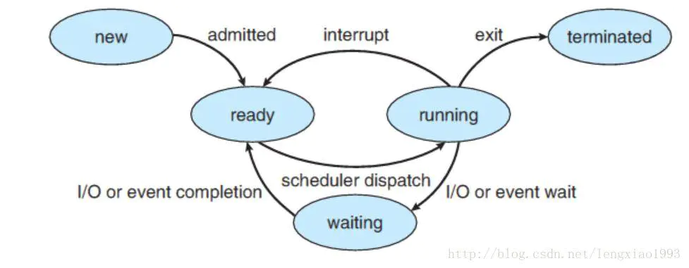
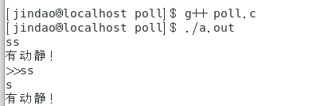
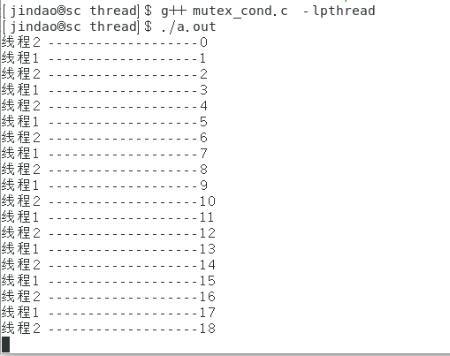

# Makefile与GCC

C语言的源程序文件*.c编译工具  gcc
C++语言的源程序文件*.cpp 编译工具  g++

## GCC

```shell
程序从源代码到可执行程序中间经历哪些步骤︰
1. 预处理︰预处理指合 执行宏展开
    #if 0
    #else
    #endif
    
    gcc -E test.C
	gcc -E test.C>test.txt
	
2. 预编译∶
3. 编译:
  作用:语法检查程序优化生成目标程序.O 二进制文件
	仅编译(人看不懂的)
	gcc -c test.c -o test.o
    编译成汇编
    gcc -S test.c -o test.s

4. 链接∶
  作用:多个目标程序包括库链接成一个可执行程序文件
    gcc test.o -o test.exe
```

**多文档编译：**

```
多文档编译∶
	每个部分  声明在.h中   定义在.c中
        main.c
        add.c add.h
        sub.c sub.h
        cheng.c cheng.h

	分开编译
        gcc -c main.c   生成 main.o
        gcc -c add.c    生成 add.o
        gcc -c sub.c    生成 sub.o
        gcc -c cheng.c  生成 cheng.o
	一起链接
		gcc main.o add.o sub.o cheng.o
		生成可执行程序默认a.out
```

## Makefile

方式1:

```makefile
#注释
#目标  依赖
math.exe: main.o add.o sub.o cheng.o
	gcc main.o add.o sub.o cheng.o -o math.exe
main.o: main.c
	gcc -c main.c -o main.o
add.o: add.c
	gcc -c add.c -o add.o
sub.o:sub.c
	gcc -c sub.c -o sub.o
cheng.o:cheng.c
	gcc -c cheng.c -o cheng.o
clean:
	rm -f *.o math,exe
```

执行可执行程序: make

删除可执行程序 : make clean

方式2:

```
$@ 目标
$< 代表依赖
```

```makefile
#注释
#目标  依赖
math.exe: main.o add.o sub.o cheng.o
	gcc *.o -o $@
%.o:%.c
	gcc -c $< -o $@
clean:
	rm -f *.o math,exe
```


# 文件复制

```c
#include <stdio.h>
#include <unistd.h>
#include <stdlib.h>

int main(int argc, char* argv[])
{
	char buff[256] = {0};
	sprintf(buff, "cp %s %s", argv[1], argv[2]);
	printf("%s\n", buff);
	system(buff);  // 执行命令
	return 0;
}
```


# 文件操作

## io文件操作

### **写文件**

```c
#include <stdio.h>
#include <fcntl.h>
#include <unistd.h> //close()

typedef struct
{
	int id;
	char name[20];
	int age;
	double grade;
}student;

int main(void)
{
	int fd = open("1.txt", O_WRONLY);
	if (-1 == fd)
	{
		int fd = open("1.txt", O_CREAT | O_WRONLY, 0666);
		if (-1 == fd)
		{
			printf("创建文件失败\n");
			return -1;
		}
		printf("创建文件成功\n");
	}
	printf("打开文件成功\n");

	student stu[5] = {
		{1,"关羽",50,66.66},
		{2,"张飞",48,12.22},
		{3,"赵云",35,55.55},
		{4,"马超",30,44.44},
		{5,"黄忠",66,88.8},
	};

	write(fd, stu, sizeof(student) * 5);  // 写入

	close(fd);
	return 0;
}
```

### **读文件**

```c
#include <stdio.h>
#include <fcntl.h>
#include <unistd.h> //close()

typedef struct
{
	int id;
	char name[20];
	int age;
	double grade;
}student;

int main(void)
{
	int fd = open("1.txt", O_RDONLY);
	if (-1 == fd)
	{
		printf("打开文件失败\n");
		return -1;
	}
	printf("文件打开成功\n");
	student s;
	for (int i = 0; i < 5; i++)
	{
		read(fd, &s, sizeof(student));
		printf("id:%d, name:%s, age:%d, grade:%g\n",
			s.id, s.name, s.age, s.grade);
	}

	close(fd);
	return 0;
}
```


## 文件映射虚拟内存

### 文件映射虚拟内存编程模型

1. 打开文件  open()
2. 修改文件大小 Ftruncate
3. 挂载映射mmap()
4. 使用虚拟内存(文件
5. 指针方式
6. 卸载映射munmap
7. 删除虚拟映射内存free
8. 关闭文件close

### mmap()函数

#### 1. 基于文件的映射

**写文件**

```c
#include <stdio.h>
#include <fcntl.h>  // open()
#include <unistd.h> //close()
#include <sys/mman.h>  // mmap
#include <string.h>
#include<stdlib.h>

typedef struct
{
	int id;
	char name[20];
	int age;
	double grade;
}student;

int main(void)
{
	// 1.打开文件,写入
	int fd = open("mmapWrite.txt", O_RDWR | O_CREAT | O_TRUNC, 0644);
	if (-1 == fd)
	{
		printf("创建文件失败\n");
		return -1;
	}

	// 2 修改文件大小
	ftruncate(fd, 3 * sizeof(student));

	//3 映射虚拟内存
	student* ptr = (student*)mmap(0, 3 * sizeof(student),
		PROT_READ | PROT_WRITE | PROT_EXEC,
		MAP_SHARED, fd, 0);
	if ((void*)-1 == ptr)
	{
		printf("映射虚拟内存失败\n");
		close(fd);
		return -1;
	}
	//4 使用内存
	student* ppp = ptr;
	ppp->id = 1;
	strcpy(ppp->name, "张三");
	ppp->age = 33;
	ppp->grade = 1.3;
	ppp++;

	ppp->id = 2;
	strcpy(ppp->name, "李四");
	ppp->age = 44;
	ppp->grade = 4.3;
	ppp++;

	ppp->id = 3;
	strcpy(ppp->name, "李五");
	ppp->age = 32;
	ppp->grade = 3.33;

	//5 接触虚拟内存映射
	int ret = munmap(ptr, 3 * sizeof(student));
	if (ret)
	{
		printf("munmmap失败");
	}

	//6 关闭文件
	close(fd);

	return 0;
}
```

**读文件**

```c
#include <stdio.h>
#include <fcntl.h>  // open()
#include <unistd.h> //close()
#include <sys/mman.h>  // mmap
#include <string.h>
#include<stdlib.h>

typedef struct
{
	int id;
	char name[20];
	int age;
	double grade;
}student;

int main(void)
{
	// 1.打开文件,写入
	int fd = open("mmapWrite.txt", O_RDONLY);

	//3 映射虚拟内存
	student* ptr = (student*)mmap(NULL, 3 * sizeof(student),
		PROT_READ,
		MAP_SHARED, fd, 0);
	if ((void*)-1 == ptr)
	{
		printf("映射虚拟内存失败\n");
		close(fd);
		return -1;
	}
	//4 使用内存
	student* s = ptr;

	for (int i = 0; i < 3; i++)
	{
		printf("id:%d, name:%s, age:%d, grade:%g\n",
			s->id, s->name, s->age, s->grade);
		s++;
	}
	int ret = munmap(ptr, 3 * sizeof(student));
	//6 关闭文件
	close(fd);

	return 0;
}
```

这样用户进程就可以像读取内存一样读取文件了,效率非常高。

例子2:

```c
//打开文件
fd = open("testdata",O_RDWR);
//创建mmap
start = (char *)mmap(NULL,128,PROT_READ|PROT_WRITE,MAP_SHARED,fd,0);
//读取文件	
strcpy(buf,start);
printf("%s\n",buf);
//写入文件
strcpy(start,"Write to file!\n");

munmap(start,128);
close(fd);
```

------

#### 2. 匿名映射

匿名映射是一种没用对应文件的一种映射，是使用特殊文件提供的匿名内存映射：
一个匿名映射没有对应的文件，这种映射的分页会被初始化为0。可以把它看成是一个内容总是被初始化为0的虚拟文件映射，比如在具有血缘关系的进程之间，如父子进程之间,　当一个进程调用mmap().之后又调用了fork(), 之后子进程会继承(拷贝)父进程映射后的空间，同时也继承了mmap()的返回地址，通过修改数据共享内存里的数据,　父子进程够可以感知到数据的变化，这样一来，父子进程就可以通过这块共享内存来实现进程间通信。

```c
/* 例如一些网络套接字进行共享*/
ptr = mmap(NULL, len , PROT_READ|PROT_WRITE, MAP_SHARED , fd , 0); 

pid = fork();
switch (pid)
{
	case pid < 0:
		printf ("err\n");
	case pid = 0:
     	/* 使用互斥的方式访问共享内存 */
	 	lock(ptr)
	 	修改数据；
	 	unlock(ptr);
	case pid > 0:
	 	/* 使用互斥的方式访问共享内存 */
	 	lock(ptr)
	 	修改数据；
	 	unlock(ptr);
}
```

# Linux进程

**创建进程**

+ System(), 在程序中执行命今
  创建完后当前进程不再执行了（挂起),等被创建进程结束后再继续运行

+ forkv   fork
  创建子进程：当前进程是父进程,被创建进程是子进程   创建完之后父子进程通知执行
+ exec簇, execl execv execle execlp execvp

**进程的状态**

+ 运行时 睡眠 挂起 死亡状态 僵尸

**进程的结束**

+ 僵尸进程：父进程创建了子进程,父进程先于子进程结束，子进程资源没有被释放,就会变成僵
  尸进程,持续占用系统资源（内核中有一颗树，树节点是进程数据进程本身资源）.子进程结束前，会向父进程发送SIGCHILD信号,父进程收到信号后,回收子进程资源，然后父进程再结束, 父进程写一个wait函数等待子进程发送SIGCHILD信号

**守护进程** 

+ 独立,记录其他进程的情况,记录操作系统系统日志

+ 如何查看当前系统上的守护进程  ps axj PXJID 为-1的是守护进程

+ 如何创建守护进程

  + 守护进程的功能实现和其他进程一样
  + 如果希望把一个进程变成守护进程

    + 把它的父进程干掉
    + 摆脱终端控制   关闭  0 1 2  文件描述符号

      + 0终端日标准输入设备
      + 1标准输出设备
      + 2标准错误输出设备
      + 重定向当前进程的io操作到      /dev/null 黑洞设备
    + 创建新的会话:  摆脱原有会话,进程组的控制

+ 守护进程创建编程模型

  ```
  第一种:
  1.创建新会话setsid
  2.改变当前工作目录 chdir
  3．重设当前文件权限umask
  4．关闭文件 close
  
  第二种:
  1．重设文件权限 umask
  2.创建子进程 fork
  3．让父进程结束
  4．创建新会话 setsid
  5．防止子进程成为僵尸进程  忽略掉SIGCHLD SIGHUP信号
  6.改变当前工作目录 chdir
  7．重定向文件描述符号  open() dup2(fd, o) dup2(fd, 1)
  ```

+ 进程的组织形式 进程
  多个进程组成一个进程组   进程组的组长   session进程
  多个进程组组成一个会话

## fork函数

创建子进程:当前进程是父进程，被创建进程是子进程

创建完之后父子进程通知执行拷贝方式来创建,fork函数创建子进程,子进程拷贝父进程的所有代码并且记录进程上下文(运行到啥时候了）
父进程的fork返回子进程id,子进程的fork返回0

```c
#include <stdio.h>
#include <stdlib.h>
#include <unistd.h>
#include <string.h>
#include <time.h>
#include <iomanip>  // 格式化打印时间

int main(void)
{
	char userName[25] = "admin";
	char passWord[25] = "123";
	char user[25];
	char pass[25];
	while (1)
	{
		printf("请输入用户名：");
		scanf("%s", user);
		printf("请输入密码：");
		scanf("%s", pass);
		if (0 == strcmp(user, userName) &&
			0 == strcmp(pass, passWord))
		{
			printf("登录成功!\n");
			break;
		}
		else
		{
			printf("登录失败,请重新输入！\n");
			sleep(2);
			system("clear");  // 执行clear命令
		}
	}

	if (0 != fork())
	{
		//父进程
		while (1)
		{
			char* wday[] = {"Sun", "Mon", "Tue", "Wed", "Thu", "Fri", "Sat"};
			time_t now = time(NULL);
			tm* p_tm = localtime(&now); /*获取本地时区时间*/

			printf("%d-%d-%d ", (p_tm->tm_year + 1900), (p_tm->tm_mon + 1), p_tm->tm_mday);
			printf("%s %d:%d:%d\n", wday[p_tm->tm_wday], p_tm->tm_hour, p_tm->tm_min, p_tm->tm_sec);
			sleep(1);
		}
	}
	else
	{
		//子进程
		srand((unsigned int)time(NULL));   // 随机数种子
		while (1)
		{
			printf("============%07d==========\n", rand() % 1000000);
			usleep(500000); //让程序休眠若干「微秒」
		}
	}

	return 0;
}
```

## 守护进程

```c
#include <stdio.h>
#include <fcntl.h>  // open()
#include <unistd.h>
#include <sys/types.h>
#include <sys/wait.h>
#include <sys/stat.h> //
#include <stdlib.h>
#include <signal.h>   //exit()

int main(void)
{
	//1．重设文件权限 umask
	umask(0);
	//2.创建子进程 fork
	int res = fork();
	if (res < 0)
	{
		printf("创建进程失败");
		exit(EXIT_FAILURE);
	}
	else if (res > 0)
	{
		//3．让父进程结束
		printf("父进程结束\n");
		exit(EXIT_SUCCESS);
	}
	else
	{
		printf("pid = % d\n", getpid());
		//4．创建新会话 setsid
		setsid();
		//5．防止子进程成为僵尸进程  忽略掉SIGCHLD SIGHUP信号
		signal(SIGCHLD, SIG_IGN);
		signal(SIGHUP, SIG_IGN);
		//6.改变当前工作目录 chdir
		chdir("/");
		//7．重定向文件描述符号  open() dup2(fd, o) dup2(fd, 1)
		int fd = open("/dev/NULL", O_RDWR);
		dup2(fd, 0);
		dup2(fd, 1);
	}

	while (true)
	{
		sleep(1); //模拟守护进程工作
	}
	return 0;
}
```

# Linux进程间通信

**进程间通信:**

+ 同一主机上的进程
  		父子进程之间
  		非父子进程之间
+ 不同主机上的进程（网络通信)

1．普通文件
		父子进程可以通过文件描述符号
		非父子进程之间就只能通过具体文件来通信

2．文件映射虚拟内存 mmap

3．管道
			父子:                匿名管道

  	创建文件描述符号   int fds[2]:
  	把文件描述符号变成管道   pipe
  	使用管道
  	关闭

​			非父子进程:        有名管道 

​							A									1.创建管道文件    			B

​				2.打开管道文件												   2.打开管道文件

​				3.往管道文件写入数据								   3.往管道文件写入数据

​				4.关闭管道														   4.关闭管道			

​															5.删除管道文件

注意：

1. 共享文件夹不能创建管道文件
2. 打开管道文件的时候只有两边一起打开才会返回只有一边打开会阻塞
3. 先关闭读取端,会导致写入端进程结束;先关闭写入端,不对读取端造成影响·


4.信号

5.共享内存

6.消息队列

7.旗语(信号量)

8.·网络通信

## 1. 文件映射虚拟内存 mmap

```c
#include <stdio.h>
#include <fcntl.h>  // open()
#include <unistd.h> //close()
#include <sys/mman.h>  // mmap
#include <string.h>
#include<stdlib.h>

int main(void)
{
	// 1.打开文件,写入
	int fd = open("mmap_fork.txt", O_RDWR | O_CREAT | O_TRUNC, 0644);
	if (-1 == fd)
	{
		printf("创建文件失败\n");
		return -1;
	}

	// 2 修改文件大小
	ftruncate(fd, 4);

	//3 映射虚拟内存
	int* ptr = (int*)mmap(0, 4,
		PROT_READ | PROT_WRITE | PROT_EXEC,
		MAP_SHARED, fd, 0);
	if ((void*)-1 == ptr)
	{
		printf("映射虚拟内存失败\n");
		close(fd);
		return -1;
	}
	*ptr = 0;
	if (fork())
	{
		int n = 0;
		while (1)
		{
			while (*ptr);//开关
			printf("n :%d\n", n++);
			sleep(1);
		}
	}
	else
	{
		int n = 0;
		char ch;
		while (1)
		{
			read(0, &ch, 1);  // linux当中的read()函数 0表示从控制台, 从控制台读出数据 write(0, buff, strlen(buff)); // 写入终端
			if (ch == '\n')
			{
				n++;
			}
			if (n % 2)
				*ptr = 0;
			else
				*ptr = 1;
		}
	}
	return 0;
}
```

```
root@localhost code]# g++ mmap_fork.c 
[root@localhost code]# ./a.out 
n :0
n :1

n :2
n :3


n :4
n :5
n :6


n :7
 n :8
```

## 2. 管道

### **匿名管道**

```c
#include <stdio.h>
#include <unistd.h>
#include <fcntl.h>
#include <stdlib.h>
#include <string.h>
// 使用匿名管道循 父进程 不断等待用户输入 并写入管道  子进程循环读取管道内容并输出
int main(void)
{
	//1 创建管道描述符号
	int fds[2];
	//2 创建管道
	int r = pipe(fds);
	if (-1 == r)
		printf("创建管道失败:%m\n"), exit(-1);
	printf("创建管道成功!\n");

	//3 使用管道
	if (fork())
	{
		char buff[2024];
		while (true)
		{
			scanf("%s", buff);
			write(fds[1], buff, strlen(buff)); // 往管道输入端输入
		}
	}
	else
	{
		char temp[1024];
		while (true)
		{
			r = read(fds[0], temp, 1024);//从管道输出端读取
			if (r > 0)
			{
				temp[r] = 0; //添加结束符号
				printf(">> %s \n", temp);
			}
		}
	}

	// 4. 关闭管道
	close(fds[0]);
	close(fds[1]);

	return 0;
}
```

```
[root@localhost code]# g++ pipe.c 
[root@localhost code]# ./a.out 
创建管道成功!
hii
>> hii 
kkk
>> kkk 
```

### **有名管道**

A

```c
#include <stdio.h>
#include <unistd.h>
#include <fcntl.h>
#include <stdlib.h>
#include <string.h>
#include <sys/types.h>
#include <sys/stat.h>

int main(void)
{
	//1 创建管道文件
	int r = mkfifo("test.pipe", 0666);
	if (-1 == r) printf("创建管道文件失败:%m\n"), exit(-1);
	printf("创建管道文件成功!\n");
	//2 打开管道文件
	int fd = open("test.pipe", O_WRONLY);
	if (-1 == fd) printf("打开管道文件失败:%m\n"), unlink("test.pipe"), exit(-1);
	printf("打开管道文件成功!\n");
	//3 循环写入
	int n = 0;
	char buff[1024] = {0};
	while (1)
	{
		sprintf(buff, "好帅:%d\n", n++);
		write(fd, buff, strlen(buff));
		sleep(1);
	}
	//4 关闭
	close(fd);
	//5 删除管道文件
	unlink("test.pipe");

	return 0;
}
```

B

```c
#include <stdio.h>
#include <unistd.h>
#include <fcntl.h>
#include <stdlib.h>
#include <string.h>
#include <sys/types.h>
#include <sys/stat.h>

int main(void)
{
	//2 打开管道文件
	int fd = open("test.pipe", O_RDONLY);
	if (-1 == fd) printf("打开管道文件失败:%m\n"), unlink("test.pipe"), exit(-1);
	printf("打开管道文件成功!\n");
	//3 循环写入
	int n = 0;
	char buff[1024] = {0};
	while (1)
	{
		int r = read(fd, buff, 1023);
		if (r > 0)
		{
			printf(">> %s \n", buff);
		}
		sleep(1);
	}
	//4 关闭
	close(fd);
	//5 删除管道文件
	unlink("test.pipe");

	return 0;
}
```


## 3. Linux 信号处理

用户模式下       用来模拟硬件中断的
硬件中断:物理层面
软件中断:模拟

信号的产生:    硬件产生内核进程
            类似:  	 QT 信号与槽,  windows 消息机制
结束当前终端进程:
ctrl +c     SIGINT
ctrl + \    SINQUIT

### 信号的处理过程


### signal()发送:

```c
#include <stdio.h>
#include <unistd.h>
#include <signal.h>

void hand(int val)
{
	printf("val: %d\n", val);
	printf("想把老子干掉, 没门\n");
}
int main(int argc, char* argv[])
{
	signal(SIGINT, hand);  //ctrl +c发送SIGINT
	printf("pid:%d\n", getpid());
	int n = 9;
	while (1)
	{
		printf("n:%d\n", n++);
		sleep(1);
	}
	return 0;
}
```

中止:

```c
#include <stdio.h>
#include <unistd.h>
#include <signal.h>
#include <stdlib.h>

int main(int argc, char* argv[])
{
	int pid = atoi(argv[1]);//字符串转整数
	int sig = atoi(argv[2]);
	printf("-----pid: %s, sig : %s\n", argv[1], argv[2]);
	printf("pid:%d,sig:%d\n", pid, sig);
	kill(pid, sig);
	return 0;
}
```

### 高级的信号处理函数

####  sigaction()

```c
#include <stdio.h>
#include <unistd.h>
#include <signal.h>

void hand(int val)
{
	printf("基本处理函数: %d\n", val);
}

void handler(int n, siginfo_t* siginfo, void* arg)
{
	printf("高级的信号处理函数!\n");
	printf("sig:%d,msg:%d, msg:%d\n", n, siginfo->si_value.sival_int, siginfo->si_int);
}

int main(int argc, char* argv[])
{
	struct sigaction act = {0};
	struct sigaction oldAct = {0};
	/* 设置信号忽略 */
	act.sa_handler = hand; //比如:act.sa_handler = SIG_IGN;
	act.sa_sigaction = handler;
	act.sa_flags = SA_SIGINFO;
	//SIGINT 就是 2
	sigaction(2, &act, &oldAct); // 注册高级信号处理;//原来的备份到oldAct里面

	printf("pid:%d\n", getpid());
	int n = 0;
	while (n < 500)
	{
		printf("n:%d\n", n++);
		sleep(1);
	}

	return 0;
}
```

#### sigqueue()

```c
#include <stdio.h>
#include <unistd.h>
#include <signal.h>
#include <stdlib.h>

int main(int argc, char* argv[])
{
	int pid = atoi(argv[1]);//字符串转整数
	int sig = atoi(argv[2]);
	union sigval v;
	v.sival_int = 100;  //	或者v.sival_ptr  用来发送地址
	sigqueue(pid, sig, v);  // 发送信号
	return 0;
}
```

效果:


### 信号屏蔽

```c
#include <stdio.h>
#include <unistd.h>
#include <signal.h>

void hand(int val)
{
	printf("基本信号处理函数:%d\n", val);
}
int main(int argc, char* argv[])
{
	sigset_t set, oldSet;
	sigemptyset(&set);  //清空信号集
	sigaddset(&set, SIGINT);  // 往信号集中添加一个关闭信号

	//先五秒钟不设置信号屏蔽
	signal(SIGINT, hand);
	sleep(5);
	int ret;
	//设置信号屏蔽20秒
	if (1 == sigismember(&set, SIGINT)) //判断某个信号是否在信号集中
	{
		printf("设置信号屏蔽!\n");
		ret = sigprocmask(SIG_BLOCK, &set, &oldSet);
		if (0 == ret)
			printf("设置信号屏蔽成功!\n");
		else
			printf("设置信号屏蔽失败:%m\n");
	}
	sleep(20);
	//解除信号屏蔽
	if (1 == sigismember(&set, SIGINT))
	{
		printf("解除信号屏蔽!\n");
		ret = sigprocmask(SIG_UNBLOCK, &set, &oldSet);  //SIG_UNBLOCK接触屏蔽
		if (0 == ret)
			printf("解除信号屏蔽成功!\n");
		else
			printf("解除信号屏蔽失败:%m\n");
	}

	// 从信号集中删除 会一个信号
	sigdelset(&set, SIGINT);
	return 0;
}
```


## 4. 进程间通讯(IPC)

IPC: Inter Process Communication 内核进程通信 POSIX    ANSI

+ 共享内存: shm share memory   在主机上指定一块内存
+ 消息队列:msgQueue message queue   在主机上指定一个或者多个队列
+ 旗语(信号量):sem semaphore  让多个进程不可能同时访问一块区域有一个整数,  进程可以加也可以减,  加法随便, 减法小于0阻塞

```
key   int   用来保证唯一性  fd
A  B    shm1
C  D    shm2
shm  msg sem 三者都必须先有一个key
根据fd来创建一个key    ftok()
```

用来查看当前主机上IPC的命今:   

```shell
ipcs  查看
-m   shm 共享内存
-q   msg 消息队列
-S   sem 信号量

ipcrm   用来删除
-m   shm 共享内存
-q   msg 消息队列
-S   sem 信号量
```

### shm共享内存

A

```c
#include <stdio.h>
#include <unistd.h>
#include <stdlib.h>
#include <sys/types.h>
#include <sys/ipc.h>
#include <sys/shm.h>
#include <signal.h>

int* p = NULL;

void hand(int val)
{
	//5 卸载共享内存
	shmdt(p);
	printf("bye bye!\n");
	exit(0);
}

int main(int agrc, char* agrv[])
{
	signal(2, hand);
	//1 创建key
	key_t key = ftok(".", 'm');  // 参数:文件路径  整数(256以类)
	if (-1 == key) printf("%m\n"), exit(-1); //输出了错误信息 后退出程序
	//2 创建共享内存 最小单位: 页 4k
	int shmid = shmget(key, 4096, IPC_CREAT);
	if (-1 == shmid) printf("shmget error: %m\n"), exit(-1);
	printf("shmget Success!\n");
	//3 挂载共享内存
	p = (int*)shmat(shmid, NULL, 0);
	if ((void*)-1 == p) printf("shmat error :%m\n"), exit(-1);
	printf("shmat Success!\n");
	//4 使用共享内存
	while (1)
	{
		printf("%d\n", *p);
		sleep(1);
	}
	return 0;
}
```

B

```c
#include <stdio.h>
#include <unistd.h>
#include <stdlib.h>
#include <sys/types.h>
#include <sys/ipc.h>
#include <sys/shm.h>
#include <signal.h>
int* p = NULL;
void hand(int val)
{
	//5 卸载共享内存
	shmdt(p);
	printf("bye bye!\n");
	exit(0);

	//删除共享内存
	//shmct1(shmid, IPC RMID, NULL);
}

int main(int agrc, char* agrv[])
{
	signal(2, hand);
	//1 创建key
	key_t key = ftok(".", 'm');  // 参数:文件路径  整数(256以类)
	if (-1 == key) printf("%m\n"), exit(-1); //输出了错误信息 后退出程序
	//2 获取共享内存
	int shmid = shmget(key, 4096, IPC_CREAT);
	if (-1 == shmid) printf("shmget error: %m\n"), exit(-1);
	printf("shmget Success!\n");
	//3 挂载共享内存,获取共享内存
	p = (int*)shmat(shmid, NULL, 0);
	if ((void*)-1 == p) printf("shmat error:%m\n"), exit(-1);
	printf("shmat Success!\n");
	//4 使用共享内存
	int n = 0;
	while (1)
	{
		*p = n++;
		sleep(1);
	}
	return 0;
}
```


###  msg 消息队列

1. 创建key   ftok
2. 创建消息队列   msgget
3. 收发消息  msgrCV   msgsnd
4. 删除消息队列  msgctl

### sem 信号量

1. 创建key   Ftok

2. 创建信号量  semget

3. 初始化信号量  Semct1

4. 使用信号量   semop   加减

5. 删除信号量   semct1

A

   ```c
#include <stdio.h>
#include <unistd.h>
#include <stdlib.h>
#include <sys/types.h>
#include <sys/ipc.h>
#include <sys/sem.h>
#include <signal.h>

//void hand(int val)
//{
//	//删除信号量
//	union semun sem_union;
//	if (semctl(shmid, 0, IPC_RMID, sem_union) == -1)
//		printf("%m\n"), exit(-1);
//}

union semun
{
	int val;
	struct semid_ds* buf;
	unsigned short* arry;
};

int main(void)
{
	//signal(2, hand);
	//1 创建key
	key_t key = ftok(".", 'm');  // 参数:文件路径  整数(256以类)
	if (-1 == key) printf("%m\n"), exit(-1); //输出了错误信息 后退出程序
	//2 创建信号量
	int shmid = semget(key, 1, IPC_CREAT | 0666); //1表示一个信号量, 0654表示权限
	//3 初始化
	union semun sem_union;
	sem_union.val = 1;
	//semct1(semid, 0, IPC_SET, sem_union);
	if (semctl(shmid, 0, SETVAL, sem_union) == -1)
		return 0;   //0表示从哪里开始 //IPC STAT获取状态 IPC SET设置 IPC RMID删除 ...
	//4 使用信号量
	struct sembuf buf;
	buf.sem_num = 0; // 信号量的索引
	buf.sem_op = -1; // 加还是减, 加多少减多少,这里就表示减1
	buf.sem_flg = 0; // 一般设置为0
	int n = 0;
	while (1)
	{
		if (semop(shmid, &buf, 1) == -1)
		{ // 参数3:操作次数 参数2: 怎样操作
			printf("%m\n"), exit(-1);
		}
		printf("卖出去%d辆劳斯莱斯!\n", ++n);
	}
	return 0;
}
   ```

   B

```c
#include <stdio.h>
#include <unistd.h>
#include <stdlib.h>
#include <sys/types.h>
#include <sys/stat.h>
#include <sys/ipc.h>
#include <sys/sem.h>
#include <signal.h>

//void hand(int val)
//{
//	//删除信号量
//	union semun sem_union;
//	if (semctl(shmid, 0, IPC_RMID, sem_union) == -1)
//		printf("%m\n"), exit(-1);
//}

union semun
{
	int val;
	struct semid_ds* buf;
	unsigned short* arry;
};

int main(void)
{
	//signal(2, hand);
	//1 创建key
	key_t key = ftok(".", 'm');  // 参数:文件路径  整数(256以类)
	if (-1 == key) printf("%m\n"), exit(-1); //输出了错误信息 后退出程序
	//2 创建信号量
	int shmid = semget(key, 1, IPC_CREAT | 0666); //1表示一个信号量, 0654表示权限
	//3 初始化
	union semun sem_union;
	sem_union.val = 1;  // 信号量,没有使用初始值
	//semct1(semid, 0, IPC_SET, sem_union);
	if (semctl(shmid, 0, SETVAL, sem_union) == -1)
		return 0;   //0表示从哪里开始 //IPC STAT获取状态 IPC SET设置 IPC RMID删除 ...
	//4 使用信号量
	struct sembuf buf;
	buf.sem_num = 0; // 信号量的索引
	buf.sem_op = 1; // 加还是减, 加多少减多少, 这里就表示加1
	buf.sem_flg = 0; // 一般设置为0
	while (1)
	{
		if (semop(shmid, &buf, 1) == -1)
		{ // 参数3:操作次数 参数2: 怎样操作
			printf("%m\n"), exit(-1);
		}
		sleep(5);
	}
	return 0;
}
```

 

# LinuX Socket网络编程

**主机:**   交换机基站路由器电脑手机

**连接:**无线电 光  电..

**五层**

1. 应用层 :  ftp http https smtp
2. 传输层 : tcp udp
3. 网络层 : ip
4. 数据链路层:  确定加密翻译编解码方式  ip报文
5. 物理层:  硬件

**七层:**

1. 应用
2. 表示
3. 会话
4. 传输层
5. 网络层
6. 数据链路
7. 层物理层

**ip:**区分网络中不同主机

+ 本质是个整数ipv4
+ 4字节整数
  192.168.1.132   数点格式   字符串
  11000006 10101000 o0000001 10000100   —>   0xc0a80184

**网口∶**192.168.1.0  网关
**子网掩码∶**
    前面三段用来确认路由  255.255.255.0
   最后一段用来确认主机
   子网掩码&ip==前面三个字节(~子网掩码）&ip ==最后一个字节

**端口：**同一主机上有多个端口,   每个进程使用一个唯一的端口

+ 从小到大使用
+ 个人写的应用程序一般建议使用 5000以上的端口号, 比如: 浏览器 80

**网络服务器一般是unix系统**    大小端系统
				代码中使用端口号   需要从小端转换成大端

## tcp协议

连接的创建和断开: 

+ **连接的创建:三次握手**
  客户端向服务器发送连接请求SYN
  服务器收到连接请求,向客户端发送收到指今ACK和连接请求SYN

  客户端向服务器发送收到指今ACK
  建立好稳定的双向数据通信连接

+ **连接的断开:四次挥手**
  客户端向服务器发送断开请求FIN
  服务器收到后向客户端发送收到指令ACK
  服务器检查是否有没有收发完的数据,如果数据都已经收发完毕,服务器向客户端发送断开请求FIN
  客户端收到服务器发来的断开请求后检查是否有没有收完的数据,如果没有,想服务器发送收到指命ACK
  连接断开

+ **TCP的十一种状态:**

  

  

**TCP和UDP的区别:**

1. TCP有连接,UDP无连接 
2. TCP是数据流,UDP是数据报文
3. TCP收发数据相对慢, UDP收发数据相对快
4. TCP安全1稳定可靠,UDP不安全不稳定不可靠
   安全:数据相对不容易被窃取
   稳定:几乎没有传输效率的变化可靠:一定能收到
5. TCP有序,数据有边界UDP无序,数据无边界

## TCP


**tcpSever**

```c
#include <stdio.h>
#include <stdlib.h>
#include <unistd.h>
#include <string.h>
#include <sys/types.h>
#include <sys/socket.h>
#include <arpa/inet.h>
#include <netdb.h>
#include <signal.h>

int tcpserver, clientConnection;

void hand(int val)
{
	// 7. 关闭socket，释放资源。
	close(tcpserver);
	close(clientConnection);
	printf("bye bye!\n");
	exit(0);
}

int main(int argc, char* argv[])
{
	if (argc != 3)printf("请输入ip地址和端口号！\n"), exit(0);
	printf("ip: %s    port: %d\n", argv[1], atoi(argv[2]));
	signal(2, hand);
	//1 创建socket
	tcpserver = socket(AF_INET, SOCK_STREAM, 0);//参数: 协议域 类型 指定协议
	if (-1 == tcpserver) printf("创建socket失败:%m\n"), exit(-1);
	printf("创建tcpserver_socket成功!\n");
	//2 创建服务器协议地址簇
	struct sockaddr_in  servAddr;  // 服务端地址信息的数据结构。
	memset(&servAddr, 0, sizeof(servAddr));
	servAddr.sin_family = AF_INET;//协议类型 和socket函数第一个参数一致
	servAddr.sin_addr.s_addr = inet_addr(argv[1]); // 字符串 转成 整形, 点分十进制的IPv4地址转换成网络字节序列的长整型。  // htonl(INADDR_ANY);  任意ip地址。
	servAddr.sin_port = htons(atoi(argv[2])); // 整型 转成 整型 小端转大端

	// 3. 绑定
	int r = bind(tcpserver, (struct sockaddr*)&servAddr, sizeof(servAddr));
	if (-1 == r)printf("绑定失败：%m\n"), close(tcpserver), exit(-2);
	printf("绑定成功!\n");

	// 4. 监听
	r = listen(tcpserver, 10);
	if (-1 == r) printf("监听失败:%m\n"), close(tcpserver), exit(-2);
	printf("监听成功!\n");

	// 5. 接受客户端连接
	struct sockaddr_in clientAddr;  // 客户端的地址信息。
	memset(&clientAddr, 0, sizeof(clientAddr));
	int socklen = sizeof(struct sockaddr_in); // struct sockaddr_in 的大小
	clientConnection = accept(tcpserver, (struct sockaddr*)&clientAddr, (socklen_t*)&socklen);  // 进行通讯 //接受客服端的套接字对象【及保存客户端的IP，port】
	if (-1 == clientConnection) printf("服务器崩溃:%m\n"), close(tcpserver), exit(-2);
	printf("有客户端连接上服务器了: %s!\n", inet_ntoa(clientAddr.sin_addr));
	// 6. 通信
	char buff[1024] = {0};
	while (1)
	{
		int iret = recv(clientConnection, buff, sizeof(buff), 0); // 255表示长度 0表示默认方式 //接收客户端的请求报文
		if (iret > 0)
		{
			buff[iret] = '\0';//添加结束符号
			printf("接收客户端的数据： %s\n", buff);
		}

		strcpy(buff, "ok");
		iret = send(clientConnection, buff, sizeof(buff), 0);// 向客户端发送响应结果。
		if (iret > 0)
		{
			buff[iret] = '\0';//添加结束符号
			printf("发送给客户端：%s\n", buff);
		}
	}
	return 0;
}
```

tcpClient

```c
#include <stdio.h>
#include <stdlib.h>
#include <unistd.h>
#include <string.h>
#include <sys/types.h>
#include <sys/socket.h>
#include <arpa/inet.h>
#include <netdb.h>
#include <signal.h>

int tcpClient;

void hand(int val)
{
	// 7. 关闭socket，释放资源。
	close(tcpClient);
	printf("bye bye!\n");
	exit(0);
}

int main(int argc, char* argv[])
{
	if (argc != 3)printf("请输入ip地址和端口号！\n"), exit(0);
	printf("ip: %s    port: %d\n", argv[1], atoi(argv[2]));
	signal(2, hand);
	// 1 创建socket
	tcpClient = socket(AF_INET, SOCK_STREAM, 0);//参数: 协议域 类型 指定协议
	if (-1 == tcpClient) printf("创建socket失败:%m\n"), exit(-1);
	printf("创建tcpClient_socket成功!\n");
	// 2 创建服务器协议地址簇
	struct sockaddr_in  servAddr;  // 服务端地址信息的数据结构。
	memset(&servAddr, 0, sizeof(servAddr));
	servAddr.sin_family = AF_INET;//协议类型 和socket函数第一个参数一致
	servAddr.sin_addr.s_addr = inet_addr(argv[1]); // 字符串 转成 整形, 点分十进制的IPv4地址转换成网络字节序列的长整型。  // htonl(INADDR_ANY);  任意ip地址。
	servAddr.sin_port = htons(atoi(argv[2])); // 整型 转成 整型 小端转大端
	//3 连接服务器
	int r = connect(tcpClient, (struct sockaddr*)&servAddr, sizeof(servAddr));
	if (-1 == r)printf("连接服务器失败:%m\n"), close(tcpClient), exit(-2);
	printf("连接服务器成功!n");
	// 4. 通信
	char buff[1024] = {0};
	while (1)
	{
		printf("发送给服务器：");
		scanf("%s", buff);
		int iret = send(tcpClient, buff, sizeof(buff), 0);
		if (iret <= 0)
		{
			printf("发送失败%m");
		}

		iret = recv(tcpClient, buff, sizeof(buff), 0);
		if (iret > 0)
		{
			buff[iret] = '\0';//添加结束符号
			printf("接收服务器的数据： %s\n", buff);
		}
	}
	return 0;
}
```


## 文件传输


**recv**

```c
#include <stdio.h>
#include <stdlib.h>
#include <unistd.h>
#include <string.h>
#include <sys/types.h>
#include <sys/socket.h>
#include <arpa/inet.h>
#include <netdb.h>
#include <signal.h>
#include <fcntl.h>

int tcpserver, clientConnection;

void hand(int val)
{
	// 7. 关闭socket，释放资源。
	close(tcpserver);
	close(clientConnection);
	printf("bye bye!\n");
	exit(0);
}

int main()
{
	signal(2, hand);
	//1 创建socket
	tcpserver = socket(AF_INET, SOCK_STREAM, 0);//参数: 协议域 类型 指定协议
	if (-1 == tcpserver) printf("创建socket失败:%m\n"), exit(-1);
	printf("创建tcpserver_socket成功!\n");
	//2 创建服务器协议地址簇
	struct sockaddr_in  servAddr;  // 服务端地址信息的数据结构。
	memset(&servAddr, 0, sizeof(servAddr));
	servAddr.sin_family = AF_INET;//协议类型 和socket函数第一个参数一致
	servAddr.sin_addr.s_addr = inet_addr("127.0.0.1"); // 字符串 转成 整形, 点分十进制的IPv4地址转换成网络字节序列的长整型。  // htonl(INADDR_ANY);  任意ip地址。
	servAddr.sin_port = htons(10860); // 整型 转成 整型 小端转大端

	// 3. 绑定
	int r = bind(tcpserver, (struct sockaddr*)&servAddr, sizeof(servAddr));
	if (-1 == r)printf("绑定失败：%m\n"), close(tcpserver), exit(-2);
	printf("绑定成功!\n");

	// 4. 监听
	r = listen(tcpserver, 10);
	if (-1 == r) printf("监听失败:%m\n"), close(tcpserver), exit(-2);
	printf("监听成功!\n");

	// 5. 接受客户端连接
	struct sockaddr_in clientAddr;  // 客户端的地址信息。
	memset(&clientAddr, 0, sizeof(clientAddr));
	int socklen = sizeof(struct sockaddr_in); // struct sockaddr_in 的大小
	clientConnection = accept(tcpserver, (struct sockaddr*)&clientAddr, (socklen_t*)&socklen);  // 进行通讯 //接受客服端的套接字对象【及保存客户端的IP，port】
	if (-1 == clientConnection) printf("服务器崩溃:%m\n"), close(tcpserver), exit(-2);
	printf("有客户端连接上服务器了: %s!\n", inet_ntoa(clientAddr.sin_addr));
	// 6. 通信
	char buff[1024];
	char fileName[256] = {0};
	int fileSize;
	int count = 0;
	r = recv(clientConnection, fileName, 255, 0);
	if (r > 0)
	{
		printf("接受到文件名:%s\n", fileName);
	}

	r = recv(clientConnection, (char*)&fileSize, 4, 0);
	if (4 == r)
	{
		printf("接收到文件大小:%d \n", fileSize);
	}
	char str[20];
	sprintf(str, "cp%s", fileName);
	printf("生成文件名: %s\n", str);
	//int fd = open(str, O_CREAT | O_WRONLY, 0666);
	int fd = open("cp1.txt", O_CREAT | O_WRONLY, 0666);
	if (fd == -1)
		printf("创建文件失败\n");
	int flag = 0;
	while (1)
	{
		r = recv(clientConnection, buff, 1024, 0);
		if (r > 0)
		{
			write(fd, buff, r);
			count += r;
			if (count >= fileSize)
				break;
		}
		/*else
		{
			break;
		}*/
	}

	printf("接收完毕!\n");
	close(fd);
	close(tcpserver);
	close(clientConnection);

	return 0;
}
```

**send**

```c
#include <stdio.h>
#include <stdlib.h>
#include <unistd.h>
#include <string.h>
#include <sys/types.h>
#include <sys/socket.h>
#include <arpa/inet.h>
#include <netdb.h>
#include <signal.h>
#include <sys/stat.h> //stat()
#include <fcntl.h>

int tcpClient;

void hand(int val)
{
	// 7. 关闭socket，释放资源。
	close(tcpClient);
	printf("bye bye!\n");
	exit(0);
}

int main(int argc, char* argv[])
{
	signal(2, hand);
	// 1 创建socket
	tcpClient = socket(AF_INET, SOCK_STREAM, 0);//参数: 协议域 类型 指定协议
	if (-1 == tcpClient) printf("创建socket失败:%m\n"), exit(-1);
	printf("创建tcpClient_socket成功!\n");
	// 2 创建服务器协议地址簇
	struct sockaddr_in  servAddr;  // 服务端地址信息的数据结构。
	memset(&servAddr, 0, sizeof(servAddr));
	servAddr.sin_family = AF_INET;//协议类型 和socket函数第一个参数一致
	servAddr.sin_addr.s_addr = inet_addr("127.0.0.1"); // 字符串 转成 整形, 点分十进制的IPv4地址转换成网络字节序列的长整型。  // htonl(INADDR_ANY);  任意ip地址。
	servAddr.sin_port = htons(10860); // 整型 转成 整型 小端转大端
	//3 连接服务器
	int r = connect(tcpClient, (struct sockaddr*)&servAddr, sizeof(servAddr));
	if (-1 == r)printf("连接服务器失败:%m\n"), close(tcpClient), exit(-2);
	printf("连接服务器成功!\n");
	// 4. 通信
	int fd = open(argv[1], O_RDONLY);
	if (-1 == fd) printf("打开文件失败:%m\n"), close(tcpClient), exit(-1);
	printf("打开文件成功！\n");
	//获取文件大小
	struct stat st = {0};
	stat(argv[1], &st);
	printf("文件大小为:%d\n", st.st_size);

	r = send(tcpClient, argv[1], strlen(argv[1]), 0);
	printf("发送文件名大小:%d\n", r);
	send(tcpClient, (char*)&st.st_size, 4, 0); // 发送文件大小
	char buff[1024];
	while (1)
	{
		r = read(fd, buff, 1024);
		if (r > 0)
		{
			send(tcpClient, buff, r, 0);
		}
		else
		{
			break;
		}
	}
	printf("发送完毕！\n");
	sleep(5);
	close(fd);
	close(tcpClient);

	return 0;
}
```


## udp

**tcpSever**

```c
#include <stdio.h>
#include <stdlib.h>
#include <unistd.h>
#include <string.h>
#include <sys/types.h>
#include <sys/socket.h>
#include <arpa/inet.h>
#include <netdb.h>
#include <signal.h>

int tcpserver, clientConnection;

void hand(int val)
{
	// 7. 关闭socket，释放资源。
	close(tcpserver);
	printf("bye bye!\n");
	exit(0);
}

int main(int argc, char* argv[])
{
	if (argc != 3)printf("请输入ip地址和端口号！\n"), exit(0);
	printf("ip: %s    port: %d\n", argv[1], atoi(argv[2]));
	signal(2, hand);
	//1 创建socket
	tcpserver = socket(AF_INET, SOCK_DGRAM, 0);//参数: 协议域 类型 指定协议
	if (-1 == tcpserver) printf("创建socket失败:%m\n"), exit(-1);
	printf("创建tcpserver_socket成功!\n");
	//2 创建服务器协议地址簇
	struct sockaddr_in  servAddr;  // 服务端地址信息的数据结构。
	memset(&servAddr, 0, sizeof(servAddr));
	servAddr.sin_family = AF_INET;//协议类型 和socket函数第一个参数一致
	servAddr.sin_addr.s_addr = inet_addr(argv[1]); // 字符串 转成 整形, 点分十进制的IPv4地址转换成网络字节序列的长整型。  // htonl(INADDR_ANY);  任意ip地址。
	servAddr.sin_port = htons(atoi(argv[2])); // 整型 转成 整型 小端转大端

	// 3. 绑定
	int r = bind(tcpserver, (struct sockaddr*)&servAddr, sizeof(servAddr));
	if (-1 == r)printf("绑定失败：%m\n"), close(tcpserver), exit(-2);
	printf("绑定成功!\n");

	// 6. 通信
	char buff[1024] = {0};
    int len = sizeof(servAddr);
	while (1)
	{
		int iret = recvfrom(tcpserver, buff, sizeof(buff), 0, (struct Sockaddr*)&servAddr,&len）// 向协议族发
		if (iret > 0)
		{
			buff[iret] = '\0';//添加结束符号
			printf("接收客户端的数据： %s\n", buff);
		}

		strcpy(buff, "ok");
		iret = sendto(tcpserver, buff, sizeof(buff), 0, (struct sockaddr*)&servAddr, sizeof(servAddr));// 发送。
		if (iret > 0)
		{
			buff[iret] = '\0';//添加结束符号
			printf("发送给客户端：%s\n", buff);
		}
	}
	return 0;
}
```

tcpClient

```c
#include <stdio.h>
#include <stdlib.h>
#include <unistd.h>
#include <string.h>
#include <sys/types.h>
#include <sys/socket.h>
#include <arpa/inet.h>
#include <netdb.h>
#include <signal.h>

int tcpClient;

void hand(int val)
{
	// 7. 关闭socket，释放资源。
	close(tcpClient);
	printf("bye bye!\n");
	exit(0);
}

int main(int argc, char* argv[])
{
	if (argc != 3)printf("请输入ip地址和端口号！\n"), exit(0);
	printf("ip: %s    port: %d\n", argv[1], atoi(argv[2]));
	signal(2, hand);
	// 1 创建socket
	tcpClient = socket(AF_INET, SOCK_STREAM, 0);//参数: 协议域 类型 指定协议
	if (-1 == tcpClient) printf("创建socket失败:%m\n"), exit(-1);
	printf("创建tcpClient_socket成功!\n");
	// 2 创建服务器协议地址簇
	struct sockaddr_in  servAddr;  // 服务端地址信息的数据结构。
	memset(&servAddr, 0, sizeof(servAddr));
	servAddr.sin_family = AF_INET;//协议类型 和socket函数第一个参数一致
	servAddr.sin_addr.s_addr = inet_addr(argv[1]); // 字符串 转成 整形, 点分十进制的IPv4地址转换成网络字节序列的长整型。  // htonl(INADDR_ANY);  任意ip地址。
	servAddr.sin_port = htons(atoi(argv[2])); // 整型 转成 整型 小端转大端

	// 4. 通信
	char buff[256];
    char temp[ 256];
	int len = sizeof addr;
    int r;
	while(1)
    {
		printf("你想发神马:");
		scanf("%s",buff);
		sendto(tcpClient,buff,strlen(buff),0,(struct sockaddr*)&addr, sizeof addr);
		r =recvfrom(tcpClient,temp,255,0,(struct sockaddr*)&addr ,&len);
        if(r>0)
        {
			temp[r] = 0;
			printf("服务器发来信息:%s \n",temp);|
		}
	}

	return 0;
}
```

# Linux IO多路复用 和 异步IO

## 概要

 **同步异步与阻塞非阻塞**

1,**用户空间和内核空间**

操作系统为了支持多个应用同时运行，需要保证不同进程之间相对独立（一个进程的崩溃不会影响其他的进程 ， 恶意进程不能直接读取和修改其他进程运行时的代码和数据）。 因此操作系统内核**需要拥有高于普通进程的权限**， 以此来调度和管理用户的应用程序。

于是内存空间被划分为两部分，一部分为内核空间，一部分为用户空间，内核空间存储的代码和数据具有更高级别的权限。内存访问的**相关硬件**在程序执行期间会进行访问控制（ Access Control），使得用户空间的程序不能直接读写内核空间的内存。

**2.进程切换**


进程切换

上图展示了进程切换中几个最重要的步骤：

1. 当一个程序正在执行的过程中， 中断（interrupt） 或 系统调用（system call） 发生可以使得 CPU 的控制权会从当前进程转移到操作系统内核。
2. 操作系统内核负责保存进程 i 在 CPU 中的上下文（程序计数器， 寄存器）到 PCBi （操作系统分配给进程的一个内存块）中。
3. 从 PCBj 取出进程 j 的CPU 上下文， 将 CPU 控制权转移给进程 j ， 开始执行进程 j 的指令。

> 可以看出来， 操作系统在进行进切换时，需要进行一系列的内存读写操作， 这带来了一定的开销

**3.进程阻塞**



进程阻塞

上图展示了一个进程的不同状态：

- New. 进程正在被创建.
- Running. 进程的指令正在被执行
- Waiting. 进程正在等待一些事件的发生（例如 I/O 的完成或者收到某个信号）
- Ready. 进程在等待被操作系统调度
- Terminated. 进程执行完毕（可能是被强行终止的）

我们所说的 “阻塞”是指进程在**发起了一个系统调用**（System Call） 后， 由于该系统调用的操作不能立即完成，需要等待一段时间，于是内核将进程挂起为**等待 （waiting）**状态， 以确保它不会被调度执行， 占用 CPU 资源。

**阻塞的原理**

阻塞的原理？


分时进程队列

对于Socket来说：

当发生阻塞时候，调用阻塞程序，而阻塞程序最重要的一个操作就是将进程从工作队列移除，并且将其加到等待队列。


当发生中断时候，调用中断程序，而中断程序最重要的一个操作就是将等待队列中的进程重新移回工作队列，继续分配系统的CPU资源。


**4.文件描述符**

我们最熟悉的句柄是0、1、2三个，0是标准输入，1是标准输出，2是标准错误输出。0、1、2是整数表示的，对应的FILE *结构的表示就是stdin、stdout、stderr，0就是stdin，1就是stdout，2就是stderr。

```c
#include <stdio.h>
#include <unistd.h>
#include <string.h>
int main(int argc, char **argv)
{
    char buf[10] = "";
    read(0, buf, 9);              /* 从标准输入 0 读入字符 */
    // fprintf(stdout, "%s\n", buf); /* 向标准输出 stdout 写字符 */
    write(1, buf, strlen(buf));
    return 0;
}
```

 同步

同步就是一个任务的完成需要依赖另外一个任务时，只有等待被依赖的任务完成后，依赖的任务才能算完成，这是一种可靠的任务序列。**也就是说，调用会等待返回结果计算完成才能继续执行。**

 异步

异步是不需要等待被依赖的任务完成，只是通知被依赖的任务要完成什么工作，依赖的任务也立即执行，只要自己完成了整个任务就算完成了。**也就是说，其实异步调用会直接返回，但是这个结果不是计算的结果，当结果计算出来之后，才通知被调用的程序。**

> 举个通俗的例子：
> 你打电话问书店老板有没有《分布式系统》这本书，如果是同步通信机制，书店老板会说，你稍等，”我查一下"，然后开始查啊查，等查好了（可能是5秒，也可能是一天）告诉你结果（返回结果）。
> 而异步通信机制，书店老板直接告诉你我查一下啊，查好了打电话给你，然后直接挂电话了（不返回结果）。然后查好了，他会主动打电话给你。在这里老板通过“回电”这种方式来回调。

 阻塞

阻塞调用是指调用结果返回之前，当前线程会被挂起，一直处于等待消息通知，不能够执行其他业务。

 非阻塞

不管可不可以读写，它都会立即返回，返回成功说明读写操作完成了，返回失败会设置相应errno状态码，根据这个errno可以进一步执行其他处理。它不会像阻塞IO那样，卡在那里不动。

> 阻塞和非阻塞关注的是**程序在等待调用结果（消息，返回值）时的状态.**

**可以这么理解么？阻塞和非阻塞，应该描述的是一种状态，同步与非同步描述的是行为方式.**

## IO 模型介绍

 1、阻塞IO：   scanf/printf [fread](https://so.csdn.net/so/search?q=fread&spm=1001.2101.3001.7020)/fwrite     read/write      cin/cout

 2、非阻塞IO：[recv](https://so.csdn.net/so/search?q=recv&spm=1001.2101.3001.7020)/send    QT中的read、write

 3、多路复用IO：使用单进程(单线程)监控多个文件的读写模型，更多情况下使用在网络通信上

**文件描述符号可以分成两类:**

+ 网络io :   socketFd    
+ 文件io :   fd

**windows下:**  所有描述符号的异步操作   都是   iocp
**linux下:**   针对 socketFd 使用 epoll   称为io多路复用
			        针对 fd  aio  称为异步IO

让io过程异步进行,提高线程读写效率.  aio执行完毕后  立即返回

两种方式来操作需要操作的数据: 

1. 检查
2. 通知（信号 信号量 回调函数)

## Linux IO 多路复用

###  概要

io多路复用：select  pol1 epoll
			io:
					input
					output
					输入输出设备  终端
						                       serverSocket
						                       fd

阻塞:

​	 比如: 聊天室,  两个阻塞:  accept  recv. 所有需要复用

解决方式: 

+ 轮询式：select,  po11  循环不断去读
  serverSocket clientSocket
  读到了  返回数据
  没读到  返回 -1

  实时性好点
  同时能处理的描述符号数量少 300

+ 中断式:  epoll  _khbit

  如果有动静就触发事件  30000

==IO多路复用是指内核一旦发现进程指定的一个或者多个IO条件准备读取，它就通知该进程==。

在处理 IO 的时候，阻塞和非阻塞都是同步 IO。
只有使用了特殊的 API 才是异步 IO。

 使用单进程(单线程)监控多个文件描述符的IO模型，多用于[网络编程](https://so.csdn.net/so/search?q=网络编程&spm=1001.2101.3001.7020)时服务端程序为若干客户端提供服务。

 优点：

 1、不需要频繁创建线程、进程和销毁线程、进程，节约时间和资源

 2、由于只有单进程(单线程)，节约的任务调度时间

 缺点：

 1、编程难度大

 2、单个客户端的请求如果比较耗费时间，其他客户端会有阻塞的感受

 因此它只适合并发高但响应时间短的情况，如：web服务器

 除此之外还有信号驱动IO、异步IO


同步IO与异步IO

select、poll、epoll之间的区别：

|            |                       select                       |                       poll                       |                            epoll                             |
| :--------: | :------------------------------------------------: | :----------------------------------------------: | :----------------------------------------------------------: |
|  操作方式  |                        遍历                        |                       遍历                       |                             回调                             |
|  底层实现  |                        数组                        |                       链表                       |                            哈希表                            |
|   IO效率   |      每次调用都进行线性遍历，时间复杂度为O(n)      |     每次调用都进行线性遍历，时间复杂度为O(n)     | 事件通知方式，每当fd就绪，系统注册的回调函数就会被调用，将就绪fd放到rdllist里面。时间复杂度O(1) |
| 最大连接数 |             1024（x86）或 2048（x64）              |                      无上限                      |                            无上限                            |
|   fd拷贝   | 每次调用select，都需要把fd集合从用户态拷贝到内核态 | 每次调用poll，都需要把fd集合从用户态拷贝到内核态 |   调用epoll_ctl时拷贝进内核并保存，之后每次epoll_wait拷贝    |

**传统select/poll的另一个致命弱点就是当你拥有一个很大的socket集合，由于网络得延时，使得任一时间只有部分的socket是"活跃" 的，而select/poll每次调用都会线性扫描全部的集合，导致效率呈现线性下降。**

### select 函数

#### 概要

如果你的服务器需要和多个客户端保持连接，处理客户端的请求，属于多进程的并发问题，如果创建很多个进程来处理这些IO流，会导致CPU占有率很高。所以人们提出了I/O多路复用模型：一个线程，**一个线程，通过记录I/O流的状态来同时管理多个I/O**。让服务端程序为若干客户端提供服务。

select只是IO复用的一种方式，其他的还有：poll，epoll等。

```c
#include <sys/select.h>
#include <sys/time.h>

int select(int nfds, fd_set *readfds, fd_set *writefds, fd_set *exceptfds, struct timeval *timeout);
/*
功能：监控多个文件描述符的读、写、异常等操作
`maxfd`：    监视对象文件描述符数量。描述符号数量:   最大描述符号+1
`readset`：  将所有关注“是否存在待读取数据”的文件描述符注册到fd_set变量，并传递其地址值。
`writeset`： 将所有关注“是否可传输无阻塞数据”的文件描述符注册到fd_set变量，并传递其地址值。
`exceptset`：将所有关注“是否发生异常”的文件描述符注册到fd_set变量，并传递其地址值。
`timeout`：调用select后，为防止陷入无限阻塞状态，传递超时信息。
返回值：发生操作的描述符的个数，超时返回0，出错返回-1
注意：select监控的结果存储在readfds、writefds、exceptfds中
*/


void FD_ZERO(fd_set *set);
//功能：清空集合

void FD_CLR(int fd, fd_set *set);
//功能：将文件描述符fd从集合fdset中去除

int  FD_ISSET(int fd, fd_set *set);
//功能：判断文件描述符fd是否在集合fdset中

void FD_SET(int fd, fd_set *set);
//功能：添加文件描述符fd到集合fdset中

```

#### 基本使用

```c
#include <stdio.h>
#include <stdlib.h>
#include <unistd.h>
#include <fcntl.h>
#include <sys/select.h>
#include <sys/types.h>

int main(void)
{
	fd_set fds; // 描述符号集合

	FD_ZERO(&fds); // 清空
	FD_SET(0, &fds);

	int r;
	char buff[1024];
	while (1)
	{
		r = select(1, &fds, NULL, NULL, NULL); // 阻塞
		if (r > 0)
		{
			printf("%d有动静\n", r);
			scanf("%s", buff);
			printf("接收到了: %s\n", buff);
		}
		else
		{
			printf("没有动静: %d\n", r);
		}
	}
	return 0;
}
```


#### 聊天室

 **服务器**

```c
#include <stdio.h>
#include <stdlib.h>
#include <unistd.h>
#include <string.h>
#include <sys/types.h>
#include <sys/socket.h>
#include <arpa/inet.h>
#include <netdb.h>
#include <signal.h>
#include <sys/select.h>

#define MUN 100  // 最多允许的最大客户端数量
int tcpserver, clientConnection[100];
int currentNum = 0; // 当前客户端数量

void hand(int val)
{
	// 7. 关闭socket，释放资源。
	close(tcpserver);
	for (int i = 0; i < MUN; i++)
	{
		if (clientConnection[i] != -1)
		{
			close(clientConnection[i]);
		}
	}
	printf("bye bye!\n");
	exit(0);
}

int main(int argc, char* argv[])
{
	if (argc != 3)printf("请输入ip地址和端口号！\n"), exit(0);
	printf("ip: %s    port: %d\n", argv[1], atoi(argv[2]));
	signal(2, hand);
	//1 创建socket
	tcpserver = socket(AF_INET, SOCK_STREAM, 0);//参数: 协议域 类型 指定协议
	if (-1 == tcpserver) printf("创建socket失败:%m\n"), exit(-1);
	printf("创建tcpserver_socket成功!\n");
	//2 创建服务器协议地址簇
	struct sockaddr_in  servAddr;  // 服务端地址信息的数据结构。
	memset(&servAddr, 0, sizeof(servAddr));
	servAddr.sin_family = AF_INET;//协议类型 和socket函数第一个参数一致
	servAddr.sin_addr.s_addr = inet_addr(argv[1]); // 字符串 转成 整形, 点分十进制的IPv4地址转换成网络字节序列的长整型。  // htonl(INADDR_ANY);  任意ip地址。
	servAddr.sin_port = htons(atoi(argv[2])); // 整型 转成 整型 小端转大端

	// 3. 绑定
	int r = bind(tcpserver, (struct sockaddr*)&servAddr, sizeof(servAddr));
	if (-1 == r)printf("绑定失败：%m\n"), close(tcpserver), exit(-2);
	printf("绑定成功!\n");

	// 4. 监听
	r = listen(tcpserver, 10);
	if (-1 == r) printf("监听失败:%m\n"), close(tcpserver), exit(-2);
	printf("监听成功!\n");

	// 监视
	// 初始化客户端描述符号
	for (int i = 0; i < MUN; i++)
	{
		clientConnection[i] = -1;
	}

	fd_set fds;  //描述符号集合
	int maxFd = 0;  // 当前最大的
	int tempFd;
	char buff[1024] = {0};
	// 5. 接受客户端连接
	struct sockaddr_in clientAddr;  // 客户端的地址信息。
	memset(&clientAddr, 0, sizeof(clientAddr));
	int socklen = sizeof(struct sockaddr_in); // struct sockaddr_in 的大小
	maxFd = ((maxFd > tcpserver) ? maxFd : tcpserver);
	while (1)
	{
		FD_ZERO(&fds); // 清空
		FD_SET(tcpserver, &fds); //把服务器的socketFd放到监视集合中
		// 把客户端的socketFd放到监视集合中去
		for (int i = 0; i < MUN; i++)
		{
			if (-1 != clientConnection[i])
			{
				FD_SET(clientConnection[i], &fds);
			}
		}

		r = select(maxFd + 1, &fds, NULL, NULL, NULL);
		if (-1 == r)
		{
			printf("服务器崩溃: %m\n");
			close(tcpserver);
			exit(-1);
		}
		else if (r == 0)
		{
			printf("等到...\n");
			continue;
		}
		else
		{ // 检查是不是服务端的动静
			printf("服务端的有动静\n");
			if (FD_ISSET(tcpserver, &fds))
			{
				tempFd = accept(tcpserver, NULL, NULL);  // 进行通讯 //接受客服端的套接字对象,但是不保存客户端ip,port
				if (-1 == tempFd)
				{
					printf("服务器崩溃:%m\n"), close(tcpserver), exit(-2);
				}
				printf("有客户端连接上服务器了: %d!\n", tempFd);
				// 保存客户端描述符
				for (int i = 0; i < MUN; i++)
				{
					printf("--------\n");
					if (-1 == clientConnection[i])
					{
						clientConnection[i] = tempFd;
						//最大描述符号变化
						maxFd = (maxFd > tempFd) ? maxFd : tempFd;
						printf("最大描述符号:%d\n", maxFd);
						break;
					}
				}
			}
		}
		// 6. 通信
		// 检查是客户端是否有动静
		printf("客户端的有动静\n");
		for (int i = 0; i < MUN; i++)
		{
			if (-1 != clientConnection[i] && FD_ISSET(clientConnection[i], &fds))
			{
				int iret = recv(clientConnection[i], buff, sizeof(buff), 0); // 255表示长度 0表示默认方式 //接收客户端的请求报文
				if (iret > 0)
				{
					buff[iret] = '\0';//添加结束符号
					printf("接收 %d客户端的数据： %s\n", clientConnection[i], buff);
				}
				strcpy(buff, "ok");
				iret = send(clientConnection[i], buff, sizeof(buff), 0);// 向客户端发送响应结果。
				if (iret > 0)
				{
					buff[iret] = '\0';//添加结束符号
					printf("发送给客户端：%s\n", buff);
				}
				else
				{
					printf("客户端:%d已经断开连接! \n");
					clientConnection[i] = -1;
				}
			}
		}
	}

	return 0;
}
```

客户端和tcp那章一样


### poll 函数

#### 概要

poll的机制与select类似，与select在本质上没有多大差别，管理多个描述符也是进行轮询，根据描述符的状态进行处理，但是poll没有最大文件描述符数量的限制。poll和select同样存在一个缺点就是，包含大量文件描述符的数组被整体复制于用户态和内核的地址空间之间，而不论这些文件描述符是否就绪，它的开销随着文件描述符数量的增加而线性增大。

```c
#include <poll.h>

int poll(struct pollfd *fds, nfds_t nfds, int timeout);
/*
fds：要监控的文件描述符的结构体数组
nfds：数组的长度
timeout：超时时间，单位是毫秒
*/

struct pollfd {
    int   fd;         	//要监控的文件描述符
    short events;     	//等待监控的事件
		/*
        POLLIN			读事件
        POLLPRI			高优先级的读事件
        POLLOUT			写事件
        POLLRDHUP		写操作关闭事件
        POLLERR			错误事件
        POLLHUP			关闭事件
        POLLNVAL		描述符不是个打开的文件
        */
    short revents;    //实际发生的事件，也就是返回结果
};
```

当需要监听多个事件时，使用`POLLIN | POLLRDNORM`设置 events 域；当poll调用之后检测某事件是否就绪时，`fds[i].revents & POLLIN`进行判断。

**编程模型:**

```c
// poll的编程模型:
//1创建fd结构体数组
struct pollfd fds [300];
int fdNum = 0;  //当前描述符号数量
//2把要监视的描述符号设置好
fds[0].fd = 0;
fds[0].events = POLLIN;
fdNum++;
//3 监视
int r = poll(fds, fdNum, 0);
if(-1 == r)
{
	//错误
}
else if(0 == r)
{
	//没有动静
    continue;
}
else
{
	//检查对应事件
    if(fds[0].revents && POLLIN)
    {
        //
	}
}
```

#### 基本使用

```c
#include <stdio.h>
#include <poll.h>
#include <stdlib.h>
#include <string.h>

int main(void)
{
	struct pollfd fds[10];
	fds[0].fd = 0;
	fds[0].events = POLLIN;
	int r;
	char buff[1024];
	while (1)
	{
		r = poll(fds, 1, 0);
		if (-1 == r)
		{
			printf("监视出错!\n");
		}
		else if (0 == r)
		{
			continue;
		}
		else
		{
			printf("有动静!\n");
			if (fds[0].revents & POLLIN)
			{
				memset(buff, 0, sizeof(buff));
				scanf("%s", buff);
				printf(">>%s\n", buff);
			}
		}
	}
	return 0;
}
```




#### 聊天室

```c
#include <stdio.h>
#include <stdlib.h>
#include <unistd.h>
#include <string.h>
#include <sys/types.h>
#include <sys/socket.h>
#include <arpa/inet.h>
#include <netdb.h>
#include <signal.h>
#include <poll.h>

#define MUN 300  // 最多允许的最大客户端数量
int tcpserver;
struct pollfd fds[MUN];//监视的fd结构体数组

void hand(int val)
{
	// 7. 关闭socket，释放资源。
	close(tcpserver);
	for (int i = 0; i < MUN; i++)
	{
		if (fds[i].fd != -1)
		{
			close(fds[i].fd);
		}
	}
	printf("bye bye!\n");
	exit(0);
}

int main(int argc, char* argv[])
{
	if (argc != 3)printf("请输入ip地址和端口号！\n"), exit(0);
	printf("ip: %s    port: %d\n", argv[1], atoi(argv[2]));
	signal(2, hand);
	//1 创建socket
	tcpserver = socket(AF_INET, SOCK_STREAM, 0);//参数: 协议域 类型 指定协议
	if (-1 == tcpserver) printf("创建socket失败:%m\n"), exit(-1);
	printf("创建tcpserver_socket成功!\n");
	//2 创建服务器协议地址簇
	struct sockaddr_in  servAddr;  // 服务端地址信息的数据结构。
	memset(&servAddr, 0, sizeof(servAddr));
	servAddr.sin_family = AF_INET;//协议类型 和socket函数第一个参数一致
	servAddr.sin_addr.s_addr = inet_addr(argv[1]); // 字符串 转成 整形, 点分十进制的IPv4地址转换成网络字节序列的长整型。  // htonl(INADDR_ANY);  任意ip地址。
	servAddr.sin_port = htons(atoi(argv[2])); // 整型 转成 整型 小端转大端

	// 3. 绑定
	int r = bind(tcpserver, (struct sockaddr*)&servAddr, sizeof(servAddr));
	if (-1 == r)printf("绑定失败：%m\n"), close(tcpserver), exit(-2);
	printf("绑定成功!\n");

	// 4. 监听
	r = listen(tcpserver, 10);
	if (-1 == r) printf("监听失败:%m\n"), close(tcpserver), exit(-2);
	printf("监听成功!\n");

	int tempFd;
	char buff[1024] = {0};

	// 5. 接受客户端连接
	struct sockaddr_in clientAddr;  // 客户端的地址信息。
	memset(&clientAddr, 0, sizeof(clientAddr));
	int socklen = sizeof(struct sockaddr_in); // struct sockaddr_in 的大小

	//
	int fdNum = 0; //当前描述符号数量, 及当前客户端数量

	// 初始化客户端描述符号
	for (int i = 0; i < MUN; i++)
	{
		fds[i].fd = -1;
		fds[i].events = POLLIN;
	}
	//把要监视的描述符号设置好, 把服务端描述符号放入
	fds[0].fd = tcpserver;
	fdNum++;
	while (1)
	{
		r = poll(fds, MUN, 10); //1. 要监控的文件描述符的结构体数组 2. nfds：数组的长度3. timeout：超时时间，单位是毫秒
		if (-1 == r)
		{
			printf("监视出错:%m!\n");
			close(tcpserver);
			exit(-1);
		}
		else if (0 == r)
		{
			//printf("延时....\n");
			continue;
		}
		else
		{
			if (fds[0].revents & POLLIN)
			{
				//有客尸端连接服务器的动作
				tempFd = accept(tcpserver, (struct sockaddr*)&clientAddr, (socklen_t*)&socklen);
				if (-1 == tempFd)
				{
					printf("服务器崩溃:%m\n");
					continue;
				}
				printf("有客户端连接上服务器了:%d - %s\n", tempFd, inet_ntoa(clientAddr.sin_addr));

				// 保存客户端描述符
				for (int i = 0; i < MUN; i++)
				{
					if (-1 == fds[fdNum].fd)
					{
						fds[fdNum].fd = tempFd;
						//最大描述符号变化
						fdNum++;
						break;
					}
				}
			}

			// 6. 通信
			for (int i = 1; i < MUN; i++)
			{
				if (-1 != fds[i].fd && (fds[i].revents & POLLIN))
				{
					int iret = recv(fds[i].fd, buff, sizeof(buff), 0); // 255表示长度 0表示默认方式 //接收客户端的请求报文
					if (iret > 0)
					{
						buff[iret] = '\0';//添加结束符号
						printf("接收 %d客户端的数据： %s\n", fds[i].fd, buff);
					}
					strcpy(buff, "ok");
					iret = send(fds[i].fd, buff, sizeof(buff), 0);// 向客户端发送响应结果。
					if (iret > 0)
					{
						buff[iret] = '\0';//添加结束符号
						printf("发送给客户端：%s\n", buff);
					}
					else
					{
						//客户端掉线
						fds[i].fd = -1;
						fdNum--;
					}
				}
			}
		}
	}
	return 0;
}
```


### epoll  函数

#### 概要

+ select和po11没啥区别 ,  轮询式   效率受到描述符号数量的影响,描述符号越多,效率越低 .    **盯着手机,看有没有电话来**

+ epoll是优化后的pol1,通过注册事件  不再需要轮询 .    **来电话了会有提示**

+ 与其他多路复用相比的优点

   1、文件描述符没有最大限制

   2、只需要拷贝一次文件描述符到内核(速度快)

   3、只返回事件发生的描述，使用方便

 **epoll工作模式**

+ LT模式

  ```
  LT(level triggered)是缺省的工作方式，并且同时支持block和no-block socket。在这种做法中，内核告诉你一个文件描述符是否就绪了，然后你可以对这个就绪的fd进行IO操作。**如果你不作任何操作，内核还是会继续通知你的**，所以，这种模式编程出错误可能性要小一点。传统的select/poll都是这种模型的代表。
  ```

+ ET模式

  ```
  ET (edge-triggered) 是高速工作方式，只支持no-block socket(非阻塞)。 在这种模式下，**当描述符从未就绪变为就绪时，内核就通过epoll告诉你，然后它会假设你知道文件描述符已经就绪，并且不会再为那个文件描述符发送更多的 就绪通知**，直到你做了某些操作而导致那个文件描述符不再是就绪状态(比如 你在发送，接收或是接受请求，或者发送接收的数据少于一定量时导致了一个EWOULDBLOCK 错误)。但是请注意，如果一直不对这个fd作IO操作(从而导致它再次变成未就绪)，内核就不会发送更多的通知(only once)。不过在TCP协议中，ET模式的加速效用仍需要更多的benchmark确认。
  ```

#### 基本使用

```c
int epoll_create(int size);
/*
功能：创建用于存储被监控描述符的空间
size：要监控的描述符的数量
返回值：代表epoll空间的描述符
*/

int epoll_ctl(int epfd, int op, int fd, struct epoll_event *event);
/*
功能：向epoll添加、删除描述符
epfd：epoll_create的返回值
op：
    EPOLL_CTL_ADD	添加描述符
    EPOLL_CTL_MOD	修改要监控的事件
    EPOLL_CTL_DEL	删除描述符
*/

typedef union epoll_data {
    void        *ptr;
    int          fd;
    uint32_t     u32;
    uint64_t     u64;
} epoll_data_t;

struct epoll_event {
    uint32_t     events;      //要监控的事件
    	/*
        EPOLLIN			读事件
        EPOLLPRI			高优先级的读事件
        EPOLLOUT			写事件
        EPOLLRDHUP		写操作关闭事件
        EPOLLERR			错误事件
        EPOLLHUP			关闭事件
        EPOLLNVAL		描述符不是个打开的文件
        */
        
    epoll_data_t data;        传递给内核的数据
};

int epoll_wait(int epfd, struct epoll_event *events, int maxevents, int timeout);
/*功能：监控描述符，并获取事件发生的描述符
epfd：epoll_create的返回值
events：用于存储监控的结果
maxevents：events数组的长度
timeout：超时时间
返回值：返回事件发生的描述符的数量
*/
```

#### 聊天室

```c
#include <stdio.h>
#include <stdlib.h>
#include <unistd.h>
#include <string.h>
#include <sys/types.h>
#include <sys/socket.h>
#include <arpa/inet.h> //提供IP地址转换函数
#include <netdb.h>
#include <signal.h>
#include <sys/epoll.h> // epoll

#define NUM 30000  // 最多允许的最大客户端数量
struct epoll_event events[NUM]; // 等待处理事件的时候用, 用于存储监控的结果
int tcpserver;

void hand(int val)
{
	// 7. 关闭socket，释放资源。
	close(tcpserver);
	for (int i = 0; i < NUM; i++)
	{
		if (events[i].data.fd != -1)
		{
			close(events[i].data.fd);
		}
	}
	printf("bye bye!\n");
	exit(0);
}

int main(int argc, char* argv[])
{
	if (argc != 3)printf("请输入ip地址和端口号！\n"), exit(0);
	printf("ip: %s    port: %d\n", argv[1], atoi(argv[2]));
	signal(2, hand);
	//1 创建socket
	tcpserver = socket(AF_INET, SOCK_STREAM, 0);//参数: 协议域 类型 指定协议
	if (-1 == tcpserver) printf("创建socket失败:%m\n"), exit(-1);
	printf("创建tcpserver_socket成功!\n");
	//2 创建服务器协议地址簇
	struct sockaddr_in  servAddr;  // 服务端地址信息的数据结构。
	memset(&servAddr, 0, sizeof(servAddr));
	servAddr.sin_family = AF_INET;//协议类型 和socket函数第一个参数一致
	servAddr.sin_addr.s_addr = inet_addr(argv[1]); // 字符串 转成 整形, 点分十进制的IPv4地址转换成网络字节序列的长整型。  // htonl(INADDR_ANY);  任意ip地址。
	servAddr.sin_port = htons(atoi(argv[2])); // 整型 转成 整型 小端转大端

	// 3. 绑定
	int r = bind(tcpserver, (struct sockaddr*)&servAddr, sizeof(servAddr));
	if (-1 == r)printf("绑定失败：%m\n"), close(tcpserver), exit(-2);
	printf("绑定成功!\n");

	// 4. 监听
	r = listen(tcpserver, 10);
	if (-1 == r) printf("监听失败:%m\n"), close(tcpserver), exit(-2);
	printf("监听成功!\n");

	// 监视
	int tempFd;
	char buff[1024] = {0};
	// 5. 接受客户端连接
	// 客户端的地址信息
	struct sockaddr_in clientAddr;
	memset(&clientAddr, 0, sizeof(clientAddr));
	int socklen = sizeof(struct sockaddr_in); // struct sockaddr_in 的大小
	//5.1 创建epol1参数可忽略给设置的最大描述符号数量
	int epfd = epoll_create(NUM);
	if (-1 == epfd)
	{
		printf("创建epoll失败:%m\n"), close(tcpserver), exit(-1);
	}
	printf("创建epoll成功\n");

	//5.2 注册事件
	struct epoll_event ev;  //描述符注册时候用
	// 初始化客户端描述符号
	for (int i = 0; i < NUM; i++)
	{
		events[i].data.fd = -1;
	}

	ev.events = EPOLLIN;   // 要监控的事件
	ev.data.fd = tcpserver;
	r = epoll_ctl(epfd, EPOLL_CTL_ADD, tcpserver, &ev);
	if (-1 == r)
	{
		printf("注册tcpserver事件失败：%m\n");
		close(epfd);
		close(tcpserver);
		exit(-2);
	}
	printf("注册tcpserver事件成功!\n");
	int nfds; //epoll wait的返回值
	while (1)
	{
		nfds = epoll_wait(epfd, events, NUM, 1000);
		/*
		epfd：epoll_create的返回值
		events：用于存储监控的结果
		maxevents：events数组的长度
		timeout：超时时间
		返回值：返回事件发生的描述符的数量
		*/
		if (nfds < 0)
		{
			printf("epoll_wait失败：%m\n");
			close(epfd);
			close(tcpserver);
			exit(-3);
		}
		else if (0 == nfds)
		{
			continue;
		}
		else
		{
			for (int i = 0; i < nfds; i++)
			{
				if (tcpserver == events[i].data.fd)
				{
					tempFd = accept(tcpserver, NULL, NULL);
					if (-1 == tempFd)
					{
						printf("服务器崩溃:%m\n");
						close(epfd);
						close(tcpserver);
						exit(-4);
					}
					printf("有客户连接上服务器了:%d\n", tempFd);  //打印注册客户端描述符号
					// 注册客户端描述符号
					ev.events = EPOLLIN;
					ev.data.fd = tempFd;
					epoll_ctl(epfd, EPOLL_CTL_ADD, tempFd, &ev);
				}

				// 6. 通信
				else if (events[i].events & EPOLLIN)
				{
					//某个客户端发数据过来了
					int iret = recv(events[i].data.fd, buff, 1023, 0);
					if (iret > 0)
					{
						buff[iret] = '\0';//添加结束符号
						printf("接收 %d客户端的数据： %s\n", events[i].data.fd, buff);
					}
					strcpy(buff, "ok");
					iret = send(events[i].data.fd, buff, sizeof(buff), 0);// 向客户端发送响应结果。
					if (iret > 0)
					{
						buff[iret] = '\0';//添加结束符号
						printf("发送给客户端：%s\n", buff);
					}
				}
			}
		}
	}
	return 0;
}
```


## Linux异步IO(AIO)

### 异步aio的基本API

| API函数     | 说明                                       |
| :---------- | :----------------------------------------- |
| aio_read    | 异步读操作                                 |
| aio_write   | 异步写操作                                 |
| aio_error   | 检查异步请求的状态                         |
| aio_return  | 获得异步请求完成时的返回值                 |
| aio_suspend | 挂起调用进程，直到一个或多个异步请求已完成 |
| aio_cancel  | 取消异步请求                               |
| lio_list    | 发起一系列异步I/O请求                      |

*上述的每个API都要用aiocb结构体赖进行操作*
aiocb的结构中常用的成员有

```c
#include <aiocb.h>

struct aiocb {
   int             aio_fildes;      //要异步操作的文件描述符
   off_t           aio_offset;     //文件中的偏移量
   volatile void  *aio_buf;        //异步读或写的缓冲区的缓冲区, 需要手动分配
   size_t          aio_nbytes;      //异步读或写的字节数
   int             aio_reqprio;    /* Request priority */
   struct sigevent aio_sigevent;   //异步通知的结构体
   int             aio_lio_opcode;  //用于lio操作时选择操作何种异步I/O类型
};
```

**编程模型:**

```c
#pragma comment(lib,"winmm.1ib")//库的加载

//1 准备缓冲区
	struct aiocb rcb, wcb
	struct aiocb* aiocb_list[AIO_LIST_NUM] = {0};  //aio_suspend第一个参数结构体指针数组
//2 异步操作异步读异步写
	aio_read  aio_write 异步io    
    
//3 检查是否操作完毕(三选一, lio_listio功能强大)
	aio_error   循环不断的检查
	aio_suspend 阻塞等待,适用于有多个io操作
    lio_listio  异步操作,适用于有多个io操作
   
//4 得到数据
	aio_return
```

### 异步I/O操作的具体使用

需要链接库 rt, 比如:

```shell
aio.c
// 普通
gcc -c aio.c
gcc aio.o 

// 异步I/O
gcc -c aio.c
gcc aio.o -l rt


-lrt
```

#### aio_read函数

```c
#include <aio.h>  // AIO
#include <stdio.h>
#include <unistd.h>
#include <stdlib.h>
#include <string.h>
#include <fcntl.h>

#define BUFF_SIZE 1024

int main(void)
{
	//1 准备缓冲区
	struct aiocb cb;
	memset(&cb, 0, sizeof(struct aiocb));
	int fd = open("test.txt", O_RDONLY);
	if (-1 == fd)
	{
		printf("打开文件失败%m\n"), exit(-1);
	}
	printf("打开文件成功\n");

	//2 异步操作异步读异步写
	cb.aio_buf = malloc(BUFF_SIZE + 1); // 开内存
	memset(cb.aio_buf, 0, sizeof(BUFF_SIZE + 1)); // 清空
	cb.aio_fildes = fd;//文件描述符号
	cb.aio_nbytes = BUFF_SIZE;//读取数据大小
	cb.aio_offset = 0;  //文件中的偏移量

	int r = aio_read(&cb);  // 异步读
	if (-1 == r)
	{
		printf("异步读失败: %m\n");
		close(fd);
		exit(-2);
	}
	printf("异步读成功\n");

	//3 检查是否操作完毕, 检查异步请求的状态
	// 循环等待异步读操作结束
	int n = 0;
	while (aio_error(&cb))
	{
		++n;
	}

	//4 得到数据, 返回读取到的数据的长度, 失败返回-1
	r = aio_return(&cb);

	if (r > 0)
	{
		printf("拿到数据了:n %d,数据长度: %d,data: %s \n", n, r, cb.aio_buf);
	}

	free(cb.aio_buf);
	close(fd);

	return 0;
}
```

**编译上述程序时必须在编译时再加一个  -lrt**

==gcc aio_read.c -lrt==


#### aio_suspend函数

aio_suspend函数可以时当前进程挂起，知道有向其注册的异步事件完成为止

第一个参数是个保存了aiocb块地址的数组，添加想要等待阻塞的异步事件，第二个参数为向cblist注册的aiocb个数,第三个参数为等待阻塞的超时事件，NULL为无限等待

```c
#include <aio.h>  // AIO
#include <stdio.h>
#include <unistd.h>
#include <stdlib.h>
#include <string.h>
#include <fcntl.h>
#pragma comment(lib,"winmm.1ib")

#define BUFF_SIZE 1024

//aio个数
#define AIO_LIST_NUM 2

int main(void)
{
	//1 准备缓冲区
	struct aiocb cb;
	struct aiocb* aiocb_list[AIO_LIST_NUM] = {0};//aio SuSpend第一个参数结构体指针数组
	memset(&cb, 0, sizeof(struct aiocb));
	int fd = open("test.txt", O_RDONLY);
	if (-1 == fd)
	{
		printf("打开文件失败%m\n"), exit(-1);
	}
	printf("打开文件成功\n");

	//2 异步操作异步读/异步写
	cb.aio_buf = malloc(BUFF_SIZE + 1); // 开内存
	memset(cb.aio_buf, 0, sizeof(BUFF_SIZE + 1)); // 清空
	cb.aio_fildes = fd;//文件描述符号
	cb.aio_nbytes = BUFF_SIZE;//读取数据大小
	cb.aio_offset = 0;  //文件中的偏移量

	int r = aio_read(&cb);  // 异步读
	if (-1 == r)
	{
		printf("异步读失败: %m\n");
		close(fd);
		exit(-2);
	}
	printf("异步读成功\n");

	//把结构体设置到aio_suspend监控的数组中去
	//将读cb的事件注册
	aiocb_list[0] = &cb;

	//3 aio_suspend阻塞式等待
	printf("阻塞！\n");
	r = aio_suspend(aiocb_list, AIO_LIST_NUM, NULL);
	if (-1 == r)printf("aio_suspend失败:%m"), close(fd), exit(-3);
	printf("阻塞式监控成功！\n");
	printf("阻塞完毕!\n");

	//4 得到数据, 返回读取到的数据的长度, 失败返回-1
	r = aio_return(&cb);

	if (r > 0)
	{
		printf("数据长度: %d,data: %s \n", r, cb.aio_buf);
	}

	free(cb.aio_buf);
	close(fd);

	return 0;
}
```


#### lio_listio函数

**发起多个或多种I/O请求,使用lio_listio函数.**

第一个参数mode可以有俩个实参，LIO_WAIT和LIO_NOWAIT，前一个会阻塞该调用直到所有I/O都完成为止，后一个则会挂入队列就返回

```c
#include <aio.h>  // AIO
#include <stdio.h>
#include <unistd.h>
#include <stdlib.h>
#include <string.h>
#include <fcntl.h>
#pragma comment(lib,"winmm.1ib")

#define BUFF_SIZE 1024

//进行aio操作个数
#define AIO_LIST_NUM 2

int main(void)
{
	//1 准备缓冲区
	struct aiocb rcb;
	struct aiocb wcb;
	struct aiocb* aiocb_list[AIO_LIST_NUM] = {0};//aio SuSpend第一个参数结构体指针数组
	memset(&rcb, 0, sizeof(struct aiocb));
	memset(&wcb, 0, sizeof(struct aiocb));

	//2 异步操作异步读/异步写
	// 异步读
	int rfd = open("test.txt", O_RDONLY);
	if (-1 == rfd)
	{
		printf("打开文件失败%m\n"), exit(-1);
	}
	printf("打开文件成功\n");

	rcb.aio_buf = malloc(BUFF_SIZE + 1); // 开内存
	memset(rcb.aio_buf, 0, sizeof(BUFF_SIZE + 1)); // 清空
	rcb.aio_fildes = rfd;//文件描述符号
	rcb.aio_nbytes = BUFF_SIZE;//读取数据大小
	rcb.aio_offset = 0;  //文件中的偏移量
	rcb.aio_lio_opcode = LIO_READ;   //lio操作类型为异步读

	aiocb_list[0] = &rcb;

	int r = aio_read(&rcb);
	if (-1 == r)
	{
		printf("异步读失败: %m\n");
		close(rfd);
		exit(-2);
	}
	printf("异步读成功\n");

	// 异步写
	int wfd = open("test2.txt", O_WRONLY | O_APPEND);
	if (-1 == wfd)
	{
		printf("打开文件失败%m\n"), exit(-1);
	}
	printf("打开文件成功\n");

	wcb.aio_buf = (char*)malloc(BUFF_SIZE + 1); // 开内存
	memset(wcb.aio_buf, 0, sizeof(BUFF_SIZE + 1)); // 清空
	strcpy(wcb.aio_buf, "哈哈哈哈哈");  // 写数据
	wcb.aio_fildes = wfd;//文件描述符号
	wcb.aio_nbytes = strlen("哈哈哈哈哈");//读取数据大小
	wcb.aio_lio_opcode = LIO_WRITE;   //lio操作类型为异步写

	aiocb_list[1] = &wcb;     //将异步写事件添加到list中

	int w = aio_write(&wcb);
	if (-1 == w)
	{
		printf("异步写失败: %m\n");
	}
	printf("异步写成功\n");

	// 4 1io 1istio监控多个io操作
	int ret = lio_listio(LIO_WAIT, aiocb_list, AIO_LIST_NUM, NULL);

	//4 得到数据, 返回读取到的数据的长度, 失败返回-1
	r = aio_return(&rcb);
	if (r > 0)
	{
		printf("读出数据长度: % d, data : % s \n", r, rcb.aio_buf);
	}

	r = aio_return(&wcb);
	if (r > 0)
	{
		printf("写入数据长度: %d\n", r);
	}

	// 关闭
	free(rcb.aio_buf);
	free(wcb.aio_buf);
	close(rfd);
	close(wfd);

	return 0;
}
```


# Linux线程

**什么是线程**

- LWP：light weight process **轻量级的进程**，本质仍是**进程**(在Linux环境下)
- 进程：独立地址空间，拥有PCB
- 线程：也有PCB，但没有独立的地址空间(共享)
- 区别：在于是否共享地址空间。 独居(进程)；合租(线程)。
- Linux下： 线程：**最小的执行单位，调度的基本单位。**
- 进程：**最小分配资源单位，可看成是只有一个线程的进程**。

Linux 实现线程的机制非常独特。从内核的角度来说，它并没有线程这个概念。Linux 把所有的线程都当做进程来实现。内核并没有准备特别的调度算法或是定义特别的数据结构来表征线程。相反，线程仅仅被视为一个与其他进程共享某些资源的进程。每个线程都拥有唯一隶属于自己的 task_struct，所以在内核中，它看起来就像是一个普通的进程（只是线程和其他一些进程共享某些资源，如地址空间）。

## 概要

```c
#include <pthread.h>

int pthread_create(pthread_t * thread, const pthread_attr_t *attr,void *(*start_routine) ( void *),void *arg);
/*
用于创建线程
thread： 接收创建的线程的 ID
attr： 指定线程的属性//一般传NULL
start_routine：指定线程函数
arg： 给线程函数传递的参数
成功返回 0， 失败返回错误码
*/


/*
其它线程的结束会因为主线程的结束而结束,所以要手动结束进程
线程结束:
	1自然结束
	2主线程结束前会结束所有分支线程
	3手动结束
		进程 exit _exit
		线程 pthread_exit(指定退出信息)
	4别的线程结束某个线程 pthread_cancel(id)被终止的线程并不一定立马被终止，
*/


int pthread_join(pthread_t thread, void **retval);
/*
thread: 等待 thread 指定的线程退出，线程未退出时，该方法阻塞
retval：接收 thread 线程退出时，指定的退出信息
*/

/*
死锁:
1.请求又保持2.不可撤销3.不可摧毁4.循环请求
*/
```

## 线程创建

### 基本使用

```c
#include <stdio.h>
#include <stdlib.h>
#include <pthread.h>
#include <assert.h>
#include <unistd.h>

struct MyInfo
{
	int age;
	char name[20];
};

void* pthread_fun1(void* arg)
{
	struct MyInfo* p = (struct MyInfo*)arg;
	for (int i = 0; i < 10; i++)
	{
		printf("线程函数---run\n");
		printf("age:%d, name:%s\n", p->age, p->name);
		sleep(1);
	}
}

void* pthread_fun2(void* arg)
{
	for (int i = 0; i < 10; i++)
	{
		printf("fun run\n");
		sleep(1);
	}
	pthread_exit(NULL);
}

int main(void)
{
	int n = 0;
	struct MyInfo info = {18, "小家电"};
	pthread_t pid1;
	pthread_t pid2;

	int res1 = pthread_create(&pid1, NULL, pthread_fun1, (void*)&info);
	int res2 = pthread_create(&pid2, NULL, pthread_fun2, NULL);
    pthread_join(pid1, NULL); //等待pid1线程退出
	pthread_join(pid2, NULL);
	assert(res1 == 0);
	assert(res2 == 0);
	for (int i = 0; i < 5; i++)
	{
		if (3 == i)
		{
			pthread_cancel(pid2);  // 线程id为pid2的线程结束 // 无效
		}
		printf("main函数---run\n");
		sleep(1);
	}

	return 0;
}
```

运行结果（注意编译链接需要带上库 -lpthread）


```c
#include <stdio.h>
#include <stdlib.h>
#include <pthread.h>
#include <assert.h>
#include <unistd.h>

struct MyInfo
{
	int age;
	char name[20];
};

void* pthread_fun1(void* arg)
{
	struct MyInfo* p = (struct MyInfo*)arg;
	for (int i = 0; i < 10; i++)
	{
		printf("线程函数---run1");
		printf("age:%d, name:%s\n", p->age, p->name);
		sleep(1);
	}
}

void* pthread_fun2(void* arg)
{
	for (int i = 0; i < 10; i++)
	{
		printf("线程函数---run2\n");
		sleep(1);
	}
	pthread_exit(NULL);
}

int main(void)
{
	int n = 0;
	struct MyInfo info = {18, "小家电"};
	pthread_t pid1;
	pthread_t pid2;

	int res1 = pthread_create(&pid1, NULL, pthread_fun1, (void*)&info);
	int res2 = pthread_create(&pid2, NULL, pthread_fun2, NULL);
	//pthread_join(pid1, NULL); //等待pid1线程退出
	//pthread_join(pid2, NULL);
	assert(res1 == 0);  // 打印错误信息
	assert(res2 == 0);
	for (int i = 0; i < 5; i++)
	{
		if (3 == i)
		{
			pthread_cancel(pid2);  // 线程id为pid2的线程结束
		}
		printf("main函数---run\n");
		sleep(1);
	}
	return 0;
}
```


## 线程同步

**基本概念:**

+ 多个线程可以同时访问区域称之为临界区域
+ 多个线程可以同时操作的数据称之为临界数据
+ 多个线程同时操作临界数据导致临界数据—脏!

**解决临界数据脏的问题  线程同步:**

1. 原子锁：不可分割

   ```c
   atomic add
   atomic inc
   atomiC Set
   ```

2. 自旋锁

3. 信号量

4. 读写锁

5. 互斥量: 互相之间排斥

   ```c
   1．初始化互斥量  pthread_mutex_init
   2.上锁         pthread_mutex_lock
   3.判断是否上锁  pthread_mutex_trylock
   4．解锁    pthread_mutex_unlock
   5．销毁锁  pthread_mutex_destroy
   ```

6. 临界变量

例子:

```c
#include <stdio.h>
#include <stdlib.h>
#include <pthread.h>
#include <assert.h>
#include <unistd.h>

int n = 0;
void* fun(void* a)
{
	for (int i = 0; i < 50000000; i++)
		n++;
}

int main(void)
{
	pthread_t p1, p2;
	pthread_create(&p1, NULL, fun, NULL);
	pthread_create(&p2, NULL, fun, NULL);
	pthread_join(p1, NULL);
	pthread_join(p2, NULL);
	printf("n: %d\n", n);//100000000
	return 0;
}
```

==结果并不是100000000, 这就是多个线程同时操作临界数据导致临界数据—脏!==

### 互斥锁

互斥锁适合频繁的一直都要注意的情况。

如果是等待较长时间  突然要解决事务(注意临界数据安全）

**临界变量(条件变量)     搭配互斥锁使用**

```c
临界变量       搭配互斥锁使用  cond
1．初始化互斥量,临界变量   pthread_cond_init
2. 上锁临界变量等待        pthread_cond_wait
3．解锁
4．发信号给临界变量      phtread_cond_signal
					   pthread_cond_broadcast
5.销毁锁,销毁临界变量    pthread_cond_destroy
```

#### 基本使用

```c
#include <stdio.h>
#include <stdlib.h>
#include <pthread.h>
#include <unistd.h>

// 定义互斥变量
pthread_mutex_t mutex;  
int n = 0;
void* fun(void* a)
{
	for (int i = 0; i < 50000000; i++)
	{
		// 上锁
		pthread_mutex_lock(&mutex);
		n++;
		// 解锁
		pthread_mutex_unlock(&mutex);
	}
}

int main(void)
{
	// 初始化互斥锁
	pthread_mutex_init(&mutex, NULL);
	pthread_t p1, p2;
	pthread_create(&p1, NULL, fun, NULL);
	pthread_create(&p2, NULL, fun, NULL);
	pthread_join(p1, NULL);
	pthread_join(p2, NULL);
	printf("n: %d\n", n);    // 100000000
	pthread_mutex_destroy(&mutex);
	return 0;
}
```


#### 条件变量

```c
临界变量(条件变量)        搭配互斥锁使用  cond
1．初始化互斥量,临界变量   pthread_cond_init
2. 上锁临界变量等待        pthread_cond_wait
3．解锁
4．发信号给临界变量      phtread_cond_signal
					   pthread_cond_broadcast
5.销毁锁,销毁临界变量    pthread_cond_destroy
```

改进

```c
#include <stdio.h>
#include <stdlib.h>
#include <pthread.h>
#include <unistd.h>

// 定义变量
pthread_mutex_t mutex;
pthread_cond_t cond;
int n = 0;
void* fun1(void* a)
{
	for (int i = 0; i < 10; i++)
	{
		// 上锁
		pthread_mutex_lock(&mutex);
		pthread_cond_wait(&cond, &mutex);  //上锁临界变量等待
		printf("线程1 -------------------%d\n", n++);
		// 解锁
		pthread_mutex_unlock(&mutex);
	}
}

void* fun2(void* a)
{
	for (int i = 0; i < 10; i++)
	{
		// 上锁
		pthread_mutex_lock(&mutex);
		pthread_cond_wait(&cond, &mutex);
		printf("线程2 -------------------%d\n", n++);
		// 解锁
		pthread_mutex_unlock(&mutex);
	}
}

int main(void)
{
	// 初始化互斥锁
	pthread_mutex_init(&mutex, NULL);
	// 初始化临界变量
	pthread_cond_init(&cond, NULL);

	pthread_t p1, p2;
	pthread_create(&p1, NULL, fun1, NULL);
	pthread_create(&p2, NULL, fun2, NULL);

	for (int i = 0; i < 20; i++)
	{// 放了20个消息
		pthread_cond_signal(&cond); // 发信号给临界变量
		sleep(1);
	}

	pthread_join(p1, NULL);
	pthread_join(p2, NULL);

	printf("n: %d\n", n);//100000000

	// 销毁互斥量,临界变量
	pthread_mutex_destroy(&mutex);
	pthread_cond_destroy(&cond);
	return 0;
}
```



### 读写锁

**读写锁:   读读相容(脏数据)   读写相斥    写写相斥**

1．初始化 pthread_rwlock_init

2．获取锁  pthread_rwlock_wrlock    pthread_rwlock_rdlock

3．释放锁pthread_rwlock_unlock

4．销毁所 pthread_rwlock_destroy

```c
#include <stdio.h>
#include <stdlib.h>
#include <pthread.h>
#include <unistd.h>

// 定义变量
pthread_rwlock_t rwlock;
int n = 0;
void* fun1(void* a)
{
	for (int i = 0; i < 5000; i++)
	{
		pthread_rwlock_rdlock(&rwlock);
		n++;
		pthread_rwlock_unlock(&rwlock);
	}
}

void* fun2(void* a)
{
	for (int i = 0; i < 5000; i++)
	{
		pthread_rwlock_rdlock(&rwlock);
		n++;
		pthread_rwlock_unlock(&rwlock);
	}
}

int main(void)
{
	//1初始化读写锁
	pthread_rwlock_init(&rwlock, NULL);

	pthread_t p1, p2;
	pthread_create(&p1, NULL, fun1, NULL);
	pthread_create(&p2, NULL, fun2, NULL);

	pthread_join(p1, NULL);
	pthread_join(p2, NULL);

	printf("n: %d\n", n);

	// 销毁
	pthread_rwlock_destroy(&rwlock);
	return 0;
}
```

脏数据:


### 自旋锁

自旋锁:   建立锁消耗资源少,当线程阻塞的时候,它会一直循环检查锁是否可用，所以说当它出于阻塞的情况下,消耗资源相对多.
互斥锁:   建立锁消耗资源多,当线程阻塞的时候,不会一直循环,当它出于阻塞情况下,不消耗资源.
**自旋锁适用于阻塞很短时间的情况,互斥锁适用于阻塞时间长的情况．**

```c
自旋锁:    spin
1. 初始化   pthread_spin_init
2．获取锁   pthread_spin_lock
3．释放锁   pthread_spin_unlock
4．销毁所   pthread_spin_destroy
```

代码:

```c
#include <stdio.h>
#include <stdlib.h>
#include <pthread.h>
#include <unistd.h>

// 定义变量
pthread_spinlock_t spin;
int n = 0;
void* fun1(void* a)
{
	for (int i = 0; i < 5000; i++)
	{
		pthread_spin_lock(&spin);
		n++;
		pthread_spin_unlock(&spin);
	}
    pthread_exit(NULL);
}

void* fun2(void* a)
{
	for (int i = 0; i < 5000; i++)
	{
		pthread_spin_lock(&spin);
		n++;
		pthread_spin_unlock(&spin);
	}
}

int main(void)
{
	//1初始化读写锁
	pthread_spin_init(&spin, PTHREAD_PROCESS_SHARED);

	pthread_t p1, p2;
	pthread_create(&p1, NULL, fun1, NULL);
	pthread_create(&p2, NULL, fun2, NULL);

	pthread_join(p1, NULL);
	pthread_join(p2, NULL);

	printf("n: %d\n", n);

	// 销毁
	pthread_spin_destroy(&spin);
	return 0;
}
```


## Linux线程池

## 概要

**线程池框架**


```txt
线程池:

任务池: 一个数据结构(链表或者队列)
	用来保存 任务对象(结构体)

线程池：一个数据结构  用来保存线程
	
任务线程:
	1. 添加任务对象到任务池中

管理线程:
	1．从任务池中获取一个未分配的任务,如果没有未分配任务   阻塞通常用条件变量来实现
	2．从线程池中获取一个空闲线程,如果没有空闲线程阻塞     等待监督线程工作
	3．修改线程属性
	4．修改任务池
	5．启动线程
	6．回到第一步

监督线程:
	1. 循环查看线程池
		如果空闲线程没有了,添加一些
		如果空闲线程比较多,删掉一些
```

### 任务池的设计

```c
//任务对象:  链表   节点
struct task__queue
{
	phtread_mutex_t 	mutex; //互斥量
	pthread_cond_t 		cond;  //条件变量
	struct task_node*   head;  //链表头
	int 				num;   //节点数
};

//任务节点:
struct task_node
{
    void* 				(*pf)(void* a);    	//实际任务,函数指针
	void* 				arg; 				//任务函数的参数
	pthread_t 			pid; 				//线程id
	int 				work_id; 			//任务id
	int 				flag; 				//状态1已分配 0未分配
	phtread_mutex_t 	mutex; 				//条件变量需要的互斥量
    struct task_node*   pNext               //指向下一个节点的指针
};
```

### 线程池的设计

```c
//线程池对象:
struct pthread__queue
{
	pthread_mutex_t 		mutex;   //互斥量
	pthread_cond_t 			cond;    //条件变量
	struct pthread_node*	head; 	 //链表头
	struct pthread_node* 	tail; 	 //链表尾
	int	 					num; 	 //节点数
};
```

```c
//每个线程的结构体:
struct pthread_node{
	pthread_t 					pit; 	//线程id
	int 						flag; 	//线程状态 0空闲 1忙碌
	phtread_mutex_t 			mutex; 	//互斥量
	pthread_cond_t 				cond;   //条件变量
	struct pthread_node*  		pNext;	//指向下一个节点的指针
};
```

### 线程池和线程结点的设计


# 原始套接字和ICMP协议

## 概要

**原始套接字:**

+ + linux系统可以允许原始套接字的操作

  + 允许程序员自己设置报文细节

  + 报文: message  结构体  网络通信中单位

    **ip报文格式:**

  + 

+ 应用:   arp解析:   DDos攻击洪泛攻击中间人攻击

**ICMP协议:**     通过ICMP协议来检测网络是否畅通

**用来区分主机:**

+ MAC地址： 物理地址不可修改的唯一的
+ iP地址:        可以修改的

```c
ping命今的实现:
    1. 创建socket
        TCP: SOCK_STREAM
        UDP: SOCK_DGRAM
        ICMP: SOCK_RAW  SOCK_PACKET
    2. setsockopt
        设置套接字选项
    3. 获取设置·接收机-ip地址
    4. 打包·准备发送包
    5. 发包
    6. 收包
    7. 解包
    8. 统计并显示结果
```


## ping命令实现

todo

# HTTP协议解析

`HTTP`协议(超文本传输协议HyperText Transfer Protocol)，它是基于TCP协议的应用层传输协议，简单来说就是客户端和服务端进行数据传输的一种规则。

**一般情况下:**

+ **客户端：浏览器**
+ **服务器：网站**

**HTTP的五大特点**

1. 支持**客户/服务器**模式。

2. **简单快速**：客户向服务器请求服务时，只需传送请求方法和路径。请求方法常用的有`GET`、`HEAD`、`POST`。每种方法规定了客户与服务器联系的类型不同。由于`HTTP`协议简单，使得`HTTP`服务器的程序规模小，因而通信速度很快。

3. **灵活**：HTTP允许传输任意类型的数据对象。正在传输的类型由`Content-Type`加以标记。

4. **无连接**：无连接的含义是限制每次连接只处理一个请求。服务器处理完客户的请求，并收到客户的应答后，即断开连接。采用这种方式可以节省传输时间。早期这么做的原因是请求资源少，追求快。后来通过`Connection: Keep-Alive`实现长连接

5. **无状态**：`HTTP`协议是无状态协议。无状态是指协议对于事务处理没有记忆能力。缺少状态意味着如果后续处理需要前面的信息，则它必须重传，这样可能导致每次连接传送的数据量增大。另一方面，在服务器不需要先前信息时它的应答就较快。

   **http协议是无连接:**     http1.0    http1.1
   			客户端 ----------->  服务器   ------------>客户端
                     			请求                        回复

**网站:** ----> 文件夹

**网页:** ----> 文件:   文本, 图片, 链接, 动图,  html

**url:**
		http://
		www.7k7k.com/  ———>  网址 ———–> ip地址
		tag/7/                    ———-> 路径

**请求指令**：八种
					GET    数据量小
					POST  数据量大
					HEAD  ……..

```c
http服务器编程模型:
1. 建立tcp连接
	socket
	setsockoptbind
	listen
2．等待连接
	accept
3．解析请求(字符串解析)
4．制作响应头
5．响应客户端
```

 **HTTP的不足**

- 通信使用明文(不加密),内容可能会被窃听
- 不验证通信方的身份,因此有可能遭遇伪装
- 无法证明报文的完整性,所以有可能已遭篡改

http服务器

http协议客户端

# 安全套接层办议SSL

`HTTP` 协议中没有加密机制,但可以通 过和 `SSL`(Secure Socket Layer, **安全套接层** )或 `TLS`(Transport Layer Security, **安全层传输协议**)的组合使用,加密 `HTTP` 的通信内容。属于通信加密，即在整个通信线路中加密。

```text
HTTP + 加密 + 认证 + 完整性保护 = HTTPS（HTTP Secure)
https = http + ssl 
ss1协议的作用:    保密传输
```

## **加密解密技术**

```c
加密解密技术:
三类:
1.对称加密: 通过 密钥 加密. 通过密钥解密
    文档加密: ^= 0x56
        哈夫曼压缩解压缩编码文件打包解包
        最常用的一些对称加密算法:
            DES:·56位的密钥
            AES:高级加密标准·128·129·256·三种长度
            blowfis
    优点：速度快
	缺点：密钥的传输问题
	双方都知道是用的这个密钥
                
2.非对称加密: 公钥 私钥
    公钥:所有人都有的
    私钥:个人单独拥有
	比如: u盾
    最常用的一些非对称加密算法:
        RSA：可以用来加密解密 也可以用来做认证
        DSA： 只能用来加密解密
        长度通常有：512 1924 2048 4096
	优点： 安全
	缺点：角解密所消耗的时间 1000倍对称加密
            
3. 单向加密:认证
	不管多长的数据,加密后的结果,不可能反推
 	最常用的一些单项加密算法:
        MD5 固定长度128位
        SHA1 160位
            
一般结合使用
```

## ssl加密解密的过程


例子:

```
证书:  有一个具备公信力的机构

腾讯课堂  腾讯课堂证书颁发机构
商家           用户
公钥:课堂链接   公钥:QQ号微信号
```


# HTTPS与Web服务器框架

## 概要

**Web系统结构**


其中一种比较经典的Web框架采用了`MVC`架构，如下图所示：

用户输入 URL，客户端发送请求，`控制器（Controller）`首先会拿到请求，然后用`模型（Models）`从数据库取出所有需要的数据，进行必要的处理，将处理后的结果发送给`视图（View）`，视图利用获取到的数据，进行渲染生成 Html Response返回给客户端。

精简版:

##  CGI

**作用:**  一些程序中间处理器,  调用系统中的其他程序和数据库交互.==可以把web服务器必做狙击手    CGI程序就是狙击手的观察员==

**CGI功能:**

+ 简单功能：计数器、生成包含日期、天气等的页面
+ 中等难度的功能：图象映象、动画
+ 高级任务：后端数据库操作、搜索引擎、多重动态页面

## web服务器常用的事件处理模式
**框架:**

1. Reactor
2. Proactor
3. ASynchronouS Completion Token
4. Accept-Connector


### reactor

[(34条消息) Reactor详解_pocher的博客-CSDN博客_reactor](https://blog.csdn.net/bingxuesiyang/article/details/89888664)

#### 1、单Reactor单线程模型


我们看代码的实现方式:

```java
  /**
    * 等待事件到来，分发事件处理
    */
  class Reactor implements Runnable {
​
      private Reactor() throws Exception {
​
          SelectionKey sk =
                  serverSocket.register(selector,
                          SelectionKey.OP_ACCEPT);
          // attach Acceptor 处理新连接
          sk.attach(new Acceptor());
      }
​
      public void run() {
          try {
              while (!Thread.interrupted()) {
                  selector.select();
                  Set selected = selector.selectedKeys();
                  Iterator it = selected.iterator();
                  while (it.hasNext()) {
                      it.remove();
                      //分发事件处理
                      dispatch((SelectionKey) (it.next()));
                  }
              }
          } catch (IOException ex) {
              //do something
          }
      }
​
      void dispatch(SelectionKey k) {
          // 若是连接事件获取是acceptor
          // 若是IO读写事件获取是handler
          Runnable runnable = (Runnable) (k.attachment());
          if (runnable != null) {
              runnable.run();
          }
      }
​
  }
  
```

这是最基本的单Reactor单线程模型。其中Reactor线程，负责多路分离套接字，有新连接到来触发connect 事件之后，交由Acceptor进行处理，有IO读写事件之后交给hanlder 处理。

Acceptor主要任务就是构建handler ，在获取到和client相关的SocketChannel之后 ，绑定到相应的hanlder上，对应的SocketChannel有读写事件之后，基于racotor 分发,hanlder就可以处理了（所有的IO事件都绑定到selector上，有Reactor分发）。

该模型 适用于处理器链中业务处理组件能快速完成的场景。不过，这种单线程模型不能充分利用多核资源，所以实际使用的不多。

#### 2、单Reactor多线程模型


相对于第一种单线程的模式来说，在处理业务逻辑，也就是获取到IO的读写事件之后，交由线程池来处理，这样可以减小主reactor的性能开销，从而更专注的做事件分发工作了，从而提升整个应用的吞吐。

我们看下实现方式：

```java
  /**
    * 多线程处理读写业务逻辑
    */
  class MultiThreadHandler implements Runnable {
      public static final int READING = 0, WRITING = 1;
      int state;
      final SocketChannel socket;
      final SelectionKey sk;
​
      //多线程处理业务逻辑
      ExecutorService executorService = Executors.newFixedThreadPool(Runtime.getRuntime().availableProcessors());
​
​
      public MultiThreadHandler(SocketChannel socket, Selector sl) throws Exception {
          this.state = READING;
          this.socket = socket;
          sk = socket.register(selector, SelectionKey.OP_READ);
          sk.attach(this);
          socket.configureBlocking(false);
      }
​
      @Override
      public void run() {
          if (state == READING) {
              read();
          } else if (state == WRITING) {
              write();
          }
      }
​
      private void read() {
          //任务异步处理
          executorService.submit(() -> process());
​
          //下一步处理写事件
          sk.interestOps(SelectionKey.OP_WRITE);
          this.state = WRITING;
      }
​
      private void write() {
          //任务异步处理
          executorService.submit(() -> process());
​
          //下一步处理读事件
          sk.interestOps(SelectionKey.OP_READ);
          this.state = READING;
      }
​
      /**
        * task 业务处理
        */
      public void process() {
          //do IO ,task,queue something
      }
  }
```

#### 3、多Reactor多线程模型


第三种模型比起第二种模型，是将Reactor分成两部分，

> 1. mainReactor负责监听server socket，用来处理新连接的建立，将建立的socketChannel指定注册给subReactor。
> 2. subReactor维护自己的selector, 基于mainReactor 注册的socketChannel多路分离IO读写事件，读写网 络数据，对业务处理的功能，另其扔给worker线程池来完成。

我们看下实现方式:

```java
  /**
    * 多work 连接事件Acceptor,处理连接事件
    */
  class MultiWorkThreadAcceptor implements Runnable {
​
      // cpu线程数相同多work线程
      int workCount =Runtime.getRuntime().availableProcessors();
      SubReactor[] workThreadHandlers = new SubReactor[workCount];
      volatile int nextHandler = 0;
​
      public MultiWorkThreadAcceptor() {
          this.init();
      }
​
      public void init() {
          nextHandler = 0;
          for (int i = 0; i < workThreadHandlers.length; i++) {
              try {
                  workThreadHandlers[i] = new SubReactor();
              } catch (Exception e) {
              }
​
          }
      }
​
      @Override
      public void run() {
          try {
              SocketChannel c = serverSocket.accept();
              if (c != null) {// 注册读写
                  synchronized (c) {
                      // 顺序获取SubReactor，然后注册channel 
                      SubReactor work = workThreadHandlers[nextHandler];
                      work.registerChannel(c);
                      nextHandler++;
                      if (nextHandler >= workThreadHandlers.length) {
                          nextHandler = 0;
                      }
                  }
              }
          } catch (Exception e) {
          }
      }
  }
```

第三种模型中，我们可以看到，mainReactor 主要是用来处理网络IO 连接建立操作，通常一个线程就可以处理，而subReactor主要做和建立起来的socket做数据交互和事件业务处理操作，它的个数上一般是和CPU个数等同，每个subReactor一个县城来处理。

此种模型中，每个模块的工作更加专一，耦合度更低，性能和稳定性也大量的提升，支持的可并发客户端数量可达到上百万级别。

关于此种模型的应用，目前有很多优秀的矿建已经在应用了，比如mina 和netty 等。上述中去掉线程池的第三种形式的变种，也 是Netty NIO的默认模式。下一节我们将着重讲解netty的架构模式。

### ASynchronouS Completion Token

+ ACT状态的保持和传递
+ 应用程序会有第三方服务调用的需求
+ **发送第三方请求的时候带一个token.   接受的时候再带上这个token.**


### AcceptConector

+ 是Reactor的变种, 很像多Reactor的多线程模型
+ 把链接和初始化分开处理,让系统中的连接建立和服务在服务初始化完成以后自动解除耦合.  有一个连接器,连接器主动的建立,连接并且去初始化服务器的处理部分, 来去处理连接上交换的数据.
+ 当服务器的处理部分.  在处理的时候,  链接器可以去做其他的事情．
+ 连接器:  负责连接的事情
+ 处理器:  负责处理.

好处:

+ 连接频率一般低于处理的频率
+ 增加处理业务的时候比较方便
+ 角色清晰:连接器只负责连接和初始化处理器只负责处理
+ 程序员方便了

# 串口编程

[(35条消息) Linux串口编程_WuYuJun's blog的博客-CSDN博客_串口编程步骤](https://blog.csdn.net/caijiwyj/article/details/90314312)

```
串口编程:
1．什么是串口晶振
波特率
起始位,数据位,停止位
数据->电平变化 发送
点平变化->数据 接收
一字节一字节收发 int -->char char --> int
2．串口编程相关知识
驱动程序:
	usb转串口线:驱动程序
	串口在操作系统上有一个映射的文件 驱动设备文件
	windows系统的串口:COM0 - COM42
	linux系统的串口:tty /dev/
3，如何去写串国的代码
本质就是读写  tty(linux)  和 COMa(win)

4．串口用途
4.1 去看开发板操作时候的一些提示
windows电脑通过usb转串口线连接上开发板的串口SecureCRT软件4.2串口服务器
串口-->网口
4.3 物理隔离设备
```


# Linux内核


制作操作系统:

​	boot   zImage    文件系统    界面(qt)
​	bootloader 系统的后动程序
​		bootsect.s
​		从磁盘读出linux内核,并且把内核迁移到内存中的某个位置

​		setup.s:
​		设置内核

​		head.s:
​		内核的头,初始化驱动后动内核的主进程
​		main.c:
​		初始化各个模块


