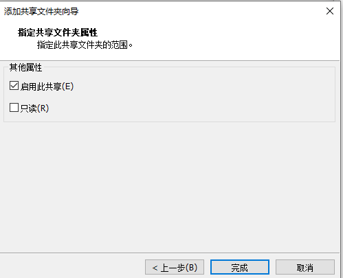

# 配置虚拟机

现在Ubuntu 18.04 操作系统已经安装完成了，但是为了后续开发方便还需要对系统进
行进一步的配置与修改。

##  1 . 网络连接修改

Ubuntu 系统安装成功之后，默认网络配置为NAT 模式，为了后续方便Ubuntu 与主机进行网络通信需要修改为桥接模式。
在系统关闭的状态下，点击“编辑虚拟机设置”将网络适配器改为桥接模式。


## 2.  安装VMware Tools

1）选择VMware 菜单栏下的“虚拟机”选项卡下的“安装 VMware Tools”选项。


在安装好的ubuntu18.04 系统中可看到“VMware Tools”DVD 光盘


3）打开光盘可以看到如下文件。


4）将VMwareTools-10.3.10-12406962.tar.gz 压缩包复制到左侧的Downloads 文件夹中。


5）选中该文件右键选择“Extract Here”选项，进行解压。


6）解压完成后会生成一个文件夹。


7）进入VMwareTools-10.3.10-12406962/vmware-tools-distrlib 文件夹。


8）在该文件夹空白处右键，选择“Open in Terminal”选项，打开一个终端。


9）执行vmware-install.pl 脚本。

输入密码1 后看到如下界面


输入yes
之后的选项全部默认“回车键”
10） 安装完成默认如下图所示。


11） 重启系统。
linux@ubuntu:$ sudo reboot

## 3.  启用共享文件夹

在启用共享文件夹前请确保VMwareTools 已经正确安装。
为了便于后续Ubuntu 与主机直接的文件传输可以启用虚拟机的共享文件夹将主机上
的一个文件夹挂载到Ubuntu 系统中。
在主机上任意位置建立一个用于共享文件的文件夹。（这里以G:\liunx_share 为例）
点击“编辑虚拟机设置”找到“选项”下的共享文件夹。


选择界面右侧的“总是启用”选项后添加一个共享文件夹。


添加完成后如下界面中选中“启用此共享”后点击”完成“




点击完成后就可以看到刚刚添加的文件夹路径了。


开启虚拟机之后在/mnt/hgfs 就可以看到共享的文件夹了。

## 4. 常用工具安装

1）net-tools 安装
从ubuntu18.04 版本开始，在系统中默认不支持ifconfig 命令进行网络状态查看。需要
安装net-tools 方可使用。

```
linux@ubuntu:$ sudo apt-get update
linux@ubuntu:$ sudo apt install net-tools
```


2）vim 安装
系统安装完成后自带的文本编辑器是vi 编辑器，这里推荐使用vim 编辑器进行文本编辑。

```
linux@ubuntu:$ sudo apt-get update
linux@ubuntu:$ sudo apt-get install vim
```

为了后续开发方便可以为vim 安装一些辅助插件。将【华清远见-FS-MP1A 开发资料
\01-工具软件】目录下的jeffy-vim-read.tar.gz 压缩包导入到虚拟机中。

解压缩

```
linux@ubuntu:$ tar -xvf jeffy-vim-read.tar.gz
```

解压成功后会得到jeffy-vim-read 文件夹，进入该文件夹下进行插件安装。

```
linux@ubuntu:$ ./install.sh
```

选择y，之后出现如下界面


安装完成出现如下提示


安装ctags

```
linux@ubuntu:$ sudo apt-get install ctags
```

3）openssh 安装

```
linux@ubuntu:$ sudo apt-get update
linux@ubuntu:$ sudo apt-get install openssh-server
```


## 6. 安装TFTP 服务器

ps: 在系统移植使用的

```
linux@ubuntu:$ sudo apt-get update
linux@ubuntu:$ sudo apt-get install tftp-hpa tftpd-hpa
```

在根目录下建立tftp 工作目录

```
linux@ubuntu:$ sudo mkdir /tftpboot
```

修改tftpboot 文件夹权限

```
linux@ubuntu:$ sudo chown linux:linux /tftpboot/
linux@ubuntu:$ sudo vi /etc/default/tftpd-hpa
```

将TFTP_DIRECTORY="/var/lib/tftpboot"修改为TFTP_DIRECTORY="/tftpboot"


重启tftp 服务

```
linux@ubuntu:$ sudo service tftpd-hpa restart
```


## 7.  安装NFS 服务器

ps: 在系统移植使用的

```
linux@ubuntu:$ sudo apt-get update
```

安装 NFS 服务器端

```
linux@ubuntu:$ sudo apt-get install nfs-kernel-server
```

安装 NFS 客户端

```
linux@ubuntu:$ sudo apt-get install nfs-common
```

建立NFS 共享目录

```
linux@ubuntu:$ sudo mkdir /source
linux@ubuntu:$ sudo chown linux:linux /source
linux@ubuntu:$ mkdir /source/rootfs
```

添加共享目录

```
linux@ubuntu:$ sudo vi /etc/exports
```

若需要把 “/source/rootfs” 目录设置为NFS 共享目录，在该文件末尾添加下面的一
行：

```
/source/rootfs *(rw,sync,no_root_squash,no_subtree_check)
```

使能NFS V2 版本

```
linux@ubuntu:$ sudo vi /etc/default/nfs-kernel-server
```

在文件的最后添加下面的配置

```
RPCNFSDOPTS="--nfs-version 2,3,4 --debug --syslog"
```


重启NFS

```
linux@ubuntu:$ sudo /etc/init.d/nfs-kernel-server restart
```

## 8. Linux 开发工具安装

```
linux@ubuntu:$ sudo apt-get update

//?
linux@ubuntu:$ sudo apt-get install gawk wget git diffstat unzip texinfo gcc-multilib buildessential chrpath socat cpio python python3 python3-pip python3-pexpect xz-utils debianutils iputils-ping

linux@ubuntu:$ sudo apt-get install libsdl1.2-dev xterm

linux@ubuntu:$ sudo apt-get install make xsltproc docbook-utils fop dblatex xmlto 

linux@ubuntu:$ sudo apt-get install python-git-doc

//?
linux@ubuntu:$ sudo apt-get install ncurses-dev libncurses5-dev libncursesw5-dev lib32ncurses5 libssl-dev linux-headers-generic u-boot-tools device-tree-compiler bison flex g++ libyaml-dev

linux@ubuntu:$ sudo apt-get install python-crypto

linux@ubuntu:$  sudo  apt-get  install  coreutils  bsdmainutils  sed  curl bc lrzsz corkscrew cvs subversion mercurial nfs-common nfs-kernel-server libarchive-zip-perl dos2unix texi2html diffstat libxml2-utils


linux@ubuntu:$ sudo apt-get install default-jre
linux@ubuntu:$ sudo apt-get install libyaml-dev libpython2.7-dev
```

## 9. vim配置

==建议直接用jeffy-vim-read.tar.gz==

sudo vim vimrc文件进行配置

```
set nocompatible

set history=100

filetype on
filetype plugin on
filetype indent on


set autoread


set mouse=a


syntax enable

colorscheme desert
set cursorline
hi cursorline guibg=#00ff00
hi CursorColumn guibg=#00ff00


set tabstop=4


set si


set wrap

set sw=4


set ruler

set cmdheight=1


set nu
"Do not redraw, when running macros.. lazyredraw"
set lz


set noerrorbells

set hlsearch
set novisualbell

set ignorecase

set encoding=utf-8

set fileencodings=utf-8

set termencoding=utf-8

set showmatch
"How many tenths of a second to blink"
set mat=2

function! CleverTab()
     if strpart( getline('.'), 0, col('.')-1 ) =~ '^\s*$'
         return "\<Tab>"
     else
         return "\<C-N>"
     endif
endfunction
inoremap <Tab> <C-R>=CleverTab()<CR>

```


## 10. 更改镜像源

- 所谓的镜像源：可以理解为提供下载软件的地方
- 因为使用 apt-get 命令默认是从国外的服务器下载安装软件的，会导致下载安装速度很慢，所以需要更改成国内的镜像源服务器。

一、可视化方式更改镜像源

1. 打开“软件和更新”设备

- Ubuntu 将“软件和更新”从“设置”中独立出来了
  

2. 选择 “[Ubuntu](https://so.csdn.net/so/search?q=Ubuntu&spm=1001.2101.3001.7020)软件 / 源代码 (需验证，输入密码) / 其它站点 / 选择最佳服务器 ”，自动选择合适的镜像源


3.重新载入可用软件列表，完成更新


二、手动修改镜像源

如：将镜像源改成[清华大学TUNA镜像源：https://mirrors.tuna.tsinghua.edu.cn/](https://mirrors.tuna.tsinghua.edu.cn/)

 1、百度找到镜像源地址并打开：


2.选择Ubuntu对应版本


3.复制相关内容，覆盖原软件源配置文件（ /etc/apt/sources.list ），覆盖前先备份

- 由于/etc/apt/sources.list文件是只读文件，所以正确编辑方式是：sudo vi /etc/apt/sources.list
  

```python
# 默认注释了源码镜像以提高 apt update 速度，如有需要可自行取消注释
deb https://mirrors.tuna.tsinghua.edu.cn/ubuntu/ bionic main restricted universe multiverse
# deb-src https://mirrors.tuna.tsinghua.edu.cn/ubuntu/ bionic main restricted universe multiverse
deb https://mirrors.tuna.tsinghua.edu.cn/ubuntu/ bionic-updates main restricted universe multiverse
# deb-src https://mirrors.tuna.tsinghua.edu.cn/ubuntu/ bionic-updates main restricted universe multiverse
deb https://mirrors.tuna.tsinghua.edu.cn/ubuntu/ bionic-backports main restricted universe multiverse
# deb-src https://mirrors.tuna.tsinghua.edu.cn/ubuntu/ bionic-backports main restricted universe multiverse
deb https://mirrors.tuna.tsinghua.edu.cn/ubuntu/ bionic-security main restricted universe multiverse
# deb-src https://mirrors.tuna.tsinghua.edu.cn/ubuntu/ bionic-security main restricted universe multiverse

# 预发布软件源，不建议启用
# deb https://mirrors.tuna.tsinghua.edu.cn/ubuntu/ bionic-proposed main restricted universe multiverse
# deb-src https://mirrors.tuna.tsinghua.edu.cn/ubuntu/ bionic-proposed main restricted universe multiverse
```

4.更换好源之后执行下方命令更新：

```python
sudo apt-get update
sudo apt-get upgrade
```

# Trzsz 文件传输利器

### 简介

trzsz 是一个简单的文件传输工具， 类似于 lrzsz ( rz / sz )， 并与 tmux 兼容。

### 引言

用过 rz、sz 上传和下载文件的，都知道非常的方便。那么，在 Linux 的原生终端，在 Mac 上的原生终端，在 Windows 中的 cmd 和 PowerShell 等，又能不能像 rz / sz 那样方便地传文件呢？

### trzsz

用 https://github.com/trzsz/trzsz-go 这个开源软件，不要用GitHub：[https ://github.com/trzsz/trzsz](https://github.com/trzsz/trzsz)，就可以实现类似 rz、sz 那样上传和下文件，还支持传输目录，支持拖文件和目录直接上传，传大文件时进度条也非常友好。

### 用法

1 、在本地使用 `trzsz ssh x.x.x.x` 登录服务器（ 若用 `trzsz -d ssh x.x.x.x` 登录，则支持拖文件和目录上传 ）。

2、在服务器上使用 `trz` 命令上传文件，使用 `trz -d` 上传目录。

3、在服务器上使用 `tsz xxx` 命令下载 xxx 文件，使用 `tsz -d xxx` 下载 xxx 目录。

### 上传和下载的示例


### 拖文件上传的示例


### 安装说明

- Ubuntu 用 apt 安装

```js
sudo apt update && sudo apt install software-properties-common
sudo add-apt-repository ppa:trzsz/ppa && sudo apt update
sudo apt install trzsz
```

复制

- Debian 用 apt 安装

```js
sudo apt install curl gpg
curl -s 'https://keyserver.ubuntu.com/pks/lookup?op=get&search=0x7074ce75da7cc691c1ae1a7c7e51d1ad956055ca' \
	| gpg --dearmor -o /usr/share/keyrings/trzsz.gpg
echo 'deb [signed-by=/usr/share/keyrings/trzsz.gpg] https://ppa.launchpadcontent.net/trzsz/ppa/ubuntu jammy main' \
	| sudo tee /etc/apt/sources.list.d/trzsz.list
sudo apt update
sudo apt install trzsz
```

复制

- Linux 用 yum 安装

```js
echo '[trzsz]
name=Trzsz Repo
baseurl=https://yum.fury.io/trzsz/
enabled=1
gpgcheck=0' | sudo tee /etc/yum.repos.d/trzsz.repo

sudo yum install trzsz
```

复制

- Mac 用 homebrew 安装

```js
brew update
brew install trzsz-go
```

复制

- Windows 用 [Scoop](https://scoop.sh/) 安装

```js
scoop bucket add extras
scoop install trzsz
```

复制

- ArchLinux 用 [yay](https://github.com/Jguer/yay) 安装

```js
yay -Syu
yay -S trzsz
```

复制

- 其他 从 [github release](https://github.com/trzsz/trzsz-go/releases) 下载，或者用 go 编译：

```js
git clone https://github.com/trzsz/trzsz-go.git
cd trzsz-go
make
sudo make install
```

复制

### 可配置项

配置文件路径为 `~/.trzsz.conf`

```js
DefaultUploadPath =
DefaultDownloadPath = /Users/username/Downloads/
```

复制

1、`DefaultUploadPath` 可以设置每次上传默认打开哪个目录。

2、`DefaultDownloadPath` 可以设置下载的默认路径（ 不需要再弹窗选择路径 ）。

### 使用建议

1、为了使用方便，可以设置 `alias` ，例如 `alias ssh="trzsz ssh"`，又或者 `alias ssh="trzsz -d ssh"` 支持拖文件上传。

2、`trzsz` 支持 `tmux`，如果是在本地使用 `tmux`，则先运行 `tmux`，再 `trzsz ssh` 登录到远程服务器，即可使用 `trz` 和 `tsz` 进行上传和下载。

### 常见问题

- 如果 [MSYS2](https://www.msys2.org/) 或 [Git Bash](https://www.atlassian.com/git/tutorials/git-bash) 遇到错误 `The handle is invalid`。在 `trzsz` 前面加上 `winpty` 即可，如 `winpty trzsz ssh x.x.x.x` 这样登录服务器。

`Git Bash` 已默认安装有 `winpty`，`MSYS2` 需要手工安装 `pacman -S winpty`。

- 在 [MSYS2](https://www.msys2.org/) 和 [Cygwin](https://www.cygwin.com/) 等，不支持直接使用 `/usr/bin/ssh` 那个 `ssh`，可能会传输失败。需要使用 Windows 自带的 [OpenSSH](https://docs.microsoft.com/en-us/windows-server/administration/openssh/openssh_install_firstuse)。

`MSYS2` 中用法 `winpty trzsz /c/Windows/System32/OpenSSH/ssh.exe x.x.x.x`。

`Cygwin` 中用法 `trzsz "C:\Windows\System32\OpenSSH\ssh.exe" x.x.x.x`。

- 拖文件或目录，没有自动上传？

1、检查 `ssh` 登录时有没有加上 `-d` 选项，如 `trzsz -d ssh x.x.x.x` 。

2、检查服务器上有没有安装 [trzsz](https://github.com/trzsz/trzsz) 或 [trzsz-go](https://github.com/trzsz/trzsz-go)，`trz` 应在某个 `PATH` 路径下。

3、在 Windows 中，检查标题有没有`管理员`三个字，`以管理员运行` 时可能会由于 UAC 设置的原因导致拖不了文件。

4、在 Windows Terminal 中，需要将文件或目录拖到左上角，显示`粘贴文件路径` 时再放开。

5、在 Windows 的 `cmd` 和 `PowerShell` 中，一次只能拖一个文件或目录，拖多个也只有鼠标正对着的那个是生效的。