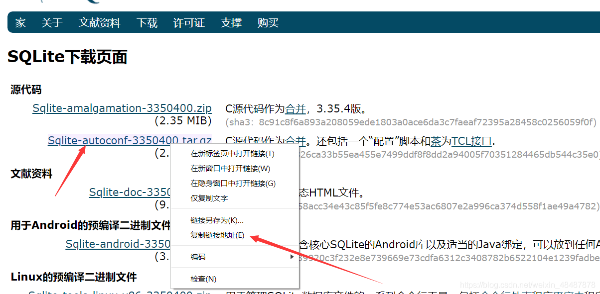
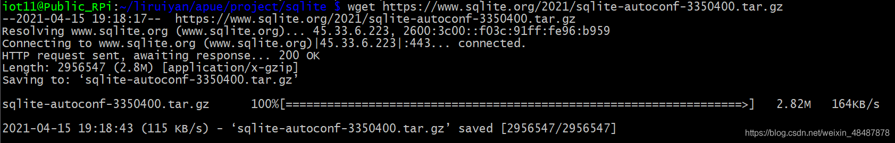
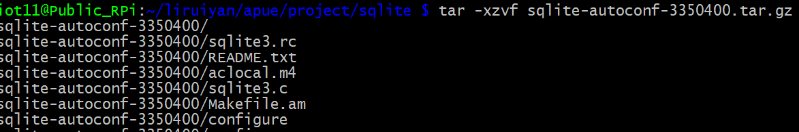
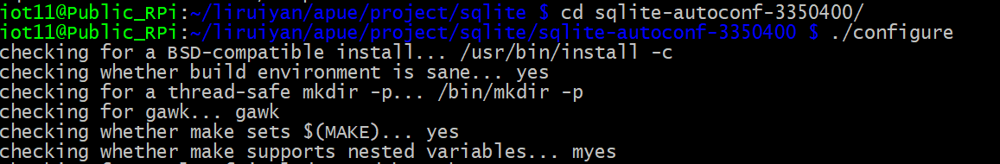
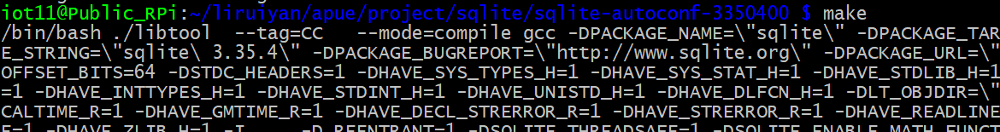
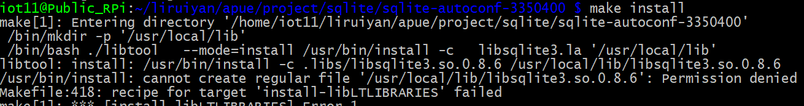
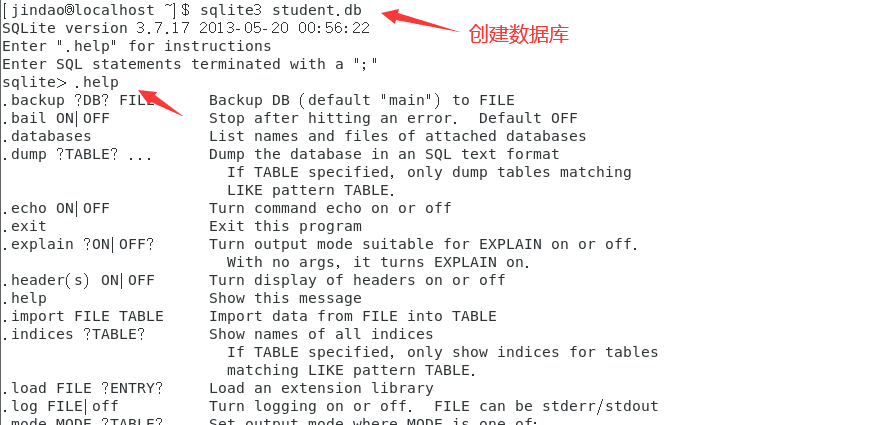
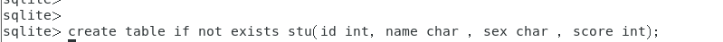

# 下载并安装SQlite3

下载网址：[SQlite3官网下载](https://www.sqlite.org/download.html)
进入官网复制链接地址

在Linux下载：[wget](https://so.csdn.net/so/search?q=wget&spm=1001.2101.3001.7020) https://www.sqlite.org/2021/sqlite-autoconf-3350400.tar.gz

解压: tar -xzvf sqlite-autoconf-3350400.tar.gz

进入cd sqlite-autoconf-3350400/并运行 ./configure

make

make install


**安装完成！**


# 使用





```
【1】数据库

   1， 数据库的安装
       sudo dpkg -i  *.deb

   2, 数据库命令：
      1）系统命令 ， 都以'.'开头
         .exit 
         .quit
         .table   查看表
         .schema  查看表的结构
          
      2）sql语句， 都以‘;’结尾

        1-- 创建一张表
            create table stuinfo(id integer, name text, age integer, score float);
        
        2-- 插入一条记录
            insert into stuinfo values(1001, 'zhangsan', 18, 80);
            insert into stuinfo (id, name, score) values(1002, 'lisi', 90);

        3-- 查看数据库记录
            select * from stuinfo;
            select * from stuinfo where score = 80;
            select * from stuinfo where score = 80 and name= 'zhangsan';
            select * from stuinfo where score = 80 or name='wangwu';
            select name,score from stuinfo;  查询指定的字段
            select * from stuinfo where score >= 85 and score < 90;

        4-- 删除一条记录
            delete from stuinfo where id=1003 and name='zhangsan';

        5-- 更新一条记录
            update stuinfo set age=20 where id=1003;
            update stuinfo set age=30, score = 82 where id=1003;

        6-- 删除一张表
            drop table stuinfo;

        7-- 增加一列
            alter table stuinfo add column sex char;

        8-- 删除一列
            create table stu as select id, name, score from stuinfo;
            drop table stuinfo;
            alter table stu rename to stuinfo;

     数据库设置主键：
     create table info(id integer primary key autoincrement, name vchar);


【8】sqlite3 数据库 C语言 API 
     int sqlite3_open(
      const char *filename,   /* Database filename (UTF-8) */
      sqlite3 **ppDb          /* OUT: SQLite db handle */
     );
    功能：打开数据库
    参数：filename  数据库名称
          ppdb      数据库句柄
    返回值：成功为0 SQLITE_OK ,出错 错误码

    int sqlite3_close(sqlite3* db);
    功能：关闭数据库
    参数：
    返回值：成功为0 SQLITE_OK ,出错 错误码

   const char *sqlite3_errmsg(sqlite3*db);
    功能：得到错误信息的描述
 
   int sqlite3_exec(
   sqlite3* db,                                  /* An open database */
  const char *sql,                           /* SQL to be evaluated */
  int (*callback)(void* arg,int,char**,char**),  /* Callback function */
  void * arg,                                    /* 1st argument to callback */
  char **errmsg                              /* Error msg written here */
  );
  功能：执行一条sql语句
  参数：db  数据库句柄
        sql sql语句
        callback  回调函数，只有在查询时，才传参
        arg      为回调函数传递参数
        errmsg  错误消息
  返回值：成功 SQLITE_OK

查询回调函数：
int (*callback)(void* arg,int ncolumns ,char** f_value,char** f_name),  /* Callback function */
功能：查询语句执行之后，会回调此函数
参数：arg   接收sqlite3_exec 传递来的参数
      ncolumns 列数
      f_value　列的值得地址
      f_name   列的名称
返回值：0，
           
  
int sqlite3_get_table(
  sqlite3 *db,          /* An open database */
  const char *zSql,     /* SQL to be evaluated */
  char ***pazResult,    /* Results of the query */
  int *pnRow,           /* Number of result rows written here */
  int *pnColumn,        /* Number of result columns written here */
  char **pzErrmsg       /* Error msg written here */
);
void sqlite3_free_table(char **result);

查询

```

# 代码

文件student.c

```c
#include <stdio.h>
#include <stdlib.h>
#include <string.h>
#include <sqlite3.h>

#define  DATABASE  "student.db"
#define  N  128

int do_insert(sqlite3 *db)
{
	int id;
	char name[32] = {};
	char sex;
	int score;
	char sql[N] = {};
	char *errmsg;

	printf("Input id:");
	scanf("%d", &id);

	printf("Input name:");
	scanf("%s", name);
	getchar();

	printf("Input sex:");
	scanf("%c", &sex);

	printf("Input score:");
	scanf("%d", &score);

	sprintf(sql, "insert into stu values(%d, '%s', '%c', %d)", id, name, sex, score);

	if(sqlite3_exec(db, sql, NULL, NULL, &errmsg) != SQLITE_OK)
	{
		printf("%s\n", errmsg);
	}
	else
	{
		printf("Insert done.\n");
	}

	return 0;
}
int do_delete(sqlite3 *db)
{
	int id;
	char sql[N] = {};
	char *errmsg;

	printf("Input id:");
	scanf("%d", &id);

	sprintf(sql, "delete from stu where id = %d", id);

	if(sqlite3_exec(db, sql, NULL, NULL, &errmsg) != SQLITE_OK)
	{
		printf("%s\n", errmsg);
	}
	else
	{
		printf("Delete done.\n");
	}

	return 0;
}
int do_update(sqlite3 *db)
{
	int id;
	char sql[N] = {};
	char name[32] = "zhangsan";
	char *errmsg;

	printf("Input id:");
	scanf("%d", &id);

	sprintf(sql, "update stu set name='%s' where id=%d", name,id);

	if(sqlite3_exec(db, sql, NULL, NULL, &errmsg) != SQLITE_OK)
	{
		printf("%s\n", errmsg);
	}
	else
	{
		printf("update done.\n");
	}

	return 0;
}


int callback(void *arg, int f_num, char ** f_value, char ** f_name)
{
	int i = 0;

	for(i = 0; i < f_num; i++)
	{
	//	printf("%-8s %s", f_value[i], f_name[i]);
		printf("%-8s", f_value[i]);
	}

	printf("++++++++++++++++++++++");
	putchar(10);

	return 0;
}

int do_query(sqlite3 *db)
{
	char *errmsg;
	char sql[N] = "select count(*) from stu where name='zhangsan';";

	if(sqlite3_exec(db, sql, callback,NULL , &errmsg) != SQLITE_OK)
	{
		printf("%s", errmsg);
	}
	else
	{
		printf("select done.\n");
	}
}

int do_query1(sqlite3 *db)
{
	char *errmsg;
	char ** resultp;
	int nrow;
	int ncolumn;

	if(sqlite3_get_table(db, "select * from stu", &resultp, &nrow, &ncolumn, &errmsg) != SQLITE_OK)
	{
		printf("%s\n", errmsg);
		return -1;
	}
	else
	{
		printf("query done.\n");
	}

	int i = 0;
	int j = 0;
	int index = ncolumn;

	for(j = 0; j < ncolumn; j++)
	{
		printf("%-10s ", resultp[j]);
	}
	putchar(10);

	for(i = 0; i < nrow; i++)
	{
		for(j = 0; j < ncolumn; j++)
		{
			printf("%-10s ", resultp[index++]);
		}
		putchar(10);
	}

return 0;
}

int main(int argc, const char *argv[])
{
	sqlite3 *db;
	char *errmsg;
	int n;
	
	if(sqlite3_open(DATABASE, &db) != SQLITE_OK)
	{
		printf("%s\n", sqlite3_errmsg(db));
		return -1;
	}
	else
	{
		printf("open DATABASE success.\n");
	}

	if(sqlite3_exec(db, "create table if not exists stu(id int, name char , sex char , score int);",NULL, NULL, &errmsg) != SQLITE_OK)
	{
		printf("%s\n", errmsg);
	}
	else
	{
		printf("Create or open table success.\n");
	}

	while(1)
	{
		printf("********************************************\n");
		printf("1: insert  2:query  3:delete 4:update 5:quit\n");
		printf("********************************************\n");
		printf("Please select:");
		scanf("%d", &n);

		switch(n)
		{
			case 1:
				do_insert(db);
				break;
			case 2:
				do_query(db);
			//	do_query1(db);
				break;
			case 3:
				do_delete(db);
				break;
			case 4:
				do_update(db);
				break;
			case 5:
				printf("main exit.\n");
				sqlite3_close(db);
				exit(0);
				break;
			default :
				printf("Invalid data n.\n");
		}

	}

	return 0;
}
```

